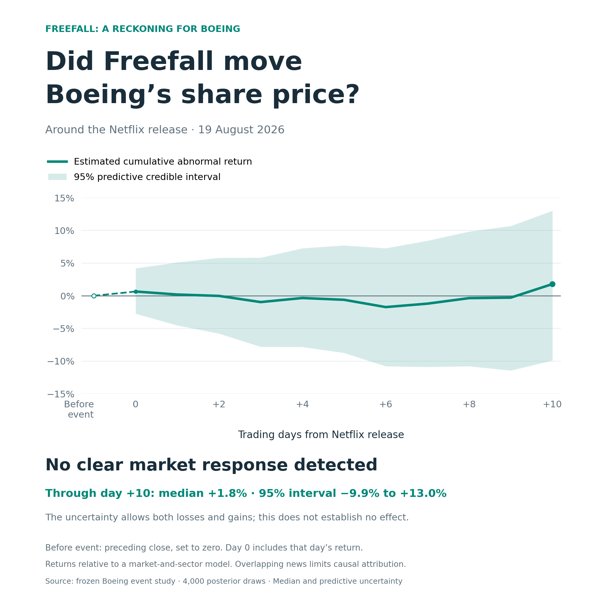
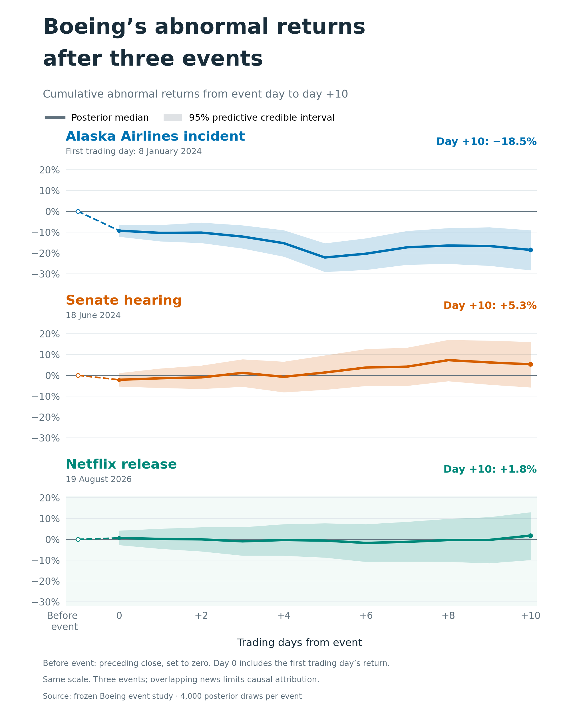

I suppose that as for many others, watching Netflix's documentary *Freefall: A Reckoning for Boeing* - a horrifying story about how poor leadership and putting profit before quality, integrity, and people can make an organization dangerous to both those inside and outside it - significantly changed my previously positive view of and sentiment toward Boeing, a company I personally had admired mainly for its major role in space exploration.

Given the strong impact the documentary had on me, I became curious about whether others were affected in a similar way. I came across several posts on socials expressing similar views and sentiments, but I wanted to examine the effect on a larger scale.

One possible way to do this is to look at how Boeing's shares behaved on the stock market around the time of the documentary's release, since stock prices are known to be partly influenced by investor sentiment. Moreover, because trading has become accessible to a much broader population through various apps in recent years, this particular causal pathway seems more plausible and therefore worth investigating.

I ran an event study around the documentary’s release, asking how Boeing’s stock performed relative to how we would have expected it to perform if the documentary had not been released.

To estimate that counterfactual, I used Boeing’s historical relationship with the broader U.S. market and a basket of aerospace and defense companies. I modeled expected returns using roughly a year of pre-event trading data and then examined Boeing’s abnormal returns - the difference between what actually happened and what the model predicted - around the documentary’s release.

I used a Bayesian robust regression model rather than relying only on a conventional event-study specification, so the analysis could better accommodate the heavy tails and occasional extreme movements that are common in financial-return data. I also checked several event windows, trading volume, a conventional regression specification, placebo windows, and an alternative release date.

The result surprised me: I found no convincing evidence of a clear negative reaction in Boeing’s share price around the documentary’s release.

On the Netflix release date itself, Boeing’s estimated abnormal return was actually slightly positive. Across the three-day window surrounding the release, the posterior median cumulative abnormal return was about −1.2%, but the 95% credible interval was wide (−6.8% to +4.7%) and included zero. In the cumulative charts, which start accumulating returns on the release day, the estimate through day +10 was +1.8%, with a wide 95% predictive credible interval of −9.9% to +13.0%. This does not rule out an economically meaningful effect.

<figure style="text-align:center;">

  

</figure>

I also repeated the analysis using the documentary’s earlier limited theatrical release as the event date. The conclusion remained essentially the same: there was some probability of a negative effect, but the estimates were not precise enough to distinguish it reliably from ordinary stock-market noise.

For comparison, I applied the same methodology to two other Boeing-related events that were also captured and described in the documentary. The January 2024 Alaska Airlines 737 MAX 9 door-plug incident produced an unmistakable signal: Boeing experienced an estimated ~9% negative abnormal return on the first trading day, with the cumulative abnormal loss becoming substantially larger over the following days. By contrast, CEO Dave Calhoun’s June 2024 Senate hearing produced only a much weaker and statistically uncertain market reaction. So, from this perspective, it seems that *Freefall* was closer to the Senate hearing than to the door-plug incident.

<figure style="text-align:center;">

  

</figure>

All this does not mean the documentary had no effect on people. Stock price is an imperfect proxy for public sentiment. It reflects the beliefs and decisions of investors, weighted by capital, not the attitudes of the general population. A documentary can substantially damage trust, employer brand, customer sentiment, employee identification, or long-term corporate reputation without creating an immediate, measurable movement in the share price.

There are also several plausible reasons why even investors who were negatively affected might not have moved the stock much. Some of the information in the documentary was already public (which probably also applies to the Senate hearing). Sophisticated investors may therefore have incorporated it into Boeing’s valuation long before the film appeared. Viewers may also have changed their opinion of Boeing without believing that the documentary materially changed its future cash flows. And any genuine effect could simply have been too small relative to normal daily market volatility to identify convincingly.

To sum it up, my initial hypothesis - driven by my own powerful personal experience - was that the documentary might produce a visible negative market response, but the data did not provide convincing support for that specific hypothesis. However, the absence of a detectable effect on stock price does not establish that other outcomes were unaffected. The natural next question to investigate would thus be whether *Freefall* changed trust in Boeing as a company, willingness to work there, willingness to fly on its aircraft, perceptions of its leadership, and the strength of its employer and consumer brand. Those outcomes may be much closer to the mechanism the documentary could affect.

P.S. For reproducibility, you can find the data sources, scripts, results, and step-by-step instructions for reproducing this analysis on [my GitHub](https://github.com/lstehlik2809/boeing-freefall-stock-market-event-study).

<!-- RELATED:BEGIN -->
## Related notes
- [[company-culture-and-financial-performance|Company culture as a forward signal of financial performance?]]
- [[nobel-prize-and-causal-inference-popularity|Did the Nobel Prize put causal inference on the public radar?]]
- [[people-analytics-popularity-after-covid|The impact of the COVID pandemic on the popularity of people analytics]]
- [[ai-and-bullshit-asymmetry|Can AI help us fight the bullshit asymmetry?]]
- [[causal-inference-in-people-analytics|Beyond prediction: Exploiting organizational events for causal inference in people analytics]]
<!-- RELATED:END -->

---
> 📄 Read the [original post with full outputs](https://blog-about-people-analytics.netlify.app/posts/2026-09-13-boeing-freefall-stock-market-event-study/) on my blog.
