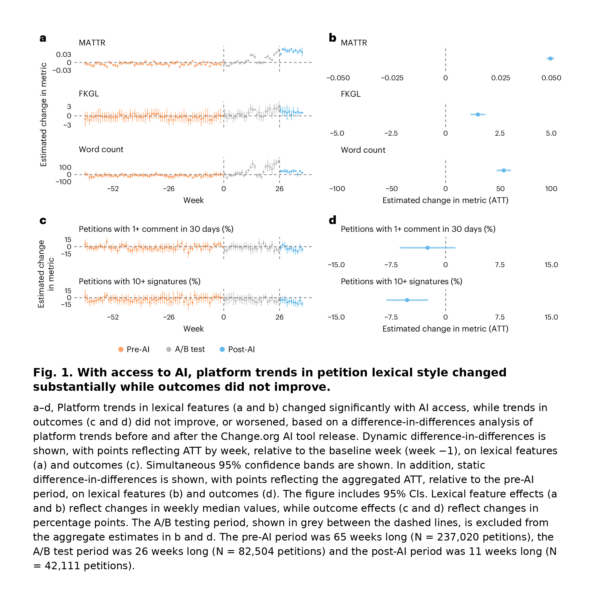

Corpus, Gilbert, Koenecke & Naaman report this pattern in a [Nature Human Behaviour paper](https://www.nature.com/articles/s41562-026-02580-8) on Change.org’s in-platform “write with AI” tool, which is, IMO, a useful reminder that, when evaluating AI’s impact at a company, we should always check whether better outputs translate into the results we actually need. 

[Change.org](https://www.change.org/) rolled the tool out by geography: the US, Great Britain and Canada got full access 11 weeks before Australia. The authors use difference-in-differences to compare changes in those countries with changes in Australia around the launch. The causal interpretation depends on parallel trends. They studied ~1.5M petitions overall, with the main causal analysis focused on English petitions in those countries. The treatment is AI access, not confirmed use by each writer.

<figure style="text-align:center;">

  
  <figcaption>Outputs moved. Outcomes didn’t. Data/code is on OSF. Figures use arXiv v5.</figcaption>

</figure> 

**What changed (outputs)**

With AI access, petitions got longer, more lexically diverse, and harder to read (higher Flesch–Kincaid grade level). In the static DiD, median word count rose by 53.6 words (~49%), median grade level by 1.49 grades, and MATTR by 0.049. Petitions also became more similar to each other: mean pairwise embedding similarity rose by 0.056 (~23% vs a pre-AI mean of 0.240). Independent raters judged the writing better and more persuasive too. That comparison was descriptive, outside the causal DiD.

**What didn’t (outcomes)**

Early engagement didn’t improve. The share reaching 10 signatures within 30 days fell by 5.33 percentage points (statistically significant). The share receiving ≥1 comment within 30 days also fell, but the change wasn’t statistically significant in the aggregate DiD. These measures track whether petitions get off the ground. They don’t tell us whether petitions achieved their goals or changed policy.

Among returning writers, second petitions written with AI access got longer and were associated with worse outcomes. Second petitions generally do worse, partly reflecting regression to the mean; the AI-access result here is associational. There was no clear benefit for writers whose first petition had already failed. Participation volume showed no detectable increase either.

What I find also interesting is that lexical features that used to predict early engagement became weaker predictors after AI access, which reminds me of the [labour-market signalling study](https://blog-about-people-analytics.netlify.app/posts/2025-11-06-genai-and-disrupt-of-labor-market-signalling/) I wrote about earlier: on Freelancer.com, writing quality improved after AI adoption but became less informative about candidates’ job performance.

<!-- RELATED:BEGIN -->
## Related notes
- [[causal-inference-in-people-analytics|Beyond prediction: Exploiting organizational events for causal inference in people analytics]]
- [[genai-and-disrupt-of-labor-market-signalling|Making talk cheap: How GenAI may disrupt labor-market signalling]]
- [[chatgpt-emails-and-causalpy|ChatGPT as a new email writing coach?]]
- [[ai-and-bullshit-asymmetry|Can AI help us fight the bullshit asymmetry?]]
- [[ai-suggestibility|Loftus & Palmer 2.0: Replicating human bias in AI]]
<!-- RELATED:END -->

---
> 📄 Read the [original post with full outputs](https://blog-about-people-analytics.netlify.app/posts/2026-10-03-change-org-ai-outputs-vs-outcomes/) on my blog.
