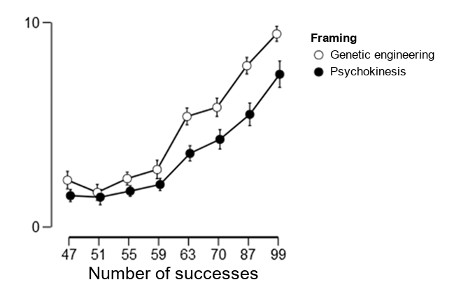
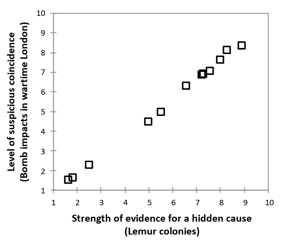
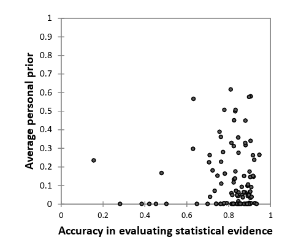

Every now and then, someone asks what my PhD* was about. The technically correct answer - *validation of a Bayesian model of causal inference based on perceived coincidences* - is a reliable way to end a conversation.

The more useful answer is this: I studied why the same odd pattern can look like random noise to one person and evidence of a hidden cause to another. And, more importantly, whether that difference necessarily means that one of them is reasoning badly.

## The question behind the long title
Coincidences have a slightly awkward double life.

On one side, they are blamed for all sorts of questionable beliefs. You think of someone you have not seen for years and they call five minutes later. A cluster appears in otherwise noisy data. Two events happen together a few times, and suddenly we have telepathy, fate, a conspiracy, a lucky shirt, or a supplement that "really works for me."

On the other side, noticing an unexpected pattern is also how real discoveries begin. John Snow's map of cholera deaths around the Broad Street pump was, in a basic sense, a suspicious coincidence. So was Semmelweis noticing that women were more likely to die after being treated by doctors coming from the autopsy room. Sometimes a cluster is noise. Sometimes it is the first glimpse of a cause.

That gives coincidences a Janus face: the same mental habit can produce both superstition and science.

My thesis looked at a model proposed by Tom Griffiths and Josh Tenenbaum that tries to explain both with one mechanism. Instead of defining a coincidence as simply an unlikely event, the model asks a more useful question:

> Would this event be more likely if some alternative causal explanation were true?

## The model in one line
The Bayesian version can be reduced to one sentence:

> Updated belief = starting belief x strength of evidence

The starting belief is the prior: how plausible an explanation looked before the new event happened. The strength of evidence tells us how much better the event is predicted by one explanation than by another. In Bayesian language, that comparison is a likelihood ratio or Bayes factor.

A coincidence appears when the data lean toward an alternative causal story, but not strongly enough to overcome our initial skepticism. A suspicious coincidence sits closer to the tipping point. If the evidence becomes strong enough - or the alternative explanation was reasonably plausible to begin with - the coincidence turns into evidence.

Here is the example I used in the thesis. Suppose an experiment produces 10 successes in 10 attempts. Statistically, those data are about 94 times more likely under a flexible alternative model than under a simple 50:50 null model. That sounds impressive, but the conclusion still depends on what is being tested.

If a new chemical is supposed to influence the sex of laboratory-rat offspring, starting odds of 1:4 against the effect may be quite reasonable. Combine those odds with the data and the alternative ends up about 23 times more likely than the null.

If a friend claims to control a coin with psychokinesis, starting odds of 1:1,000 may already be generous. Combine the very same data with that prior and the null is still about 11 times more likely. Ten heads remain a coincidence - or perhaps a reason to inspect the coin and the friend more carefully.

The important point is that treating the same evidence differently is not automatically irrational. It is exactly what rational updating should do when the competing explanations had very different plausibility before the evidence arrived.

## Study 1: two dials, not one
The first preregistered study included 108 participants and tried to separate two parts of the judgment process.

**The first was evidence reading**: can people tell how strongly a pattern favors a hidden cause over chance?

**The second was prior calibration**: how willing are they, before seeing decisive evidence, to believe that an unexpected cause might exist?

Participants saw the same success rates framed in two ways: as attempts to influence a coin through psychokinesis, or as attempts to influence rat offspring through genetic engineering. They also judged the same spatial patterns in two different stories: bomb impacts in wartime London and lemur colonies in Madagascar. Finally, they completed a battery of cognitive and personality measures.

The first result was reassuring. People's judgments moved in the direction predicted by the Bayesian model. More successes produced more belief in the alternative explanation, and the increase happened earlier and faster in the genetic-engineering scenario than in the psychokinesis scenario.

In other words, participants used both the evidence and the prior plausibility of the story. They did not simply count successes, and they did not simply stick to their initial belief.

<figure style="text-align:center;">

  
  <figcaption>Figure 1. The same statistical evidence moved judgments more in the genetic-engineering scenario than in the psychokinesis scenario. Error bars are 99% confidence intervals. Adapted from Graph 1 of the thesis.</figcaption>

</figure> 

A second result came from the spatial-pattern tasks. When the patterns were presented as bomb impacts, participants rated how suspicious a coincidence each pattern was. When the same patterns were presented as lemur colonies, they rated how strongly the pattern suggested a hidden cause.

At the level of the 12 map patterns, the two sets of average ratings were almost perfectly aligned. The patterns that looked like the strongest coincidences were also the patterns that looked like the strongest evidence for a cause. That is exactly what the model predicts: perceived coincidence strength and perceived evidence strength are two descriptions of the same statistical signal.

<figure style="text-align:center;">

  
  <figcaption>Figure 2. Across the 12 spatial patterns, average ratings of "suspicious coincidence" (bomb impacts in wartime London framing) and "evidence for a hidden cause" (Lemur colonies framing) were almost identical (Spearman rho = 1.00 at the map-pattern level). Adapted from Graph 7 of the thesis.</figcaption>

</figure> 

<figure style="text-align:center;">

  
  <figcaption>Figure 3. In these tasks, accuracy in evaluating statistical evidence and prior openness to hidden causes were essentially unrelated (Spearman rho = .044; BF01 about 30). Adapted from Graph 9 of the thesis.</figcaption>

</figure> 

The most interesting result for me was the separation between the two 'dials.' A person's ability to read the statistical evidence was essentially unrelated to their prior openness to unexpected hidden causes: Spearman's rho was .044, and the Bayes factor favored the null relationship by roughly 30 to 1.

This matters because it suggests that a person who is quick to see hidden causes is not necessarily unable to read evidence. At least in these tasks, the evidence-processing part of the system could work reasonably well while the starting assumptions were set differently.

There were also systematic differences between people in prior openness, but little evidence of stable differences in evidence reading across the two tasks. And it was mainly the prior-openness measure - not evidence-reading accuracy - that showed meaningful links with other cognitive characteristics associated with rational and irrational thinking.

The exploratory pattern pointed more toward intellectual skepticism than toward unusual or intense experience as the relevant difference. I would treat that as a hypothesis for another study, not as the final word. But it fits the broader idea: the important question may be less "Can this person recognize evidence?" and more "How much evidence do they require before accepting an unusual explanation?"

## Study 2: can confusion move the prior?
The second preregistered study asked whether that prior dial can be shifted by the situation itself.

The idea was simple. When the world feels understandable, exploiting an existing mental model is usually efficient. When the situation stops making sense, it may become useful to explore more unusual explanations. So perhaps feeling stuck or confused temporarily makes unexpected causal stories seem more plausible.

To test this, 110 participants were included in the analysis. Some worked on difficult or unsolvable matchstick-algebra problems designed to create cognitive impasse. I then measured whether they became more willing to accept unexpected hidden causes.

The data did not clearly support the hypothesis. The experimental and control groups showed a similar level of prior openness.

> No clear effect, a weak manipulation check, and too much uncertainty for a strong conclusion.

This is the less exciting finding, but probably the more useful one. The manipulation check was weak, and the estimate was uncertain enough that a meaningful effect could not be ruled out. So the honest conclusion is not "confusion has no effect." It is: this experiment did not create or measure the proposed effect cleanly enough to tell.

A stronger follow-up would need a larger sample, several different ways to make situations feel less comprehensible, several measures of prior openness, and ideally before-and-after measurements. Science occasionally answers a question with another, better-specified question. This was one of those occasions.

## So, are people rational?
My thesis did not settle the Great Rationality Debate. It did not prove that the brain literally runs Bayes' theorem, that people are perfect statisticians, or that every strange belief is secretly rational.

The claim supported by the first study is narrower and, I think, more interesting: in at least some coincidence tasks, people's judgments have the structure predicted by a rational Bayesian model. They respond to the diagnostic strength of evidence, combine it with prior plausibility, and move from 'mere coincidence' toward 'evidence' in a sensible way.

At the same time, a sound updating rule does not guarantee a sound conclusion. If the prior probability of hidden causes is too generous, random noise can become a message. If it is too skeptical, a real discovery can be dismissed as a fluke.

That is why the difference between discovery and superstition may sometimes be quantitative rather than qualitative. The machinery can be the same; the calibration differs.

This is also the part of the thesis that has stayed with me. When we see a belief that looks irrational, it is tempting to conclude that the person cannot reason. Sometimes that is true. But another possibility is that they are updating coherently from starting assumptions we do not share - or from assumptions that were sensible in another environment and are poorly tuned to this one.

That does not make every belief defensible. It tells us where to look. Before blaming the updating rule, inspect the prior. Before calling a pattern meaningful, count the opportunities for it to occur. And before declaring an odd event impossible under chance, compare chance with a concrete alternative rather than with our surprise.

## A few important caveats
The first study used a relatively small and mostly university-based sample, a limited set of tasks, and measures with restricted ranges in places. The second study had an uncertain effect estimate and a manipulation that may not have worked strongly enough. The results therefore should not be generalized to every kind of coincidence, every population, or every form of irrational belief.

Still, the findings support a useful alternative to the simple story that people see coincidences because they are bad at probability. Sometimes people may be surprisingly good at reading the statistical signal. The problem can sit elsewhere: in what they considered plausible before the signal arrived.

P.S. Both studies were preregistered, and the data and analyses are openly available on OSF: [Study 1](https://osf.io/a7hmn/) and [Study 2](https://osf.io/zwim3).

P.P.S. The project also included Czech pilot localizations of five psychometric measures: an extended Cognitive Reflection Test, a Heuristics and Biases Test, the Personal Need for Structure inventory, the Rational-Experiential Inventory, and the Revised Paranormal Belief Scale. Because apparently two studies were not enough.

---
\* Source: Luděk Stehlík (2017), *Validation of Bayesian Model of Causal Inferences Made on the Basis of Perceived Coincidences*, Charles University. Figures adapted from Graphs 1, 7, and 9 of the dissertation.

<!-- RELATED:BEGIN -->
## Related notes
- [[conspiracy-theories-and-overfitting|Conspiracy theories as a specific example of overfitting?]]
- [[car-accidents-near-home|Before you blame the driver, check the denominator]]
- [[ai-and-bullshit-asymmetry|Can AI help us fight the bullshit asymmetry?]]
- [[nobel-prize-and-causal-inference-popularity|Did the Nobel Prize put causal inference on the public radar?]]
- [[impact-of-pets-on-life-satisfaction|Before you believe the £70,000 cat]]
<!-- RELATED:END -->

---
> 📄 Read the [original post with full outputs](https://blog-about-people-analytics.netlify.app/posts/2026-09-30-coincidence-or-evidence/) on my blog.
