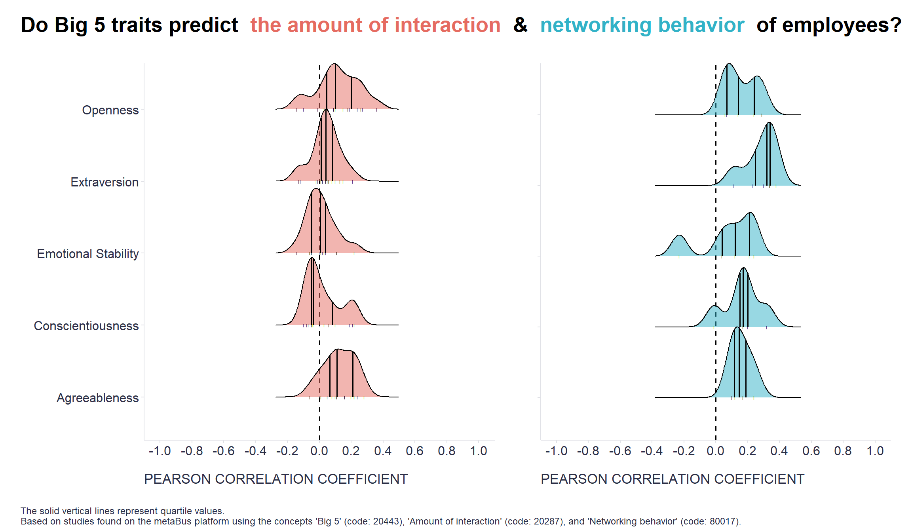

One of [our](https://www.timeisltd.com/) clients once asked us to what extent employees’ level of engagement in corporate communication and collaboration is driven by their personality and to what extent by their job role, the conditions in which they work, and other factors outside their personality.

Our first answer was that the latter probably plays a more significant role than the former, but it was difficult to answer more specifically because we did not yet have all the data we needed to quantify the tightness of this relationship. This motivated me to look at existing research on this topic to help us better set our apriori expectations on this issue.

With the help of [metaBus](http://metabus.org/), an amazing platform for curating, searching, and summarizing research findings from the social and organizational sciences, I was able to get the results of over 100 studies on the relationship between employees’ [Big 5 personality traits](https://en.wikipedia.org/wiki/Big_Five_personality_traits) and the amount of interaction and networking behavior they engage in. Among the criteria for the amount of interaction were variables like contact frequency, frequency of participation, communication frequency, meeting frequency, hours of interaction, interaction duration, etc. For networking behavior there were criteria as liaison, building networks, relationship building, network activity, maintaining contacts, increasing internal visibility, network ability, and informal network. 

```r
# The following concepts were used to search for relevant studies on the metaBus platform (their respective codes are given in brackets):
# Big 5 (20443)  
# Amount of interaction (20287) 
# Networking behavior (80017)

# uploading libraries
library(tidyverse) # for data manipulation and visualization 
library(ggridges) # for data visualization
library(ggtext) # for enabling markdown in ggplots
library(patchwork) #  for combining ggplots

# data preparation
# uploading data
interaction <- readr::read_csv("./interactionAmount.csv")
networking <- readr::read_csv("./networkingBehavior.csv")

# preparing dataset for amount of interaction concept
interactionPrep <- interaction %>%
  dplyr::filter(
    # removing non-relevant personality characteristics 
    !Var1 %in% c("Empathic concern"),
    # limiting to studies conducted at the individual level
    Var2Unit == "Individual"
  ) %>%
  # reversing Neuroticism to Emotional Stability
  dplyr::mutate(
    r = case_when(
      Var1 == "Neuroticism" ~ r*-1,
      TRUE ~ r
    )
  ) %>%
  # uniting the names of personality characteristics across the studies
  dplyr::mutate(
    Var1 = case_when(
      stringr::str_detect(Var1, "Extraversion") | stringr::str_detect(Var1, "Extroversion") | stringr::str_detect(Var1, "extraversion") ~ "Extraversion",
      stringr::str_detect(Var1, "Openness to experience") | stringr::str_detect(Var1, "openness") ~ "Openness",
      stringr::str_detect(Var1, "agreeableness") ~ "Agreeableness",
      stringr::str_detect(Var1, "emotional stability") | stringr::str_detect(Var1, "Neuroticism") ~ "Emotional Stability",
      stringr::str_detect(Var1, "Conscientious") | stringr::str_detect(Var1, "Consciousness") ~ "Conscientiousness",
      TRUE ~ Var1
    )
  )

# preparing dataset for networking behavior concept
networkingPrep <- networking %>%
  dplyr::filter(
    Var2Unit == "Individual"
  ) %>%
  # reversing Neuroticism to Emotional Stability
  dplyr::mutate(
    r = case_when(
      Var1 == "Neuroticism" ~ r*-1,
      TRUE ~ r
    )
  ) %>%
  # uniting the names of personality characteristics across the studies
  dplyr::mutate(
    Var1 = case_when(
      stringr::str_detect(Var1, "Openness") ~ "Openness",
      stringr::str_detect(Var1, "Emotional stability") | stringr::str_detect(Var1, "Neuroticism") ~ "Emotional Stability",
      stringr::str_detect(Var1, "Conscientious") | stringr::str_detect(Var1, "Consciousness") ~ "Conscientiousness",
      TRUE ~ Var1
    )
  )

# data visualization
# creating chart for the amount of interaction concept
interactionChart <- interactionPrep %>%
  ggplot2::ggplot(aes(x = r, y = Var1)) + 
  ggplot2::geom_vline(xintercept = 0, linetype = "dashed", size = 0.56) +
  ggridges::geom_density_ridges(
    fill = "#e56b61",
    alpha = 0.5,
    scale = 1,
    jittered_points = TRUE,
    position = position_points_jitter(width = 0, height = 0,seed = 123),
    point_shape = '|', point_size = 1, point_alpha = 1, 
    quantile_lines =TRUE, vline_linetype = "solid", vline_color = "black", vline_size = 0.55
    #quantile_fun=function(x,...)median(x)
  ) +
  ggplot2::scale_x_continuous(limits = c(-1, 1), breaks = seq(-1,1,0.2)) +
  ggplot2::labs(
    x = "PEARSON CORRELATION COEFFICIENT",
    y = ""
  ) +
  ggplot2::theme(
    plot.title = element_text(color = '#2C2F46', face = "bold", size = 20, margin=margin(0,0,12,0), hjust = 0.5),
    plot.subtitle = element_text(color = '#2C2F46', face = "plain", size = 16, margin=margin(0,0,20,0)),
    plot.caption = element_text(color = '#2C2F46', face = "plain", size = 11, hjust = 0),
    axis.title.x = element_text(margin = margin(t = 15, r = 0, b = 0, l = 0), color = '#2C2F46', face = "plain", size = 13, lineheight = 16, hjust = 0),
    axis.title.y = element_text(margin = margin(t = 0, r = 0, b = 0, l = 0), color = '#2C2F46', face = "plain", size = 13, lineheight = 16, hjust = 1),
    legend.title = element_text(color = '#2C2F46', face = "plain", size = 12),
    legend.text = element_text(color = '#2C2F46', face = "plain", size = 10),
    axis.text = element_text(color = '#2C2F46', face = "plain", size = 12, lineheight = 16),
    axis.text.x = element_text(),
    legend.position = "right",
    axis.line.x = element_line(colour = "#E0E1E6"),
    axis.line.y = element_line(colour = "#E0E1E6"),
    panel.background = element_blank(),
    panel.grid.major.y = element_blank(),
    panel.grid.major.x = element_blank(),
    panel.grid.minor = element_blank(),
    axis.ticks.x = element_line(color = "#E0E1E6"),
    axis.ticks.y = element_line(color = "#E0E1E6"),
    plot.margin=unit(c(5,5,5,5),"mm"), 
    plot.title.position = "plot",
    plot.caption.position =  "plot"
)

# creating chart for the networking behavior concept
networkingChart <- networkingPrep %>%
  ggplot2::ggplot(aes(x = r, y = Var1)) + 
  ggplot2::geom_vline(xintercept = 0, linetype = "dashed", size = 0.56) +
  ggridges::geom_density_ridges(
    fill = "#32b2c7",
    alpha = 0.5,
    scale = 1,
    jittered_points = TRUE,
    position = position_points_jitter(width = 0, height = 0,seed = 123),
    point_shape = '|', point_size = 1, point_alpha = 1, 
    quantile_lines =TRUE, vline_linetype = "solid", vline_color = "black", vline_size = 0.55
    #quantile_fun=function(x,...)median(x)
  ) +
  ggplot2::scale_x_continuous(limits = c(-1, 1), breaks = seq(-1,1,0.2)) +
  ggplot2::labs(
    x = "PEARSON CORRELATION COEFFICIENT",
    y = ""
  ) +
  ggplot2::theme(
    plot.title = element_text(color = '#2C2F46', face = "bold", size = 20, margin=margin(0,0,12,0), hjust = 0.5),
    plot.subtitle = element_text(color = '#2C2F46', face = "plain", size = 16, margin=margin(0,0,20,0)),
    plot.caption = element_text(color = '#2C2F46', face = "plain", size = 11, hjust = 0),
    axis.title.x = element_text(margin = margin(t = 15, r = 0, b = 0, l = 0), color = '#2C2F46', face = "plain", size = 13, lineheight = 16, hjust = 0),
    axis.title.y = element_text(margin = margin(t = 0, r = 0, b = 0, l = 0), color = '#2C2F46', face = "plain", size = 13, lineheight = 16, hjust = 1),
    legend.title = element_text(color = '#2C2F46', face = "plain", size = 12),
    legend.text = element_text(color = '#2C2F46', face = "plain", size = 10),
    axis.text.y = element_blank(),
    axis.text = element_text(color = '#2C2F46', face = "plain", size = 12, lineheight = 16),
    legend.position = "right",
    axis.line.x = element_line(colour = "#E0E1E6"),
    axis.line.y = element_line(colour = "#E0E1E6"),
    panel.background = element_blank(),
    panel.grid.major.y = element_blank(),
    panel.grid.major.x = element_blank(),
    panel.grid.minor = element_blank(),
    axis.ticks.x = element_line(color = "#E0E1E6"),
    axis.ticks.y = element_line(color = "#E0E1E6"),
    plot.margin=unit(c(5,5,5,5),"mm"), 
    plot.title.position = "plot",
    plot.caption.position =  "plot"
  )

# combining the charts together
g <- interactionChart + networkingChart 

# adding title and caption
g <- g + patchwork::plot_annotation(
  title = "<span style='font-size:20pt;font-weight:bold;'>**Do Big 5 traits predict** 
    <span style='color:#e56b61;'>**the amount of interaction**</span> **&**
    <span style='color:#32b2c7;'>**networking behavior**</span> **of employees?**
    </span>",
  
  caption = "The solid vertical lines represent quartile values.\nBased on studies found on the metaBus platform using the concepts 'Big 5' (code: 20443), 'Amount of interaction' (code: 20287), and 'Networking behavior' (code: 80017).",
  theme = theme(
    plot.title = ggtext::element_markdown(lineheight = 1.1, margin=margin(10,0,12,0)),
    plot.caption = element_text(color = '#2C2F46', face = "plain", size = 9, hjust = 0)
    )
  )

print(g)

```



As can be seen from the graphs above, the relationship between personality and the amount of interaction and networking behavior goes in the expected direction. Agreeable, open, and extraverted employees and to some extent also conscientious and emotionally stable employees tend to engage more in interactions with others and in networking. However, the relationships found are relatively weak. The middle 80% of observed effects range from an absolute value of .02 to .24, so across the studies shown, small effects prevail. And even in the case of the strongest effect (*r* = .38), personality “explains” only 14% of the variability in the networking behavior. There is therefore ample scope for the influence of a range of other factors.

How about you? Are you able to engage in interactions and networking in a way that supports your career, work performance, or other positive outcomes, perhaps despite your natural tendencies due to your personality setup? Feel free to share your experience and thoughts in the comments. Btw, you can find interesting information on this topic in the excellent book [8 Steps to High Performance](https://www.amazon.com/Steps-High-Performance-Change-Ignore/dp/163369397X) by [Marc Effron](https://www.linkedin.com/in/effron/), specifically in chapters 4 and 6.  

**Caveat:** The graphs represent only a simple summary of the effects observed in the selected studies, not a proper meta-analysis. If you're interested in the specific analysis steps and choices behind the graphs shown, you can check the code above or go to my [GitHub page](https://github.com/lstehlik2809/Personality-interaction-and-networking).

<!-- RELATED:BEGIN -->
## Related notes
- [[personality-and-work-engagement|Putting the "ideal" personality for high work engagement in a broader context]]
- [[big-five-personality-and-earnings|Link between the Big Five personality traits and earnings]]
- [[job-personality-fit|Do people’s personalities vary across different jobs?]]
- [[life-success-personality-profiles|The Big Five and different ways of succeeding]]
- [[self-awareness-and-personality|Does your personality interfere with your self-awareness?]]
<!-- RELATED:END -->

---
> 📄 Read the [original post with full outputs](https://blog-about-people-analytics.netlify.app/posts/2022-09-17-collaboration-and-personality/) on my blog.
