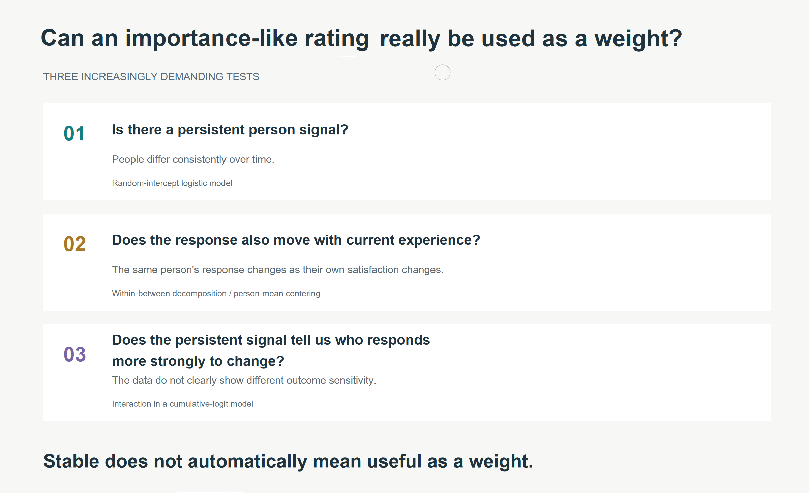
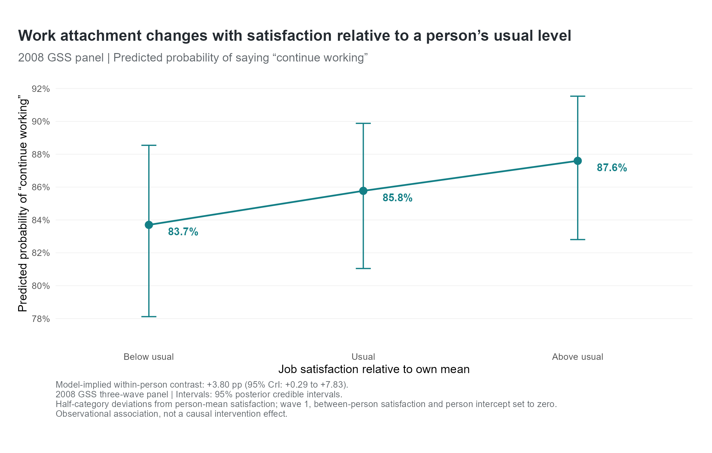
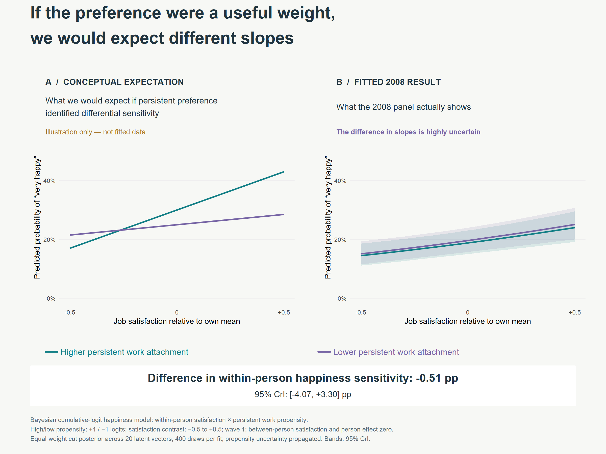
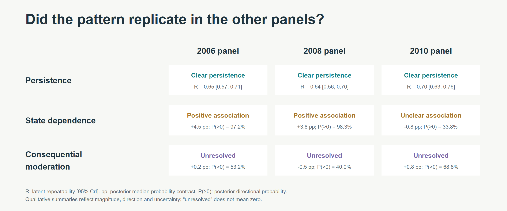

Some of our employee surveys ask two questions about the same experience:

***How important is this to you?***

and

***How satisfied are you with it?***

Autonomy, recognition, development, flexibility, pay - whatever the topic happens to be.

The obvious next step is to combine the answers. If something is very important and satisfaction is low, it moves up the priority list. Sometimes this becomes a formal score along the lines of:

`priority = importance * dissatisfaction`

I’ve always found that intuitively appealing. But it also made me curious: **what does the importance rating actually tell us about a person?**

If someone says autonomy is very important, are we measuring a reasonably stable preference? Does the answer partly reflect what is happening to them right now? And, most importantly, does a high importance rating actually tell us that improving autonomy would matter more for that person’s outcomes?

Those are different questions. And if we want to use importance as a mathematical weight, I think we should distinguish them.

A high importance rating could reflect a fairly stable preference. It could also increase because someone currently has too little autonomy and the issue has become salient. A particularly good experience might change the answer too. And some movement will simply be noise.

So the concern isn’t whether employees can tell us what matters to them. That information is useful in its own right. The narrower question is: 

> Does the rating contain the kind of information required for the decision we want to make?

## Three questions I would ask
Suppose an employee says autonomy is very important to them. Before treating that answer as a weight, I would want to know three things.

1. **Is it persistent?** Does this person tend to give a similar answer over time? Are there meaningful, reasonably stable differences between people?
2. **Does it move with current experience?** When this same person’s experience gets better or worse, does their reported preference move too?
3. **Does the persistent part tell us who responds more strongly to change?** If the experience improves, do people with a stronger persistent preference actually show a larger change in the outcome we care about?

The third question is the one I find most interesting. A rating can be quite stable without telling us much about **who would benefit more from an intervention**.

<figure style="text-align:center;">

  
  <figcaption>Three increasingly demanding tests for a preference-like response.</figcaption>

</figure>

## A longitudinal example
I used public General Social Survey data to illustrate what this logic looks like with repeated observations of the same people.

The GSS has three separate longitudinal panels. To avoid turning the article into a description of the survey design, I’ll use just **one panel as the worked example**: people who entered in 2008 and were interviewed again in 2010 and 2012.

So for the analysis below, we are following the **same respondents over three interviews**. I ran the same models in the other two GSS panels as a replication check and I’ll return to those briefly later.

The preference-like question was whether people would **continue working if they had enough money to live comfortably for the rest of their lives**. I paired that with **job satisfaction** as the experience, and **general happiness** as the broader outcome.

This isn’t literally an employee importance question. It is closer to work attachment or work centrality. And a national social survey isn’t an employee survey. I’m using it because the longitudinal structure lets us demonstrate the measurement problem. The coefficients themselves aren’t the point.

### 1. Is there a persistent person component?
The work-attachment response is binary: continue working or stop working. So I started with a **random-intercept logistic model**:

$$logit P(Yᵢₜ = 1) = α + waveₜ + uᵢ$$
The important term here is `uᵢ`, the person-specific random intercept. In plain English, the model allows some people to have a persistently higher tendency than others to say: *I would keep working*.

For the 2008 panel, latent repeatability was about **0.64**, with a 95% credible interval of roughly **0.56 to 0.70**. So the response contained substantial persistence. I wouldn’t interpret 0.64 as “64% of work preference is a fixed trait.” That’s too strong. It means that, on the latent scale of the logistic model, persistent differences between respondents are large relative to occasion-specific residual variation.

So the first answer is fairly clear: **Yes, there is a meaningful persistent person component**.

If all I cared about was whether the question distinguishes people in a reasonably stable way, that would be encouraging. But that’s not enough to justify using it as a weight.

### 2. Does the response move when someone’s own experience moves?
Now consider job satisfaction. Suppose Anna is usually satisfied with her job and Bob usually isn’t. If Anna is also more likely to say she would continue working, a normal regression can detect that association. But it doesn’t tell us why Anna and Bob differ. They may have different jobs, incomes, personalities, managers, career histories, health, family situations, and so on.

For this question, I’m more interested in a different comparison: *When Anna is more satisfied than **Anna usually is**, does her work-attachment response change?* That is a **within-person** question. So I split job satisfaction into two components. The first is:

$$Sᵢₜ − S̄ᵢ$$
which tells us whether someone’s satisfaction at this interview is above or below **their own average**. The second captures differences in average satisfaction **between people**.

This is usually called a **within-between decomposition, person-mean centering**, or a **Mundlak-style specification**. The terminology matters less than the reason for doing it. Without the decomposition, “satisfaction” mixes two quite different questions: *Why are Anna and Bob different?* and *What happens when Anna changes relative to herself?*

For the 2008 panel, moving from half a satisfaction category below a person’s usual level to half a category above it was associated with about a **3.8 percentage-point increase** in the probability of saying they would continue working. The 95% credible interval was approximately **0.3 to 7.8 percentage points**. So in this panel, the preference-like response wasn’t purely persistent. It also moved somewhat with the person’s current experience.

<figure style="text-align:center;">

  
  <figcaption>Work attachment and satisfaction relative to own usual level.</figcaption>

</figure>

I think this is important for employee surveys. If an “importance” response partly changes when the underlying experience changes, then it isn’t simply a stable preference sitting inside the person waiting to be measured. That doesn’t make the item useless, but it changes the interpretation.

Also worth keeping in mind that this is still observational data. Something else could change both satisfaction and the preference-like response. The direction of influence might also run both ways. Repeated measurement just gives us a better comparison. It doesn’t turn a panel study into an experiment.

### 3. Does the persistent component tell us who is more sensitive?
This is the test that gets closest to the logic of an importance weight. Suppose Anna has relatively strong persistent attachment to work and Bob has relatively weak attachment. Now imagine both become more satisfied with their jobs. Does Anna’s happiness change more strongly? If yes, the preference-like response may contain useful information about **differential sensitivity**.

Statistically, I tested an interaction between within-person job satisfaction, and the person’s persistent work propensity. Because happiness is an ordered categorical outcome, I used a **cumulative-logit model** rather than treating its categories as if they were equally spaced points on a continuous scale.

Schematically:

``Happinessᵢₜ ~ within-person satisfaction + persistent propensity + their interaction + ...``

The interaction is the key term. If it is positive, then the satisfaction-happiness relationship is stronger among people with higher persistent work attachment. That would be much closer to the evidence we’d want before saying: *This person’s preference should increase the weight assigned to improving this experience*.

There is one statistical complication here that I think is worth keeping in a People Analytics article. The persistent propensity isn’t directly observed. We estimate it from a small number of responses. So we shouldn’t estimate one score for each person and then act as though those scores were known perfectly. In the Bayesian analysis, I instead carried **posterior draws of the person propensities** into the happiness model.

The intuitive version is simple: instead of pretending we know each person’s latent preference exactly, the outcome model is evaluated across multiple plausible values of it. That propagates uncertainty from the first model into the second. This is particularly relevant whenever we use empirical-Bayes scores, factor scores, latent traits or other estimated person-level quantities as predictors.

For the 2008 panel, the consequential contrast was approximately **−0.5 percentage points**, with a 95% credible interval from roughly **−4.1 to +3.3 points**. That interval comfortably spans both positive and negative effects. But this result doesn’t mean “*Work attachment definitely doesn’t matter*”. It’s rather **“*These data do not tell us that people with stronger persistent work attachment have greater happiness sensitivity to changes in job satisfaction*.”**

<figure style="text-align:center;">

  
  <figcaption>Consequential validity asks whether persistent work attachment predicts differential happiness sensitivity to within-person changes in job satisfaction.</figcaption>

</figure> 

### This is where reliability and usefulness part company
For the worked example, the answers are:

* **Is there a persistent person signal?** Yes.
* **Does the response also move with current experience?** Yes, in this panel.
* **Does the persistent component identify people whose broader outcome is more sensitive to that experience?** We don’t have clear evidence that it does.

That’s the distinction I was looking for when I started thinking about our *importance* × *satisfaction* questions.

We sometimes move rather quickly from “*This measure captures stable individual differences.*” to “*Therefore those differences should affect how we prioritize interventions.*” But the second statement doesn’t follow from the first. Reliability and decision usefulness are different validation problems.

### What about the other two GSS panels?
I used the 2008 panel above because carrying three overlapping panels through every figure makes the example harder to follow. But I didn’t want to choose one convenient panel and stop there. The same models were run in two other respondent panels, beginning in 2006 and 2010. And the replication was useful.

* **Persistence was consistent**. All three panels showed substantial persistent differences between people.
* **State dependence was less consistent**. The 2006 result looked similar to 2008. The 2010 estimate was close to zero and uncertain.
* **Consequential moderation was unresolved in all three**.

That makes me less confident that the within-person state effect is some general property of the response. And it also makes the main result more interesting, not less: finding persistence was easy; showing that the persistent component had the consequential meaning needed for weighting was much harder.

<figure style="text-align:center;">

  
  <figcaption>Replication of the three tests across the 2006, 2008 and 2010 GSS longitudinal panels.</figcaption>

</figure> 

For a company study, though, you wouldn’t need three independently recruited panels. One continuing employee panel is enough to run this design.

## So what does this mean for importance × dissatisfaction?
I wouldn’t throw the matrix away. An importance-by-satisfaction view can be a useful **conversation tool**. It tells us two things employees are reporting: *this matters to me, and my current experience isn’t good*. Those are both worth knowing. But a stronger statement would be: *Because this employee rates the topic as more important, improving it should produce a larger outcome improvement, so we should multiply its intervention priority*.

That is no longer just employee voice. It’s a predictive claim, which needs evidence. I would therefore distinguish two uses:

* **Importance as employee voice**: Useful for understanding what people care about, what they notice, where they are frustrated and what they want the organization to discuss.
* **Importance as a predictive weight**: Requires evidence that the score tells us something about differential consequences.
A survey item can be perfectly useful for the first purpose without being validated for the second.

## What I would collect in an employee panel
Suppose the topic is autonomy. At each wave, I would measure three matched constructs: importance of autonomy, experienced autonomy, and relevant outcome, for example, job satisfaction. Then repeatedly measure the same employees.

The statistical sequence follows directly from the three questions.

### Test 1: persistence
Use a **mixed-effects model with a person random intercept**. If the importance item is binary or ordinal, use the corresponding generalized mixed model rather than automatically treating it as continuous.

Question: *Are there meaningful persistent differences between employees?*

With richer multi-item measures and enough waves, a latent state-trait model or longitudinal SEM would let us separate stable trait, transient state and measurement error more explicitly.

### Test 2: state dependence
Use a **within-between decomposition**, such as person-mean centering.

Question: *When this employee’s experience changes relative to their own usual level, does their reported importance move too?*

This is exactly the information a normal cross-sectional regression cannot cleanly provide.

### Test 3: consequential validity
Test whether the persistent preference component moderates the **within-person experience-outcome relationship**.

Question: *Does the preference measure identify employees for whom changes in the experience are associated with larger changes in the outcome?*

And if that persistent preference is itself estimated, account for its uncertainty.

A Bayesian multilevel or latent-variable model is convenient here because uncertainty in one estimated quantity can be propagated into the next part of the model instead of treating a point estimate as observed truth. But Bayesian modeling isn’t essential to the basic idea. Mixed-effects models and within-person decomposition can be done perfectly well in a frequentist framework. The important bit is the estimand.

### I would also want more than three waves
The GSS panel gives only three observations per person. That’s enough to demonstrate the logic. If I were designing the employee study from scratch, I’d prefer **five or more waves** if the survey cadence and sample size made that realistic. More observations make it easier to separate:

* persistent differences,
* temporary states,
* measurement error, and potentially
* lagged dynamics.

I’d also keep wording and response scales stable, track role and manager changes, retain partial longitudinal cases when the model can use them, and test measurement invariance for multi-item constructs.

And before calling the importance measure predictive, I’d want to know whether it actually improves prediction in **future held-out waves**.

### There is still one bigger step
Even convincing moderation in an observational panel wouldn’t fully answer the management question. Usually we really care about:

> If we change autonomy, workload, recognition or pay, who will benefit and by how much?

And that’s causal. So the strongest validation would eventually come from an experiment or a credible quasi-experimental design that lets us estimate **heterogeneous treatment effects**.

At that point, an importance rating becomes one candidate moderator among several. It doesn’t get special status merely because we happened to ask employees how important something was.

## Where I landed
My curiosity started with a fairly mundane survey practice: we ask employees both how important an experience is and how satisfied they are with it, then sometimes combine the two.

I still think both questions can be useful. I’m just less comfortable assuming that the product of the two automatically has the meaning we want it to have.

An importance-like response may contain a persistent person signal. It may also react to current experience. And even a persistent signal does not automatically tell us who will benefit more if that experience changes.

So before turning importance into a weight, I would first ask: **What exactly has this rating been validated to tell us?** That seems like a measurement question before it becomes a ranking question 🤔

P.S. Curious if anyone in my network has done the same or a similar exercise with their data - and what they found.

<!-- RELATED:BEGIN -->
## Related notes
- [[the-triple-filter-test|The Triple-Filter Test: How to prioritize HR interventions with panel data]]
- [[cross-lagged-panel-modeling|Getting (more) causal insights from employee survey data (without an RCT)]]
- [[you-said-we-did|‘You Said, We Did’ matters - maybe just not as distinctly as we assume]]
- [[did-with-repeated-cross-sectional-data|What a European cigarette tax study taught me about employee listening]]
- [[psw-and-selection-bias-in-employee-surveys|How to analyze employee survey results with less (selection) bias?]]
<!-- RELATED:END -->

---
> 📄 Read the [original post with full outputs](https://blog-about-people-analytics.netlify.app/posts/2026-09-23-importance-vs-satisfaction/) on my blog.
