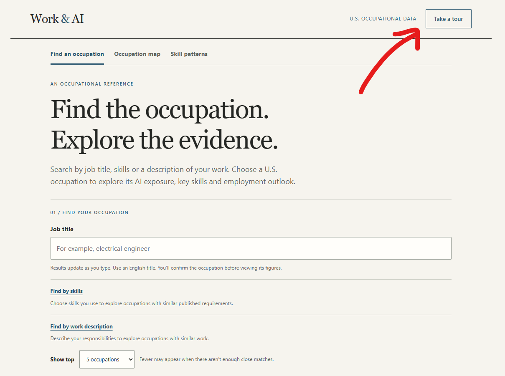
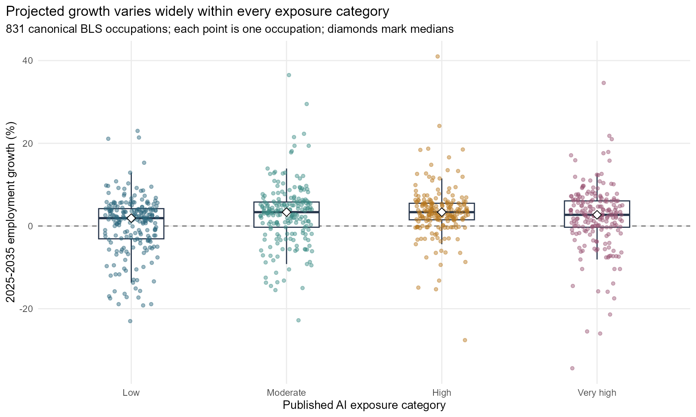

As part of a recent training on using AI effectively, I created Work & AI - a [small app](https://lstehlik2809.github.io/work-and-ai/) for anyone curious about how AI might affect our jobs.

It combines AI exposure categories and 2025–2035 employment projections from the U.S. Bureau of Labor Statistics with job descriptions, tasks and skills from O*NET.

You can look up a job title, select skills you use, or describe what you actually do. Then explore questions like:

* How exposed is this occupation to AI, and is employment expected to grow or shrink?
* In which occupational families and occupations with similar skill requirements is AI exposure concentrated?
* Which skills are relatively more/less common in occupations with higher or lower AI exposure?

The “Take a tour” button will show you around.

<figure style="text-align:center;">

  

</figure>

Just a few things that caught my eye so far:

* In occupations least exposed to AI, the most disproportionately represented skills overlap pretty nicely with what programmers are often said to do these days when working with AI agents: operations control and monitoring, quality control, and troubleshooting 😅
* Software developers sit in the “very high” AI exposure category, yet employment is projected to grow by 10.2% between 2025 and 2035. High exposure and growing demand can coexist 😯 (The supplementary descriptive stats also suggested that higher AI exposure does not line up with a simple pattern of lower employment growth - median projected growth is 1.9% in Low-exposure occupations, 3.35% in both Moderate and High, and 2.7% in Very high - see chart below.)
* Within several occupational families - e.g., healthcare practitioners or personal care and service - the picture varies quite a bit, with occupations more or less evenly spread across all four AI exposure levels 🤔

<figure style="text-align:center;">

  
  <figcaption>Each point is one BLS occupation. Boxes show the middle half of occupations; diamonds mark empirical medians. The dashed line marks zero projected growth. Differences between growth percentages are percentage points (pp).</figcaption>

</figure>

⚠️ Several things to keep in mind: Exposure can mean AI helping with the work as well as doing parts of it, so it doesn’t measure replacement probability. These are U.S. occupational estimates that might not generalize well to other parts of the world. Also, things are moving pretty quickly, so what was true - even just roughly - last year or this year may no longer be true next year.

If you want to play with it, go [here](https://lstehlik2809.github.io/work-and-ai/).

<!-- RELATED:BEGIN -->
## Related notes
- [[hr-tech-ai-shift|How AI is reshaping HR-tech]]
- [[linkedin-contacts-job-positions|Analyzing LinkedIn connections' jobs using LLMs and the BERTopic package]]
- [[cv-job-match-career-site|Improving a company career site with tools from OpenAI]]
- [[agentic-ai-for-visual-data-exploration|Agentic AI for visual data exploration]]
- [[ai-powered-data-exploration-assistant|Testing my GenAI skepticism]]
<!-- RELATED:END -->

---
> 📄 Read the [original post with full outputs](https://blog-about-people-analytics.netlify.app/posts/2026-09-18-job-ai-exposure/) on my blog.
