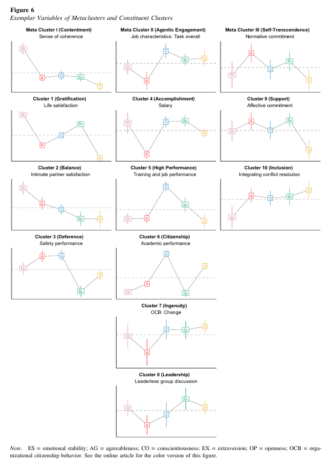

Recently, I came across a [study by Michael Wilmot, Brenton Wiernik and Deniz Ones (2025)](https://www.researchgate.net/publication/393373619_Mapping_Domains_of_Life_Success_Insights_From_Meta-Analytic_Criterion_Profile_Analysis) that looks at how Big Five personality traits relate to different forms of life success.

The authors combined 111 meta-analyses covering 206 variables, more than 3,300 studies and over 2.25 million participants. They identified ten clusters of success-related variables across three broader families: Contentment, Agentic Engagement and Self-Transcendence.

One thing I found interesting, though not super-surprising, is that there isn’t a single personality profile associated with all forms of success. The pattern linked to leadership, for example, looks different from those linked to ingenuity, balance, inclusion or high performance.

Specifically, they estimated the contributions of both profile shape (the relative peaks and valleys across the five traits) and elevation (the average level across those traits). 

<figure style="text-align:center;">

  
  <figcaption>The figure showing Big Five personality patterns for representative outcomes within three broad families of life success and their ten constituent clusters. The different peaks and valleys illustrate how the relative contributions of the five traits vary across outcomes such as life satisfaction, salary, job performance and leadership. Each panel represents one example outcome, rather than the average profile of its entire cluster. These patterns describe associations, not causal effects or a person’s probability of success. ES = emotional stability; A = agreeableness; C = conscientiousness; Ex = extraversion; O = openness. Source: Wilmot, Wiernik & Ones (2025), Figure 6.</figcaption>

</figure>

For context, the two together explained an average of 8.2% of the variance in the success-related variables: about 5.8 percentage points from elevation and 2.4 from shape. The figures varied substantially across domains, but most of the variation remained unexplained. That puts “personality is your destiny” into perspective, though, to be fair, these estimates only cover five broad traits, not every aspect of personality.

Still, the authors suggest that matching people’s Big Five profiles to the cluster patterns could help inform people-related practices like career counselling.

However, they didn’t provide a tool for doing the comparison, so I made one 🤓

You enter your Big Five percentiles and the app converts them into standardized scores. It then compares the shape of your profile with the average trait pattern associated with each success type.

Under the hood, it uses a Pearson correlation across the five traits, based on the study’s centred regression profiles. Overall personality elevation is shown separately, and there’s also an optional exploratory regression view that includes both level and pattern effects.

In the default view, what you get is a ranking of how closely your profile resembles the research profiles.

If you want to try it, go 👉 [here](https://lstehlik2809.github.io/life-success-profile-match/).

<object
  data="./life-success-personality-profiles/life-success-linkedin-carousel.pdf"
  type="application/pdf"
  width="100%"
  height="800px">
  

    Your browser cannot display this PDF.
    <a href="./life-success-personality-profiles/life-success-linkedin-carousel.pdf" download>Download the PDF</a>.

  

</object>
 

⚠️ A few caveats are worth keeping in mind. Most of the evidence in the study is cross-sectional and correlational. A strong match may suggest greater aptitude for that form of success, but it doesn’t give you a precise probability of achieving it, and it doesn’t mean that changing a personality trait would cause a particular outcome.

The ten profiles are clusters of success-related variables, not ten types of people. And while the matching method in the app is based on the paper’s results, the individual-level use of it hasn’t been independently validated.

I’d treat it as something for reflection and conversation, rather than a hiring filter or a verdict on what you should do.

<!-- RELATED:BEGIN -->
## Related notes
- [[job-personality-fit|Do people’s personalities vary across different jobs?]]
- [[big-five-personality-and-earnings|Link between the Big Five personality traits and earnings]]
- [[personality-and-work-engagement|Putting the "ideal" personality for high work engagement in a broader context]]
- [[collaboration-and-personality|Collaboration and personality]]
- [[personality-frameworks-contest|A showdown between the Big Five, Enneagram, MBTI, and astrology]]
<!-- RELATED:END -->

---
> 📄 Read the [original post with full outputs](https://blog-about-people-analytics.netlify.app/posts/2026-09-07-life-success-personality-profiles/) on my blog.
