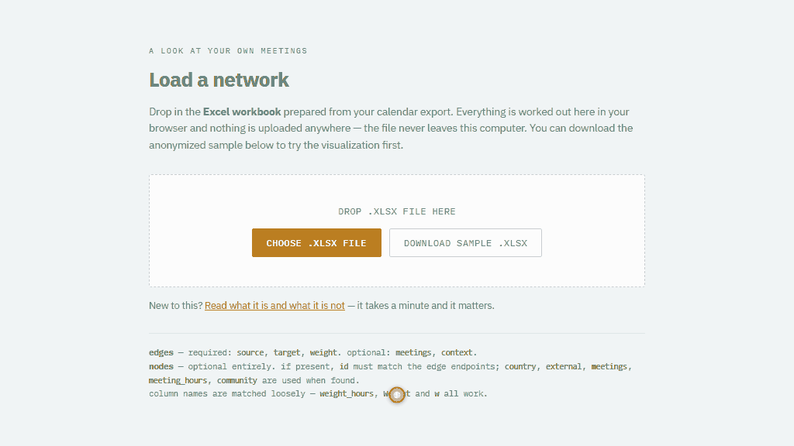

Recently, at work, I came across another example of GenAI-driven commoditization of a data product that was once relatively rare and accessible only through collaboration with a third-party vendor or an internal expert equipped with highly specialized software.

Specifically, I’m talking about a meeting ego-network app that originated as an experimental side product of our efforts within the Sanofi AI Catalysts network to build an MVP of an AI-assisted planner helping people better manage their work time and priorities.

To use it, one just needs to export their Outlook calendar data for a given time range, for example the last quarter, as a CSV file, use a pre-prepared prompt to process the data in a company-internal GenAI with access to a Python sandbox, and upload the resulting Excel file with nodes, edges, and some additional information into the prepared app. Yeah, the workflow isn’t exactly user-friendly, but it’s good enough for an experimental POC 😉

The resulting view gives an employee an easy-to-digest helicopter view of their longer-term collaboration through meetings and allows them to see where, with whom, and in what context they spent their meeting time, and whether they actually spent that time with the people they needed to meet with. All of this comes with obvious limitations, given that calendar data is just one limited and relatively noisy signal of real collaboration, which is important to keep in mind so that one does not overinterpret what appears in the chart and stats.

Of course, this is only one relatively limited use of ONA methodology, and for a full-fledged, company-wide ONA you would still need the help of experienced vendors or internal teams with the right expertise and resources. But still, the fact that you can set up something like this in two or three hours and make the potentially useful insights it generates broadly accessible is pretty amazing. And who knows how quickly AI will become capable of safely and reliably supporting the more ambitious and larger-scale ONA use cases as well 🤔

P.S. To get a better sense of how the app works, you can check it out [here](https://lstehlik2809.github.io/calendar-ego-network-app/) using sample calendar data.

<!-- RELATED:BEGIN -->
## Related notes
- [[hr-tech-ai-shift|How AI is reshaping HR-tech]]
- [[ai-powered-data-exploration-assistant|Testing my GenAI skepticism]]
- [[agentic-ai-for-visual-data-exploration|Agentic AI for visual data exploration]]
- [[linkedin-contacts-job-positions|Analyzing LinkedIn connections' jobs using LLMs and the BERTopic package]]
- [[gai-simulation-work-habits|Does GenAI make me a better (more rational) thinker?]]
<!-- RELATED:END -->

---
> 📄 Read the [original post with full outputs](https://blog-about-people-analytics.netlify.app/posts/2026-08-11-meeting-ego-network-app/) on my blog.
