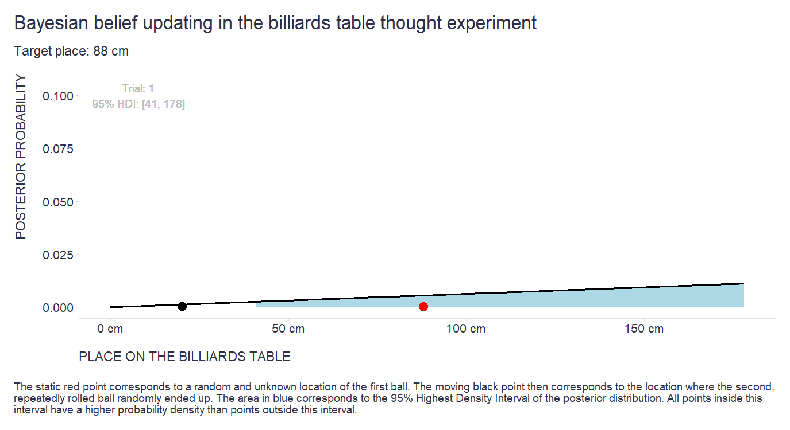
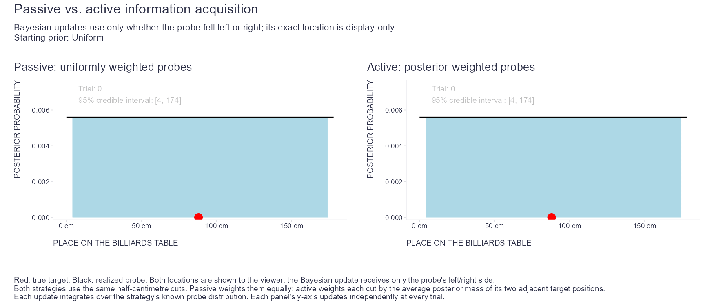

Almost four years ago, I shared a [small animation](https://blog-about-people-analytics.netlify.app/posts/2022-10-27-bayesian-belief-updating/) illustrating Bayesian belief updating using a billiards-table thought experiment described in [Philip Tetlock’s](https://en.wikipedia.org/wiki/Philip_E._Tetlock) book [*Superforecasting*](https://en.wikipedia.org/wiki/Superforecasting:_The_Art_and_Science_of_Prediction).

Imagine that a ball stops at an unknown position on a billiards table. You cannot see it. A second ball is then repeatedly rolled onto the table, and after every roll, you are told only whether it stopped to the left or right of the first ball. Each answer contains little information on its own, but Bayesian updating lets the evidence accumulate and gradually narrows down the likely position of the first ball.

<div style="text-align:center">



</div>

Recently, while preparing materials for a psychometrics lecture I’ll teach this autumn, I realized that the same thought experiment can illustrate the difference between passively receiving information and choosing which information to collect next, using what we have already learned to focus data collection where uncertainty remains.

It also offers a loose analogy to [computerized adaptive testing](https://en.wikipedia.org/wiki/Computerized_adaptive_testing). The unknown ball position corresponds roughly to latent ability, the comparison point to item difficulty, and each left-or-right outcome to a binary response that provides information about the unknown position.

In a traditional fixed-form test, items are selected in advance and administered regardless of how a person responded to earlier items. The randomly generated probes in my original simulation work similarly: their probabilities do not depend on what has already been learned, so the whole sequence could have been generated before the experiment began. A small modification produces a different strategy. We can use the current posterior distribution to change the probabilities with which the possible probe positions are selected.
The animation below starts both approaches at Trial 0 with the same uniform prior.

<div style="text-align:center">



</div>

On the left is the passive approach. Each comparison ball is drawn uniformly from a set of half-centimetre positions between the possible target locations. We observe only whether it is to the left or right of the unknown target and update the posterior.

On the right, the same probe positions are available, but their selection probabilities depend on the current posterior. Positions near more plausible target locations receive greater weight. We draw a probe from this distribution, observe whether it falls to the left or right of the target, update the posterior, and repeat.

The black point shows where the comparison ball actually landed, but its exact location is included only for illustration. In both approaches, the Bayesian update uses the left-or-right outcome and the known probe-selection distribution—not the realized probe position itself.

Both approaches therefore use the same observations and the same Bayesian updating. What differs is how the probes are selected. The passive approach samples all possible probe positions uniformly. The active approach gradually concentrates its sampling in regions that remain plausible.

This general principle is related to ideas in [active learning](https://en.wikipedia.org/wiki/Active_learning_(machine_learning)), [optimal experimental design](https://en.wikipedia.org/wiki/Optimal_experimental_design), [information gain](https://en.wikipedia.org/wiki/Information_gain_(decision_tree)), and - importantly for my psychometrics lecture - also in already mentioned [computerized adaptive testing (CAT)](https://en.wikipedia.org/wiki/Computerized_adaptive_testing).

The connection to CAT is fairly direct at the level of the selection rule. An adaptive test uses previous responses and the current estimate of ability when selecting the next item. An informative item will usually be near the person’s current estimated ability rather than far above or below it.

The billiards example is an idealized version of this idea. Once some regions of the table have become unlikely, the active strategy spends fewer probes there and more probes near positions supported by the current posterior.

There are 179 possible target positions, from 0 to 178 cm. A binary answer can provide at most one bit of information. Distinguishing among 179 equally plausible possibilities would therefore require at least
$log₂(179) ≈ 7.48 bits$

That gives a theoretical lower bound of about eight perfectly chosen binary questions. The strategy shown here does not reach that bound, because the exact probe location is deliberately hidden from the inference procedure. Each left-or-right answer therefore provides less than one bit. Even so, the posterior-weighted strategy narrows the range of plausible positions considerably faster than uniform passive sampling in this example.

The analogy to CAT has clear limits. In the billiards example, the left-or-right relationship is deterministic once the target and probe positions are fixed. But because the inference procedure does not use the realized probe location, the observed outcome has a probabilistic likelihood after averaging over all probe positions that could have been selected.

Test responses are probabilistic for a different reason. A person at a given ability level may answer an item correctly or incorrectly with some probability. Moreover, a real adaptive test normally knows which item was administered and uses its estimated difficulty and other item parameters when updating the ability estimate.

Real CAT algorithms also do not usually sample item difficulties directly from the current posterior. Item selection can be based on Fisher information, expected posterior information gain, expected reduction in posterior uncertainty, or similar criteria. Practical systems must also deal with constraints such as content coverage and item exposure, as well as issues including test security, stopping rules, calibration uncertainty, and multidimensionality.

The billiards simulation is therefore best understood as a simplified illustration rather than a simulation of CAT or item response theory. Information collected so far can guide both the estimate of an unknown quantity and the choice of what to observe next.

The same idea applies also outside psychometrics. In analytics, improving inference often means collecting more data or fitting better models. Another option is to choose the data we collect more deliberately: when observations are chosen well, reducing uncertainty may require fewer of them.

P.S. Feel free to “steal” the code below if you find it useful for your own educational adventures. If you’re interested in a more realistic simulation of CAT, I also have a [separate post](https://blog-about-people-analytics.netlify.app/posts/2025-06-02-cat-and-irt-demo/) with an interactive app and the full source code.

```r
# Passive versus active information acquisition when probe location is hidden
#
# Methodology
# -----------
# An unknown target occupies one of the integer-centimetre positions from 0 to
# 178 on a billiards table. On each trial, the simulated environment places a
# probe at one of the half-centimetre cuts between those possible target
# positions. The chart shows the realized probe, but the Bayesian learner does
# not observe its exact location. It learns only whether the probe fell to the
# left or to the right of the target.
#
# The two strategies differ only in how they choose the distribution of the
# next probe before observing its side:
#
#   * Passive acquisition gives every half-centimetre cut equal probability.
#   * Active acquisition weights a cut by the current posterior mass at its
#     two adjacent target positions. If p_t(x) is the current posterior, the
#     weight of the cut between x_j and x_(j+1) is proportional to
#
#                 [p_t(x_j) + p_t(x_(j+1))] / 2.
#
# The active rule is therefore a cut-based analogue of sampling from the
# posterior. It tends to place probes in regions that the current posterior
# considers plausible. It is not a posterior-median query and is not claimed
# to maximize the information gained on every trial. With a uniform starting
# prior, the distributions used to select the first probe are identical. The
# displayed paths can nevertheless differ at Trial 1 because each strategy
# receives its own random probe and binary outcome. On later trials, the active
# probe distribution also adapts to its resulting posterior.
#
# Let Q denote the unobserved probe position and let F_t(x) be the CDF of the
# strategy's known probe distribution on that trial. For a proposed target
# position x, the likelihood of the observed side is
#
#     P(probe left of target  | target = x) = F_t(x),
#     P(probe right of target | target = x) = 1 - F_t(x).
#
# There is no ambiguity from equality because probes occupy half-centimetres
# and target hypotheses occupy integer centimetres. The posterior update is
#
#     p[t + 1](x) is proportional to
#         p[t](x) * P(observed side | target = x).
#
# This likelihood integrates over the probe distribution because the realized
# value of Q is hidden from inference. The learner does know the selection rule
# and hence F_t. Showing the black probe in the animation is only a visual aid;
# neither its coordinate nor the red target coordinate enters the update.
#
# Everything else is held constant: target grid, starting prior, available
# probe cuts, binary observation, update function, number of trials, and
# posterior summary. The shaded region is an exact central 95% credible
# interval for the discrete posterior. Each panel rescales its y-axis
# independently so that both posterior shapes remain legible.
#
# The animation is one simulated pair of paths, not a proof that the active
# rule must be faster in every run. Its purpose is to show how data collection
# can use what has already been learned to focus observations where uncertainty
# remains. A performance claim would require repeated simulations over targets
# and random seeds, using measures such as posterior entropy, interval width,
# estimation error, and interval coverage.
#
# Reproducing the animation
# -------------------------
# The script requires the tidyverse, patchwork, and gifski R packages. It uses
# FFmpeg when available to produce opaque full frames and prevent text trails;
# otherwise it falls back to gifski. Running the complete file writes
# "bayesianPassiveVsActive_matched_information.gif" to the working directory.
# Change starting_prior_type below to switch between the uniform and discrete
# normal starting priors. The current published version uses the uniform prior.

library(tidyverse)
library(patchwork)
library(gifski)

# -------------------------------------------------------------------------
# Setup
# -------------------------------------------------------------------------

table_width <- 178
field <- seq(0, table_width, by = 1)

# True target position. It is unknown to both inference strategies.
point <- 88

# Starting-prior switch. Change only this value to "uniform" or "normal".
starting_prior_type <- "uniform"

# These settings are used only when starting_prior_type == "normal". The
# resulting prior is a Gaussian-shaped probability mass function evaluated on
# the integer grid and renormalized within the table boundaries.
normal_prior_mean <- table_width / 2
normal_prior_sd <- 25

make_starting_prior <- function(
    type,
    field,
    normal_mean,
    normal_sd) {
  type <- match.arg(type, c("uniform", "normal"))

  prior_weights <- switch(
    type,
    uniform = rep(1, length(field)),
    normal = {
      if (!is.finite(normal_sd) || normal_sd <= 0) {
        stop("normal_prior_sd must be a positive finite number.")
      }

      dnorm(
        field,
        mean = normal_mean,
        sd = normal_sd
      )
    }
  )

  if (any(!is.finite(prior_weights)) || sum(prior_weights) <= 0) {
    stop("The selected starting prior could not be normalized.")
  }

  prior_weights / sum(prior_weights)
}

first_prior <- make_starting_prior(
  type = starting_prior_type,
  field = field,
  normal_mean = normal_prior_mean,
  normal_sd = normal_prior_sd
)

starting_prior_label <- if (starting_prior_type == "normal") {
  stringr::str_glue(
    "Discrete normal (mean = {normal_prior_mean}, SD = {normal_prior_sd})"
  )
} else {
  "Uniform"
}

n_trials <- 30

# Both strategies draw hidden random probes, so the seed controls both paths.
set.seed(1234)

# -------------------------------------------------------------------------
# Shared inference helpers
# -------------------------------------------------------------------------

# Exact equal-tailed credible interval for a discrete posterior. Because the
# endpoints lie on a discrete grid, the enclosed probability can be slightly
# greater than 95%. Unlike a sample-based interval estimate, this calculation
# introduces no Monte Carlo noise into either the display or the random probe
# sequence.
get_credible_interval <- function(probability, field, ci = 0.95) {
  stopifnot(
    length(probability) == length(field),
    all(is.finite(probability)),
    all(probability >= 0),
    abs(sum(probability) - 1) < 1e-10,
    ci > 0,
    ci < 1
  )

  alpha <- 1 - ci
  cumulative_probability <- cumsum(probability)

  lower_index <- which(cumulative_probability >= alpha / 2)[1]
  upper_index <- which(cumulative_probability >= 1 - alpha / 2)[1]

  tibble(
    lci = field[lower_index],
    hci = field[upper_index]
  )
}

# Passive selection rule: sample uniformly from the same half-centimetre cuts
# available to the active strategy. Its cut weights do not depend on the
# current posterior.
choose_passive_probe_design <- function(prior, field) {
  cuts <- (field[-length(field)] + field[-1]) / 2
  cut_weights <- rep(
    1 / length(cuts),
    length(cuts)
  )

  list(
    latent_probe = sample(
      cuts,
      size = 1,
      prob = cut_weights
    ),
    probe_cdf = c(0, cumsum(cut_weights))
  )
}

# Active selection rule: form a cut-based approximation to posterior sampling.
# Each half-centimetre cut is weighted by the average posterior mass of its two
# neighboring integer target hypotheses and the resulting weights are
# normalized. Because cuts and target hypotheses occupy different grids, exact
# probe/target ties cannot occur.
choose_active_probe_design <- function(prior, field) {
  cuts <- (field[-length(field)] + field[-1]) / 2
  cut_weights <- (
    prior[-length(prior)] + prior[-1]
  ) / 2

  if (any(!is.finite(cut_weights)) || sum(cut_weights) <= 0) {
    stop("The active probe distribution could not be normalized.")
  }

  cut_weights <- cut_weights / sum(cut_weights)

  # At field[i], all cuts through cuts[i - 1] are to its left. This is the
  # exact CDF of the discrete cut distribution evaluated on the target grid.
  probe_cdf <- c(0, cumsum(cut_weights))

  list(
    latent_probe = sample(
      cuts,
      size = 1,
      prob = cut_weights
    ),
    probe_cdf = probe_cdf
  )
}

# The posterior update receives only the observed side and the CDF of the
# strategy's known probe distribution. It never receives the realized probe.
# On the integer target grid, F_probe(x) = P(probe < x), because probes lie only
# on half-centimetre cuts. Therefore, for target hypothesis x:
#   P(probe is right of target | x) = 1 - F_probe(x)
#   P(probe is left  of target | x) = F_probe(x)
update_from_hidden_probe <- function(prior, outcome, probe_cdf) {
  if (length(probe_cdf) != length(prior)) {
    stop("probe_cdf and prior must have the same length.")
  }

  if (outcome == "right") {
    likelihood <- 1 - probe_cdf
  } else if (outcome == "left") {
    likelihood <- probe_cdf
  } else {
    stop("outcome must be either 'left' or 'right'.")
  }

  unnormalized_posterior <- likelihood * prior
  evidence <- sum(unnormalized_posterior)

  if (!is.finite(evidence) || evidence <= 0) {
    stop("The observation eliminated every target hypothesis.")
  }

  unnormalized_posterior / evidence
}

# The simulation is shared. choose_probe_design is the only injected behavior.
simulate_strategy <- function(approach_name, choose_probe_design) {
  interval <- get_credible_interval(first_prior, field)

  history <- tibble(
    posterior = first_prior,
    trial = 0L,
    outcome = "prior",
    latentProbeForDisplay = NA_real_,
    lci = interval$lci,
    hci = interval$hci,
    approach = approach_name
  )

  prior <- first_prior

  for (trial_i in seq_len(n_trials)) {
    latentProbeForDisplay <- NA_real_

    if (sum(prior > 0) == 1) {
      probability <- prior
      outcome <- "located"
    } else {
      probe_design <- choose_probe_design(prior, field)

      # Only the simulated environment sees this realized location. The two
      # inference strategies receive only the resulting side below.
      latentProbeForDisplay <- probe_design$latent_probe
      outcome <- ifelse(
        latentProbeForDisplay > point,
        "right",
        "left"
      )

      probability <- update_from_hidden_probe(
        prior = prior,
        outcome = outcome,
        probe_cdf = probe_design$probe_cdf
      )
    }

    interval <- get_credible_interval(probability, field)

    history <- bind_rows(
      history,
      tibble(
        posterior = probability,
        trial = trial_i,
        outcome = outcome,
        latentProbeForDisplay = latentProbeForDisplay,
        lci = interval$lci,
        hci = interval$hci,
        approach = approach_name
      )
    )

    prior <- probability
  }

  history
}

# -------------------------------------------------------------------------
# Run the matched comparison
# -------------------------------------------------------------------------

passive_name <- "Passive: uniformly weighted probes"
active_name <- "Active: posterior-weighted probes"

passive_posteriors <- simulate_strategy(
  approach_name = passive_name,
  choose_probe_design = choose_passive_probe_design
)

active_posteriors <- simulate_strategy(
  approach_name = active_name,
  choose_probe_design = choose_active_probe_design
)

posteriors_df <- bind_rows(
  passive_posteriors,
  active_posteriors
) %>%
  group_by(approach, trial) %>%
  mutate(place = row_number() - 1) %>%
  ungroup() %>%
  mutate(
    in_interval = place >= lci & place <= hci,
    approach = factor(
      approach,
      levels = c(passive_name, active_name)
    )
  )

annotation_df <- posteriors_df %>%
  distinct(
    approach,
    trial,
    outcome,
    lci,
    hci,
    latentProbeForDisplay
  ) %>%
  mutate(
    label = stringr::str_glue(
      "Trial: {trial}\n95% credible interval: [{lci}, {hci}]"
    )
  )

# -------------------------------------------------------------------------
# Plotting
# -------------------------------------------------------------------------

base_theme <- theme(
  plot.title = element_text(
    color = "#2C2F46",
    face = "plain",
    size = 16,
    margin = margin(0, 0, 10, 0)
  ),
  axis.title.x.bottom = element_text(
    margin = margin(t = 15),
    color = "#2C2F46",
    face = "plain",
    size = 11,
    hjust = 0
  ),
  axis.title.y.left = element_text(
    margin = margin(r = 15),
    color = "#2C2F46",
    face = "plain",
    size = 11,
    hjust = 1
  ),
  axis.text = element_text(
    color = "#2C2F46",
    face = "plain",
    size = 10
  ),
  axis.line = element_line(colour = "#E0E1E6"),
  axis.ticks = element_line(color = "#E0E1E6"),
  panel.background = element_blank(),
  panel.grid = element_blank(),
  plot.margin = unit(c(5, 5, 5, 5), "mm"),
  plot.title.position = "plot"
)

make_panel <- function(
    data_all,
    annotations_all,
    approach_name,
    trial_i) {
  d <- data_all %>%
    filter(
      as.character(approach) == approach_name,
      trial == trial_i
    )

  a <- annotations_all %>%
    filter(
      as.character(approach) == approach_name,
      trial == trial_i
    )

  # Scale this panel from its own posterior at the current trial. This lets
  # passive and active concentration remain legible even when their peaks
  # differ greatly.
  panel_y_max <- max(d$posterior) * 1.25

  ggplot(d, aes(x = place, y = posterior)) +
    geom_area(
      data = d %>% filter(in_interval),
      fill = "light blue"
    ) +
    geom_line(linewidth = 1) +
    # Draw the target first and slightly larger. If a probe lands almost on
    # the target, the smaller black probe remains visible over a red rim.
    geom_point(
      data = a,
      aes(x = point, y = 0),
      inherit.aes = FALSE,
      size = 5,
      color = "red"
    ) +
    # The realized probe is shown to the viewer but is not an input to
    # update_from_hidden_probe().
    geom_point(
      data = a %>% filter(!is.na(latentProbeForDisplay)),
      aes(x = latentProbeForDisplay, y = 0),
      inherit.aes = FALSE,
      size = 3.5
    ) +
    geom_text(
      data = a,
      aes(x = 8, y = Inf, label = label),
      inherit.aes = FALSE,
      hjust = 0,
      vjust = 1.35,
      color = "grey"
    ) +
    scale_y_continuous(
      limits = c(0, panel_y_max),
      labels = function(x) sprintf("%.3f", x),
      expand = expansion(mult = c(0.02, 0.10))
    ) +
    scale_x_continuous(
      limits = c(0, table_width),
      labels = scales::number_format(suffix = " cm")
    ) +
    labs(
      title = approach_name,
      x = "PLACE ON THE BILLIARDS TABLE",
      y = "POSTERIOR PROBABILITY"
    ) +
    base_theme
}

render_comparison_gif <- function(
    gif_file = "bayesianPassiveVsActive_matched_information.gif") {
  frame_dir <- tempfile("bayes_matched_frames_")
  dir.create(frame_dir, recursive = TRUE)
  on.exit(unlink(frame_dir, recursive = TRUE), add = TRUE)

  frame_files <- character()

  for (trial_i in 0:n_trials) {
    passive_plot <- make_panel(
      posteriors_df,
      annotation_df,
      passive_name,
      trial_i
    )

    active_plot <- make_panel(
      posteriors_df,
      annotation_df,
      active_name,
      trial_i
    )

    combined_plot <-
      passive_plot + active_plot +
      plot_layout(ncol = 2) +
      plot_annotation(
        title = "Passive vs. active information acquisition",
        subtitle = stringr::str_glue(
          "Bayesian updates use only whether the probe fell left or right; its exact location is display-only\nStarting prior: {starting_prior_label}"
        ),
        caption = paste0(
          "Red: true target. Black: realized probe. Both locations are shown to the viewer; the Bayesian update receives only the probe's left/right side.\n",
          "Both strategies use the same half-centimetre cuts. Passive weights them equally; active weights each cut by the average posterior mass of its two adjacent target positions.\n",
          "Each update integrates over the strategy's known probe distribution. ",
          "Each panel's y-axis updates independently at every trial."
        ),
        theme = theme(
          plot.title = element_text(
            color = "#2C2F46",
            face = "plain",
            size = 19,
            margin = margin(0, 0, 12, 0)
          ),
          plot.subtitle = element_text(
            color = "#2C2F46",
            face = "plain",
            size = 13,
            margin = margin(0, 0, 15, 0)
          ),
          plot.caption = element_text(
            color = "#2C2F46",
            face = "plain",
            size = 11,
            hjust = 0,
            margin = margin(t = 28)
          )
        )
      )

    frame_file <- file.path(
      frame_dir,
      sprintf("frame_%03d.png", trial_i)
    )

    ggsave(
      filename = frame_file,
      plot = combined_plot,
      width = 14,
      height = 6,
      units = "in",
      dpi = 125,
      bg = "white"
    )

    frame_files <- c(frame_files, frame_file)
  }

  # Prefer opaque full-frame GIF encoding. This prevents text trails when the
  # independently scaled panels change their internal layout between frames.
  ffmpeg_path <- Sys.which("ffmpeg")
  encoded_with_ffmpeg <- FALSE

  if (nzchar(ffmpeg_path)) {
    input_pattern <- normalizePath(
      file.path(frame_dir, "frame_%03d.png"),
      winslash = "/",
      mustWork = FALSE
    )
    palette_file <- normalizePath(
      file.path(frame_dir, "palette.png"),
      winslash = "/",
      mustWork = FALSE
    )
    gif_output <- normalizePath(
      gif_file,
      winslash = "/",
      mustWork = FALSE
    )

    palette_status <- system2(
      ffmpeg_path,
      args = c(
        "-loglevel", "error",
        "-y",
        "-framerate", "2",
        "-i", shQuote(input_pattern),
        "-vf", "palettegen=stats_mode=full",
        "-frames:v", "1",
        shQuote(palette_file)
      ),
      stdout = FALSE,
      stderr = FALSE
    )

    if (identical(palette_status, 0L)) {
      gif_status <- system2(
        ffmpeg_path,
        args = c(
          "-loglevel", "error",
          "-y",
          "-framerate", "2",
          "-i", shQuote(input_pattern),
          "-i", shQuote(palette_file),
          "-filter_complex", "paletteuse=dither=sierra2_4a",
          "-loop", "0",
          "-gifflags", "-transdiff",
          shQuote(gif_output)
        ),
        stdout = FALSE,
        stderr = FALSE
      )

      encoded_with_ffmpeg <- identical(gif_status, 0L)
    }
  }

  if (!encoded_with_ffmpeg) {
    warning(
      "Full-frame FFmpeg encoding was unavailable; using gifski fallback."
    )

    gifski::gifski(
      png_files = frame_files,
      gif_file = gif_file,
      width = 1750,
      height = 750,
      delay = 0.5,
      loop = TRUE
    )
  }
}

render_comparison_gif()


```

<!-- RELATED:BEGIN -->
## Related notes
- [[bayesian-belief-updating|A visual introduction to Bayesian belief updating]]
- [[cat-and-irt-demo|An interactive demo of Computerized Adaptive Testing]]
- [[bayesian-simulation|Harnessing Bayesian analysis for business process simulation]]
- [[visual-inference-statistics|Visual statistical inference]]
- [[garden-of-forking-paths-redo|Refactoring the "Garden of Forking Paths"]]
<!-- RELATED:END -->

---
> 📄 Read the [original post with full outputs](https://blog-about-people-analytics.netlify.app/posts/2026-08-28-passive-versus-active-information-acquisition/) on my blog.
