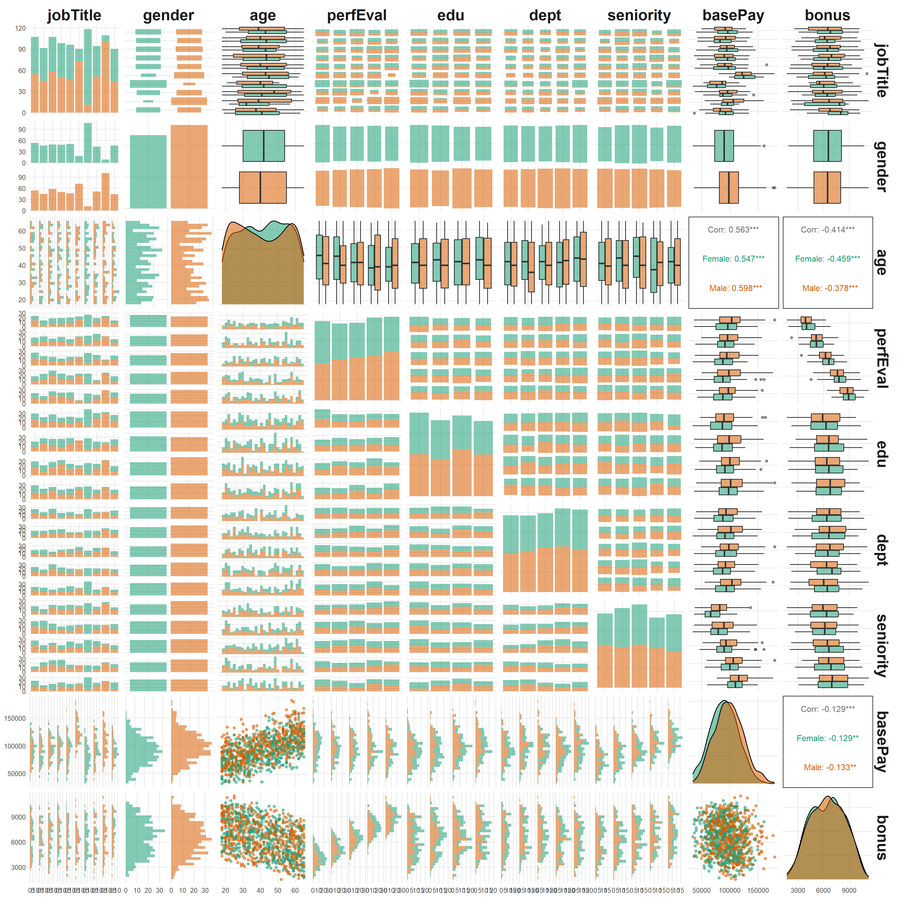
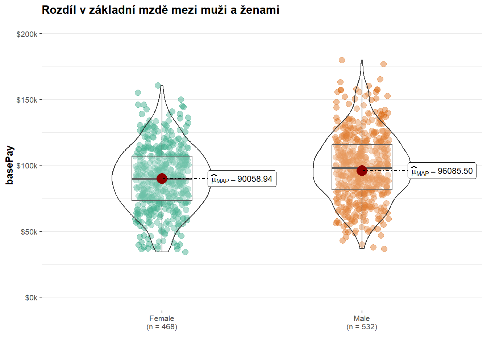
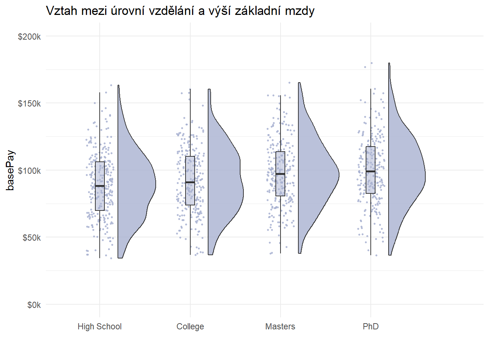
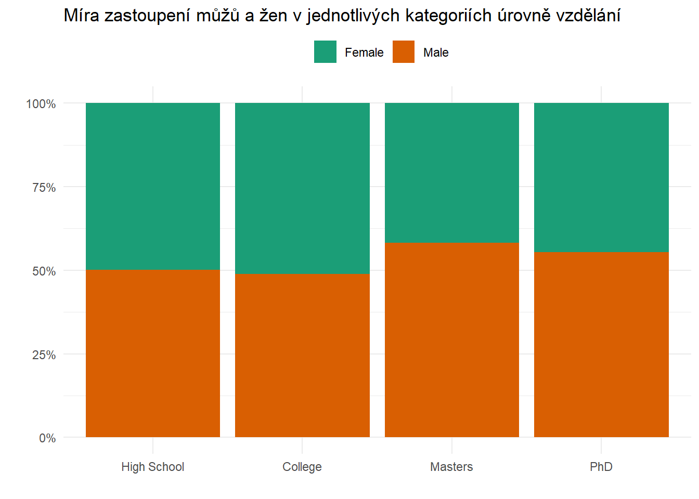
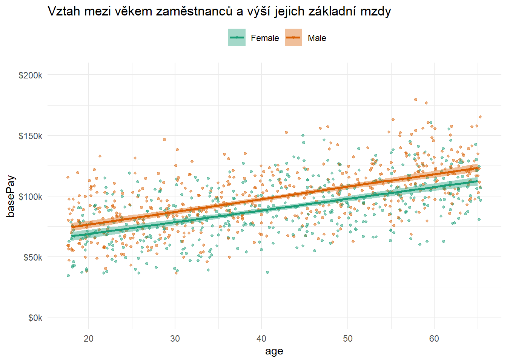
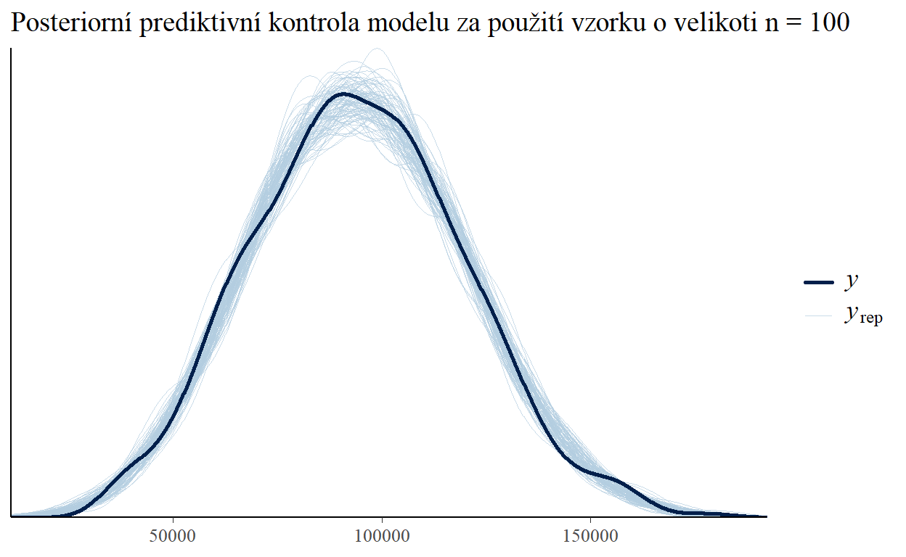
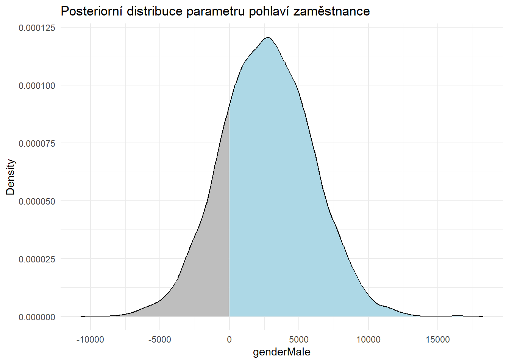
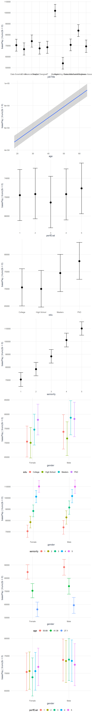

```r
# uploading libraries
library(tidyverse)
library(ggthemes)
library(plotly)
library(RColorBrewer)
library(DT)
library(GGally)
library(skimr)
library(ggstatsplot)
library(ggpubr)

if (!require(remotes)) {
    install.packages("remotes")
}
if (!requireNamespace("raincloudplots", quietly = TRUE)) {
    remotes::install_github('jorvlan/raincloudplots')
}

library(raincloudplots)
library(PupillometryR)

library(brms)
library(tidybayes)

# Keep Czech text in UTF-8 so Distill can read the embedded JSON metadata.
Sys.setlocale("LC_CTYPE", "Czech_Czechia.UTF-8")

# One formatter for every inline number in the post: space as the thousands
# separator, comma as the decimal mark (Czech convention). A negative
# `digits` rounds to tens/hundreds and prints no decimal places.
gender_usd <- function(x, digits = 2) {
  formatC(round(x, digits), format = "f", digits = max(0, digits),
          big.mark = " ", decimal.mark = ",")
}


```


## Co to je *gender pay gap* a jak ho měřit?  

*Gender pay gap* (GPG), v překladu genderová příjmová nerovnost nebo příjmová propast mezi muži a ženami, označuje **typický rozdíl mezi platovým ohodnocením pracujících žen a mužů**. Obvykle je GPG vyjadřována procenty, poměrem typické hrubé hodinové (či roční) mzdy ženy k typické mzdě muže nebo poměrem rozdílu mezi typickou mzdou mužů a žen vůči typické mzdě mužů.  

Bez ohledu na způsob měření GPG, je dobře doloženým faktem, že ženy jsou obecně hůře placeny než muži, jakkoli [se tento rozdíl postupem času zmenšuje](http://www.econ.jku.at/papers/2003/wp0311.pdf). Rozdíly v platech se přitom mohou v jednotlivých zemích poměrně dost lišit. Názorně to ilustruje níže uvedený graf, který ukazuje vývoj (neadjustované) GPG (definované jako poměr rozdílu mediánové mzdy zaměstnaných mužů a žen a mediánové mzdy zaměstnaných mužů) v průběhu několika minulých let v zemích [OECD](https://data.oecd.org/earnwage/gender-wage-gap.htm).

```r
# Keep all available years, including 2016.
gpgoecd <- readr::read_csv("./DP_LIVE_29012021212234147.csv", show_col_types = FALSE)
gpg_years <- sort(unique(gpgoecd$TIME))
country_names <- c(
  AUS = "Austrálie", AUT = "Rakousko", BEL = "Belgie", CAN = "Kanada",
  CHE = "Švýcarsko", CHL = "Chile", COL = "Kolumbie", CRI = "Kostarika",
  CZE = "Česko", DEU = "Německo", DNK = "Dánsko", FIN = "Finsko",
  FRA = "Francie", GBR = "Spojené království", GRC = "Řecko", HUN = "Maďarsko",
  ISL = "Island", ISR = "Izrael", ITA = "Itálie", JPN = "Japonsko",
  KOR = "Jižní Korea", MEX = "Mexiko", NOR = "Norsko", NZL = "Nový Zéland",
  OECD = "OECD", POL = "Polsko", PRT = "Portugalsko", SVK = "Slovensko",
  SWE = "Švédsko", USA = "Spojené státy"
)
gpg_plot_data <- gpgoecd %>%
  dplyr::filter(is.finite(Value))

# Read panels from left to right, starting with the highest latest value.
gpg_latest <- gpg_plot_data %>%
  dplyr::group_by(LOCATION) %>%
  dplyr::slice_max(TIME, n = 1, with_ties = FALSE) %>%
  dplyr::ungroup() %>%
  dplyr::arrange(dplyr::desc(Value), LOCATION)
gpg_country_order <- unname(country_names[gpg_latest$LOCATION])
gpg_plot_data <- gpg_plot_data %>%
  dplyr::mutate(
    country = factor(unname(country_names[LOCATION]), levels = gpg_country_order),
    series = if_else(LOCATION == "CZE", "Česko", "Ostatní"),
    hover = paste0(
      "Země: ", country, "<br>Rok: ", TIME, "<br>GPG: ",
      scales::number(Value, accuracy = 0.1, decimal.mark = ","), " %"
    )
  ) %>%
  dplyr::arrange(LOCATION, TIME)

# Explicit NAs break lines at missing years; no values are interpolated.
gpg_line_data <- gpg_plot_data %>%
  dplyr::select(LOCATION, TIME, Value) %>%
  dplyr::group_by(LOCATION) %>%
  tidyr::complete(TIME = gpg_years) %>%
  dplyr::filter(sum(!is.na(Value)) > 1) %>%
  dplyr::ungroup() %>%
  dplyr::mutate(
    country = factor(unname(country_names[LOCATION]), levels = gpg_country_order),
    series = if_else(LOCATION == "CZE", "Česko", "Ostatní")
  )

# Small multiples give every country the same time axis and percentage scale.
g <- ggplot2::ggplot(gpg_plot_data, aes(x = TIME, y = Value, colour = series)) +
  ggplot2::geom_line(
    data = gpg_line_data, aes(group = LOCATION), linewidth = 0.75, na.rm = TRUE
  ) +
  ggplot2::geom_point(aes(text = hover), size = 2) +
  # Separate x axes repeat year labels; the explicit limits below stay identical.
  ggplot2::facet_wrap(~ country, ncol = 5, scales = "free_x") +
  ggplot2::scale_colour_manual(
    values = c("Ostatní" = "#326781", "Česko" = "#B96236"), guide = "none"
  ) +
  ggplot2::scale_y_continuous(
    limits = c(0, 40), breaks = c(0, 20, 40),
    labels = scales::label_number(suffix = " %", decimal.mark = ","),
    expand = expansion(add = 2)
  ) +
  ggplot2::scale_x_continuous(
    breaks = gpg_years, limits = range(gpg_years),
    expand = expansion(add = 0.25)
  ) +
  ggplot2::labs(
    x = NULL, y = "Gender pay gap (GPG)",
    title = "Genderová příjmová nerovnost v zemích OECD",
    subtitle = paste0(min(gpg_years), "–", max(gpg_years),
                      " · Stejná stupnice pro všechny země · Česko zvýrazněno"),
    caption = paste0(
      "Zdroj: OECD · Panely seřazeny podle poslední dostupné hodnoty.\n",
      "Chybějící roky zůstávají prázdné; jediný dostupný údaj je zobrazen jako bod."
    )
  ) +
  ggplot2::theme_minimal(base_size = 11) +
  ggplot2::theme(
    legend.position = "none",
    panel.grid.minor = element_blank(),
    panel.grid.major.x = element_blank(),
    panel.grid.major.y = element_line(colour = "#E5E9EC", linewidth = 0.35),
    panel.spacing = grid::unit(1.1, "lines"),
    strip.text = element_text(face = "bold", colour = "#374151", hjust = 0, size = 10),
    axis.text = element_text(colour = "#59636E", size = 8),
    axis.title.y = element_text(margin = margin(r = 10)),
    plot.title = element_text(face = "bold", size = 15),
    plot.subtitle = element_text(colour = "#59636E", margin = margin(b = 12)),
    plot.caption = element_text(hjust = 0, colour = "#59636E", margin = margin(t = 14)),
    plot.title.position = "plot", plot.caption.position = "plot"
  )

# Plotly appends the source note to its existing panel labels.
gpg_widget <- plotly::ggplotly(
  g,
  width = 900,
  height = 1100,
  tooltip = "text"
)
gpg_widget %>%
  plotly::layout(
    title = list(
      text = paste0(g$labels$title, "<br><sup>", g$labels$subtitle, "</sup>"),
      x = 0, xanchor = "left"
    ),
    margin = list(l = 65, r = 20, t = 105, b = 90),
    hovermode = "closest",
    annotations = list(list(
      text = gsub("\n", "<br>", g$labels$caption, fixed = TRUE),
      x = 0, y = -0.065, xref = "paper", yref = "paper",
      xanchor = "left", yanchor = "top", align = "left", showarrow = FALSE,
      font = list(size = 11, color = "#59636E")
    ))
  )

```

<iframe srcdoc="&lt;!doctype html&gt;
&lt;html lang=&quot;en&quot;&gt;&lt;head&gt;&lt;meta charset=&quot;utf-8&quot;&gt;&lt;meta name=&quot;viewport&quot; content=&quot;width=device-width, initial-scale=1&quot;&gt;
&lt;style&gt;html,body,#chart{width:100%;height:100%;margin:0}body{overflow:hidden}&lt;/style&gt;
&lt;/head&gt;&lt;body&gt;&lt;div id=&quot;chart&quot;&gt;&lt;/div&gt;&lt;script src=&quot;./paygap/plotly-widget-01.min.js&quot;&gt;&lt;/script&gt;&lt;script&gt;
const figure={&quot;data&quot;:[{&quot;x&quot;:[2016,2017,2018,2019],&quot;y&quot;:[16.023430838,15.614010894,15.127413864,14.714332257],&quot;text&quot;:&quot;&quot;,&quot;type&quot;:&quot;scatter&quot;,&quot;mode&quot;:&quot;lines&quot;,&quot;line&quot;:{&quot;width&quot;:2.834645669291339,&quot;color&quot;:&quot;rgba(185,98,54,1)&quot;,&quot;dash&quot;:&quot;solid&quot;},&quot;hoveron&quot;:&quot;points&quot;,&quot;name&quot;:&quot;Česko&quot;,&quot;legendgroup&quot;:&quot;Česko&quot;,&quot;showlegend&quot;:true,&quot;xaxis&quot;:&quot;x12&quot;,&quot;yaxis&quot;:&quot;y3&quot;,&quot;hoverinfo&quot;:&quot;text&quot;,&quot;frame&quot;:null},{&quot;x&quot;:[2016,2017,2018,2019],&quot;y&quot;:[36.666666667,34.617382557,34.107310951,32.480444715],&quot;text&quot;:&quot;&quot;,&quot;type&quot;:&quot;scatter&quot;,&quot;mode&quot;:&quot;lines&quot;,&quot;line&quot;:{&quot;width&quot;:2.834645669291339,&quot;color&quot;:&quot;rgba(50,103,129,1)&quot;,&quot;dash&quot;:&quot;solid&quot;},&quot;hoveron&quot;:&quot;points&quot;,&quot;name&quot;:&quot;Ostatní&quot;,&quot;legendgroup&quot;:&quot;Ostatní&quot;,&quot;showlegend&quot;:true,&quot;xaxis&quot;:&quot;x&quot;,&quot;yaxis&quot;:&quot;y&quot;,&quot;hoverinfo&quot;:&quot;text&quot;,&quot;frame&quot;:null},{&quot;x&quot;:[2016,2017,2018,2019],&quot;y&quot;:[24.601289447,24.518092661,23.537368955,23.480013436],&quot;text&quot;:&quot;&quot;,&quot;type&quot;:&quot;scatter&quot;,&quot;mode&quot;:&quot;lines&quot;,&quot;line&quot;:{&quot;width&quot;:2.834645669291339,&quot;color&quot;:&quot;rgba(50,103,129,1)&quot;,&quot;dash&quot;:&quot;solid&quot;},&quot;hoveron&quot;:&quot;points&quot;,&quot;name&quot;:&quot;Ostatní&quot;,&quot;legendgroup&quot;:&quot;Ostatní&quot;,&quot;showlegend&quot;:false,&quot;xaxis&quot;:&quot;x2&quot;,&quot;yaxis&quot;:&quot;y&quot;,&quot;hoverinfo&quot;:&quot;text&quot;,&quot;frame&quot;:null},{&quot;x&quot;:[2016,2017,2018,2019],&quot;y&quot;:[21.593332041,21.791789941,22.659192432,null],&quot;text&quot;:&quot;&quot;,&quot;type&quot;:&quot;scatter&quot;,&quot;mode&quot;:&quot;lines&quot;,&quot;line&quot;:{&quot;width&quot;:2.834645669291339,&quot;color&quot;:&quot;rgba(50,103,129,1)&quot;,&quot;dash&quot;:&quot;solid&quot;},&quot;hoveron&quot;:&quot;points&quot;,&quot;name&quot;:&quot;Ostatní&quot;,&quot;legendgroup&quot;:&quot;Ostatní&quot;,&quot;showlegend&quot;:false,&quot;xaxis&quot;:&quot;x3&quot;,&quot;yaxis&quot;:&quot;y&quot;,&quot;hoverinfo&quot;:&quot;text&quot;,&quot;frame&quot;:null},{&quot;x&quot;:[2016,2017,2018,2019],&quot;y&quot;:[16.47225837,17.717920638,18.855203722,null],&quot;text&quot;:&quot;&quot;,&quot;type&quot;:&quot;scatter&quot;,&quot;mode&quot;:&quot;lines&quot;,&quot;line&quot;:{&quot;width&quot;:2.834645669291339,&quot;color&quot;:&quot;rgba(50,103,129,1)&quot;,&quot;dash&quot;:&quot;solid&quot;},&quot;hoveron&quot;:&quot;points&quot;,&quot;name&quot;:&quot;Ostatní&quot;,&quot;legendgroup&quot;:&quot;Ostatní&quot;,&quot;showlegend&quot;:false,&quot;xaxis&quot;:&quot;x4&quot;,&quot;yaxis&quot;:&quot;y&quot;,&quot;hoverinfo&quot;:&quot;text&quot;,&quot;frame&quot;:null},{&quot;x&quot;:[2016,2017,2018,2019],&quot;y&quot;:[16.492248062,11.111111111,14,18.75],&quot;text&quot;:&quot;&quot;,&quot;type&quot;:&quot;scatter&quot;,&quot;mode&quot;:&quot;lines&quot;,&quot;line&quot;:{&quot;width&quot;:2.834645669291339,&quot;color&quot;:&quot;rgba(50,103,129,1)&quot;,&quot;dash&quot;:&quot;solid&quot;},&quot;hoveron&quot;:&quot;points&quot;,&quot;name&quot;:&quot;Ostatní&quot;,&quot;legendgroup&quot;:&quot;Ostatní&quot;,&quot;showlegend&quot;:false,&quot;xaxis&quot;:&quot;x5&quot;,&quot;yaxis&quot;:&quot;y&quot;,&quot;hoverinfo&quot;:&quot;text&quot;,&quot;frame&quot;:null},{&quot;x&quot;:[2016,2017,2018,2019],&quot;y&quot;:[18.142076503,18.172157279,18.910585817,18.470705065],&quot;text&quot;:&quot;&quot;,&quot;type&quot;:&quot;scatter&quot;,&quot;mode&quot;:&quot;lines&quot;,&quot;line&quot;:{&quot;width&quot;:2.834645669291339,&quot;color&quot;:&quot;rgba(50,103,129,1)&quot;,&quot;dash&quot;:&quot;solid&quot;},&quot;hoveron&quot;:&quot;points&quot;,&quot;name&quot;:&quot;Ostatní&quot;,&quot;legendgroup&quot;:&quot;Ostatní&quot;,&quot;showlegend&quot;:false,&quot;xaxis&quot;:&quot;x6&quot;,&quot;yaxis&quot;:&quot;y2&quot;,&quot;hoverinfo&quot;:&quot;text&quot;,&quot;frame&quot;:null},{&quot;x&quot;:[2016,2017,2018,2019],&quot;y&quot;:[18.221153846,18.17322239,18.518518519,17.59375],&quot;text&quot;:&quot;&quot;,&quot;type&quot;:&quot;scatter&quot;,&quot;mode&quot;:&quot;lines&quot;,&quot;line&quot;:{&quot;width&quot;:2.834645669291339,&quot;color&quot;:&quot;rgba(50,103,129,1)&quot;,&quot;dash&quot;:&quot;solid&quot;},&quot;hoveron&quot;:&quot;points&quot;,&quot;name&quot;:&quot;Ostatní&quot;,&quot;legendgroup&quot;:&quot;Ostatní&quot;,&quot;showlegend&quot;:false,&quot;xaxis&quot;:&quot;x7&quot;,&quot;yaxis&quot;:&quot;y2&quot;,&quot;hoverinfo&quot;:&quot;text&quot;,&quot;frame&quot;:null},{&quot;x&quot;:[2016,2017,2018,2019],&quot;y&quot;:[16.796536797,16.534100525,16.310424203,16.008911521],&quot;text&quot;:&quot;&quot;,&quot;type&quot;:&quot;scatter&quot;,&quot;mode&quot;:&quot;lines&quot;,&quot;line&quot;:{&quot;width&quot;:2.834645669291339,&quot;color&quot;:&quot;rgba(50,103,129,1)&quot;,&quot;dash&quot;:&quot;solid&quot;},&quot;hoveron&quot;:&quot;points&quot;,&quot;name&quot;:&quot;Ostatní&quot;,&quot;legendgroup&quot;:&quot;Ostatní&quot;,&quot;showlegend&quot;:false,&quot;xaxis&quot;:&quot;x8&quot;,&quot;yaxis&quot;:&quot;y2&quot;,&quot;hoverinfo&quot;:&quot;text&quot;,&quot;frame&quot;:null},{&quot;x&quot;:[2016,2017,2018,2019],&quot;y&quot;:[15.510718789,16.19047619,15.250121418,null],&quot;text&quot;:&quot;&quot;,&quot;type&quot;:&quot;scatter&quot;,&quot;mode&quot;:&quot;lines&quot;,&quot;line&quot;:{&quot;width&quot;:2.834645669291339,&quot;color&quot;:&quot;rgba(50,103,129,1)&quot;,&quot;dash&quot;:&quot;solid&quot;},&quot;hoveron&quot;:&quot;points&quot;,&quot;name&quot;:&quot;Ostatní&quot;,&quot;legendgroup&quot;:&quot;Ostatní&quot;,&quot;showlegend&quot;:false,&quot;xaxis&quot;:&quot;x9&quot;,&quot;yaxis&quot;:&quot;y2&quot;,&quot;hoverinfo&quot;:&quot;text&quot;,&quot;frame&quot;:null},{&quot;x&quot;:[2016,2017,2018,2019],&quot;y&quot;:[14.762372073,null,15.095647352,null],&quot;text&quot;:&quot;&quot;,&quot;type&quot;:&quot;scatter&quot;,&quot;mode&quot;:&quot;lines&quot;,&quot;line&quot;:{&quot;width&quot;:2.834645669291339,&quot;color&quot;:&quot;rgba(50,103,129,1)&quot;,&quot;dash&quot;:&quot;solid&quot;},&quot;hoveron&quot;:&quot;points&quot;,&quot;name&quot;:&quot;Ostatní&quot;,&quot;legendgroup&quot;:&quot;Ostatní&quot;,&quot;showlegend&quot;:false,&quot;xaxis&quot;:&quot;x10&quot;,&quot;yaxis&quot;:&quot;y2&quot;,&quot;hoverinfo&quot;:&quot;text&quot;,&quot;frame&quot;:null},{&quot;x&quot;:[2016,2017,2018,2019],&quot;y&quot;:[15.670899643,15.38215397,14.876690892,null],&quot;text&quot;:&quot;&quot;,&quot;type&quot;:&quot;scatter&quot;,&quot;mode&quot;:&quot;lines&quot;,&quot;line&quot;:{&quot;width&quot;:2.834645669291339,&quot;color&quot;:&quot;rgba(50,103,129,1)&quot;,&quot;dash&quot;:&quot;solid&quot;},&quot;hoveron&quot;:&quot;points&quot;,&quot;name&quot;:&quot;Ostatní&quot;,&quot;legendgroup&quot;:&quot;Ostatní&quot;,&quot;showlegend&quot;:false,&quot;xaxis&quot;:&quot;x11&quot;,&quot;yaxis&quot;:&quot;y3&quot;,&quot;hoverinfo&quot;:&quot;text&quot;,&quot;frame&quot;:null},{&quot;x&quot;:[2016,2017,2018,2019],&quot;y&quot;:[13.899182143,15.040042332,15.662080133,13.869849949],&quot;text&quot;:&quot;&quot;,&quot;type&quot;:&quot;scatter&quot;,&quot;mode&quot;:&quot;lines&quot;,&quot;line&quot;:{&quot;width&quot;:2.834645669291339,&quot;color&quot;:&quot;rgba(50,103,129,1)&quot;,&quot;dash&quot;:&quot;solid&quot;},&quot;hoveron&quot;:&quot;points&quot;,&quot;name&quot;:&quot;Ostatní&quot;,&quot;legendgroup&quot;:&quot;Ostatní&quot;,&quot;showlegend&quot;:false,&quot;xaxis&quot;:&quot;x13&quot;,&quot;yaxis&quot;:&quot;y3&quot;,&quot;hoverinfo&quot;:&quot;text&quot;,&quot;frame&quot;:null},{&quot;x&quot;:[2016,2017,2018,2019],&quot;y&quot;:[13.2659380064312,13.0077221584776,12.8900073252095,null],&quot;text&quot;:&quot;&quot;,&quot;type&quot;:&quot;scatter&quot;,&quot;mode&quot;:&quot;lines&quot;,&quot;line&quot;:{&quot;width&quot;:2.834645669291339,&quot;color&quot;:&quot;rgba(50,103,129,1)&quot;,&quot;dash&quot;:&quot;solid&quot;},&quot;hoveron&quot;:&quot;points&quot;,&quot;name&quot;:&quot;Ostatní&quot;,&quot;legendgroup&quot;:&quot;Ostatní&quot;,&quot;showlegend&quot;:false,&quot;xaxis&quot;:&quot;x15&quot;,&quot;yaxis&quot;:&quot;y3&quot;,&quot;hoverinfo&quot;:&quot;text&quot;,&quot;frame&quot;:null},{&quot;x&quot;:[2016,2017,2018,2019],&quot;y&quot;:[11.538461538,11.664190193,11.714285714,null],&quot;text&quot;:&quot;&quot;,&quot;type&quot;:&quot;scatter&quot;,&quot;mode&quot;:&quot;lines&quot;,&quot;line&quot;:{&quot;width&quot;:2.834645669291339,&quot;color&quot;:&quot;rgba(50,103,129,1)&quot;,&quot;dash&quot;:&quot;solid&quot;},&quot;hoveron&quot;:&quot;points&quot;,&quot;name&quot;:&quot;Ostatní&quot;,&quot;legendgroup&quot;:&quot;Ostatní&quot;,&quot;showlegend&quot;:false,&quot;xaxis&quot;:&quot;x17&quot;,&quot;yaxis&quot;:&quot;y4&quot;,&quot;hoverinfo&quot;:&quot;text&quot;,&quot;frame&quot;:null},{&quot;x&quot;:[2016,2017,2018,2019],&quot;y&quot;:[9.4178809362,null,11.497909952,null],&quot;text&quot;:&quot;&quot;,&quot;type&quot;:&quot;scatter&quot;,&quot;mode&quot;:&quot;lines&quot;,&quot;line&quot;:{&quot;width&quot;:2.834645669291339,&quot;color&quot;:&quot;rgba(50,103,129,1)&quot;,&quot;dash&quot;:&quot;solid&quot;},&quot;hoveron&quot;:&quot;points&quot;,&quot;name&quot;:&quot;Ostatní&quot;,&quot;legendgroup&quot;:&quot;Ostatní&quot;,&quot;showlegend&quot;:false,&quot;xaxis&quot;:&quot;x19&quot;,&quot;yaxis&quot;:&quot;y4&quot;,&quot;hoverinfo&quot;:&quot;text&quot;,&quot;frame&quot;:null},{&quot;x&quot;:[2016,2017,2018,2019],&quot;y&quot;:[14.313146076,14.773510708,9.5866017068,null],&quot;text&quot;:&quot;&quot;,&quot;type&quot;:&quot;scatter&quot;,&quot;mode&quot;:&quot;lines&quot;,&quot;line&quot;:{&quot;width&quot;:2.834645669291339,&quot;color&quot;:&quot;rgba(50,103,129,1)&quot;,&quot;dash&quot;:&quot;solid&quot;},&quot;hoveron&quot;:&quot;points&quot;,&quot;name&quot;:&quot;Ostatní&quot;,&quot;legendgroup&quot;:&quot;Ostatní&quot;,&quot;showlegend&quot;:false,&quot;xaxis&quot;:&quot;x20&quot;,&quot;yaxis&quot;:&quot;y4&quot;,&quot;hoverinfo&quot;:&quot;text&quot;,&quot;frame&quot;:null},{&quot;x&quot;:[2016,2017,2018,2019],&quot;y&quot;:[8.1699346405,7.3482428115,7.1428571429,7.5757575758],&quot;text&quot;:&quot;&quot;,&quot;type&quot;:&quot;scatter&quot;,&quot;mode&quot;:&quot;lines&quot;,&quot;line&quot;:{&quot;width&quot;:2.834645669291339,&quot;color&quot;:&quot;rgba(50,103,129,1)&quot;,&quot;dash&quot;:&quot;solid&quot;},&quot;hoveron&quot;:&quot;points&quot;,&quot;name&quot;:&quot;Ostatní&quot;,&quot;legendgroup&quot;:&quot;Ostatní&quot;,&quot;showlegend&quot;:false,&quot;xaxis&quot;:&quot;x21&quot;,&quot;yaxis&quot;:&quot;y5&quot;,&quot;hoverinfo&quot;:&quot;text&quot;,&quot;frame&quot;:null},{&quot;x&quot;:[2016,2017,2018,2019],&quot;y&quot;:[7.7692307692,7.1508379888,7.8696925329,6.5084501978],&quot;text&quot;:&quot;&quot;,&quot;type&quot;:&quot;scatter&quot;,&quot;mode&quot;:&quot;lines&quot;,&quot;line&quot;:{&quot;width&quot;:2.834645669291339,&quot;color&quot;:&quot;rgba(50,103,129,1)&quot;,&quot;dash&quot;:&quot;solid&quot;},&quot;hoveron&quot;:&quot;points&quot;,&quot;name&quot;:&quot;Ostatní&quot;,&quot;legendgroup&quot;:&quot;Ostatní&quot;,&quot;showlegend&quot;:false,&quot;xaxis&quot;:&quot;x22&quot;,&quot;yaxis&quot;:&quot;y5&quot;,&quot;hoverinfo&quot;:&quot;text&quot;,&quot;frame&quot;:null},{&quot;x&quot;:[2016,2017,2018,2019],&quot;y&quot;:[9.3643171806,5.3202686547,5.0632142857,null],&quot;text&quot;:&quot;&quot;,&quot;type&quot;:&quot;scatter&quot;,&quot;mode&quot;:&quot;lines&quot;,&quot;line&quot;:{&quot;width&quot;:2.834645669291339,&quot;color&quot;:&quot;rgba(50,103,129,1)&quot;,&quot;dash&quot;:&quot;solid&quot;},&quot;hoveron&quot;:&quot;points&quot;,&quot;name&quot;:&quot;Ostatní&quot;,&quot;legendgroup&quot;:&quot;Ostatní&quot;,&quot;showlegend&quot;:false,&quot;xaxis&quot;:&quot;x24&quot;,&quot;yaxis&quot;:&quot;y5&quot;,&quot;hoverinfo&quot;:&quot;text&quot;,&quot;frame&quot;:null},{&quot;x&quot;:[2016,2017,2018,2019],&quot;y&quot;:[6.764027671,6.3909774436,5.8492413118,4.9940828402],&quot;text&quot;:&quot;&quot;,&quot;type&quot;:&quot;scatter&quot;,&quot;mode&quot;:&quot;lines&quot;,&quot;line&quot;:{&quot;width&quot;:2.834645669291339,&quot;color&quot;:&quot;rgba(50,103,129,1)&quot;,&quot;dash&quot;:&quot;solid&quot;},&quot;hoveron&quot;:&quot;points&quot;,&quot;name&quot;:&quot;Ostatní&quot;,&quot;legendgroup&quot;:&quot;Ostatní&quot;,&quot;showlegend&quot;:false,&quot;xaxis&quot;:&quot;x25&quot;,&quot;yaxis&quot;:&quot;y5&quot;,&quot;hoverinfo&quot;:&quot;text&quot;,&quot;frame&quot;:null},{&quot;x&quot;:[2016,2017,2018,2019],&quot;y&quot;:[5.7326280384,5.2966919656,4.8632060095,null],&quot;text&quot;:&quot;&quot;,&quot;type&quot;:&quot;scatter&quot;,&quot;mode&quot;:&quot;lines&quot;,&quot;line&quot;:{&quot;width&quot;:2.834645669291339,&quot;color&quot;:&quot;rgba(50,103,129,1)&quot;,&quot;dash&quot;:&quot;solid&quot;},&quot;hoveron&quot;:&quot;points&quot;,&quot;name&quot;:&quot;Ostatní&quot;,&quot;legendgroup&quot;:&quot;Ostatní&quot;,&quot;showlegend&quot;:false,&quot;xaxis&quot;:&quot;x26&quot;,&quot;yaxis&quot;:&quot;y6&quot;,&quot;hoverinfo&quot;:&quot;text&quot;,&quot;frame&quot;:null},{&quot;x&quot;:[2016,2017,2018,2019],&quot;y&quot;:[4.486279454,4.486279454,4.486279454,null],&quot;text&quot;:&quot;&quot;,&quot;type&quot;:&quot;scatter&quot;,&quot;mode&quot;:&quot;lines&quot;,&quot;line&quot;:{&quot;width&quot;:2.834645669291339,&quot;color&quot;:&quot;rgba(50,103,129,1)&quot;,&quot;dash&quot;:&quot;solid&quot;},&quot;hoveron&quot;:&quot;points&quot;,&quot;name&quot;:&quot;Ostatní&quot;,&quot;legendgroup&quot;:&quot;Ostatní&quot;,&quot;showlegend&quot;:false,&quot;xaxis&quot;:&quot;x27&quot;,&quot;yaxis&quot;:&quot;y6&quot;,&quot;hoverinfo&quot;:&quot;text&quot;,&quot;frame&quot;:null},{&quot;x&quot;:[2016,2017,2018,2019],&quot;y&quot;:[3.7012987013,4.1902961563,null,null],&quot;text&quot;:&quot;&quot;,&quot;type&quot;:&quot;scatter&quot;,&quot;mode&quot;:&quot;lines&quot;,&quot;line&quot;:{&quot;width&quot;:2.834645669291339,&quot;color&quot;:&quot;rgba(50,103,129,1)&quot;,&quot;dash&quot;:&quot;solid&quot;},&quot;hoveron&quot;:&quot;points&quot;,&quot;name&quot;:&quot;Ostatní&quot;,&quot;legendgroup&quot;:&quot;Ostatní&quot;,&quot;showlegend&quot;:false,&quot;xaxis&quot;:&quot;x28&quot;,&quot;yaxis&quot;:&quot;y6&quot;,&quot;hoverinfo&quot;:&quot;text&quot;,&quot;frame&quot;:null},{&quot;x&quot;:[2016,2017,2018,2019],&quot;y&quot;:[7.0917506686,7.6923076923,5.7879259259,4],&quot;text&quot;:&quot;&quot;,&quot;type&quot;:&quot;scatter&quot;,&quot;mode&quot;:&quot;lines&quot;,&quot;line&quot;:{&quot;width&quot;:2.834645669291339,&quot;color&quot;:&quot;rgba(50,103,129,1)&quot;,&quot;dash&quot;:&quot;solid&quot;},&quot;hoveron&quot;:&quot;points&quot;,&quot;name&quot;:&quot;Ostatní&quot;,&quot;legendgroup&quot;:&quot;Ostatní&quot;,&quot;showlegend&quot;:false,&quot;xaxis&quot;:&quot;x29&quot;,&quot;yaxis&quot;:&quot;y6&quot;,&quot;hoverinfo&quot;:&quot;text&quot;,&quot;frame&quot;:null},{&quot;x&quot;:[2016,2017,2018,2019],&quot;y&quot;:[1.7857142857,2.967032967,4.7252747253,0],&quot;text&quot;:&quot;&quot;,&quot;type&quot;:&quot;scatter&quot;,&quot;mode&quot;:&quot;lines&quot;,&quot;line&quot;:{&quot;width&quot;:2.834645669291339,&quot;color&quot;:&quot;rgba(50,103,129,1)&quot;,&quot;dash&quot;:&quot;solid&quot;},&quot;hoveron&quot;:&quot;points&quot;,&quot;name&quot;:&quot;Ostatní&quot;,&quot;legendgroup&quot;:&quot;Ostatní&quot;,&quot;showlegend&quot;:false,&quot;xaxis&quot;:&quot;x30&quot;,&quot;yaxis&quot;:&quot;y6&quot;,&quot;hoverinfo&quot;:&quot;text&quot;,&quot;frame&quot;:null},{&quot;x&quot;:[2016,2017,2018,2019],&quot;y&quot;:[16.023430838,15.614010894,15.127413864,14.714332257],&quot;text&quot;:[&quot;Země: Česko&lt;br&gt;Rok: 2016&lt;br&gt;GPG: 16,0 %&quot;,&quot;Země: Česko&lt;br&gt;Rok: 2017&lt;br&gt;GPG: 15,6 %&quot;,&quot;Země: Česko&lt;br&gt;Rok: 2018&lt;br&gt;GPG: 15,1 %&quot;,&quot;Země: Česko&lt;br&gt;Rok: 2019&lt;br&gt;GPG: 14,7 %&quot;],&quot;type&quot;:&quot;scatter&quot;,&quot;mode&quot;:&quot;markers&quot;,&quot;marker&quot;:{&quot;autocolorscale&quot;:false,&quot;color&quot;:&quot;rgba(185,98,54,1)&quot;,&quot;opacity&quot;:1,&quot;size&quot;:7.559055118110237,&quot;symbol&quot;:&quot;circle&quot;,&quot;line&quot;:{&quot;width&quot;:1.8897637795275593,&quot;color&quot;:&quot;rgba(185,98,54,1)&quot;}},&quot;hoveron&quot;:&quot;points&quot;,&quot;name&quot;:&quot;Česko&quot;,&quot;legendgroup&quot;:&quot;Česko&quot;,&quot;showlegend&quot;:false,&quot;xaxis&quot;:&quot;x12&quot;,&quot;yaxis&quot;:&quot;y3&quot;,&quot;hoverinfo&quot;:&quot;text&quot;,&quot;frame&quot;:null},{&quot;x&quot;:[2016,2017,2018,2019],&quot;y&quot;:[36.666666667,34.617382557,34.107310951,32.480444715],&quot;text&quot;:[&quot;Země: Jižní Korea&lt;br&gt;Rok: 2016&lt;br&gt;GPG: 36,7 %&quot;,&quot;Země: Jižní Korea&lt;br&gt;Rok: 2017&lt;br&gt;GPG: 34,6 %&quot;,&quot;Země: Jižní Korea&lt;br&gt;Rok: 2018&lt;br&gt;GPG: 34,1 %&quot;,&quot;Země: Jižní Korea&lt;br&gt;Rok: 2019&lt;br&gt;GPG: 32,5 %&quot;],&quot;type&quot;:&quot;scatter&quot;,&quot;mode&quot;:&quot;markers&quot;,&quot;marker&quot;:{&quot;autocolorscale&quot;:false,&quot;color&quot;:&quot;rgba(50,103,129,1)&quot;,&quot;opacity&quot;:1,&quot;size&quot;:7.559055118110237,&quot;symbol&quot;:&quot;circle&quot;,&quot;line&quot;:{&quot;width&quot;:1.8897637795275593,&quot;color&quot;:&quot;rgba(50,103,129,1)&quot;}},&quot;hoveron&quot;:&quot;points&quot;,&quot;name&quot;:&quot;Ostatní&quot;,&quot;legendgroup&quot;:&quot;Ostatní&quot;,&quot;showlegend&quot;:false,&quot;xaxis&quot;:&quot;x&quot;,&quot;yaxis&quot;:&quot;y&quot;,&quot;hoverinfo&quot;:&quot;text&quot;,&quot;frame&quot;:null},{&quot;x&quot;:[2016,2017,2018,2019],&quot;y&quot;:[24.601289447,24.518092661,23.537368955,23.480013436],&quot;text&quot;:[&quot;Země: Japonsko&lt;br&gt;Rok: 2016&lt;br&gt;GPG: 24,6 %&quot;,&quot;Země: Japonsko&lt;br&gt;Rok: 2017&lt;br&gt;GPG: 24,5 %&quot;,&quot;Země: Japonsko&lt;br&gt;Rok: 2018&lt;br&gt;GPG: 23,5 %&quot;,&quot;Země: Japonsko&lt;br&gt;Rok: 2019&lt;br&gt;GPG: 23,5 %&quot;],&quot;type&quot;:&quot;scatter&quot;,&quot;mode&quot;:&quot;markers&quot;,&quot;marker&quot;:{&quot;autocolorscale&quot;:false,&quot;color&quot;:&quot;rgba(50,103,129,1)&quot;,&quot;opacity&quot;:1,&quot;size&quot;:7.559055118110237,&quot;symbol&quot;:&quot;circle&quot;,&quot;line&quot;:{&quot;width&quot;:1.8897637795275593,&quot;color&quot;:&quot;rgba(50,103,129,1)&quot;}},&quot;hoveron&quot;:&quot;points&quot;,&quot;name&quot;:&quot;Ostatní&quot;,&quot;legendgroup&quot;:&quot;Ostatní&quot;,&quot;showlegend&quot;:false,&quot;xaxis&quot;:&quot;x2&quot;,&quot;yaxis&quot;:&quot;y&quot;,&quot;hoverinfo&quot;:&quot;text&quot;,&quot;frame&quot;:null},{&quot;x&quot;:[2016,2017,2018],&quot;y&quot;:[21.593332041,21.791789941,22.659192432],&quot;text&quot;:[&quot;Země: Izrael&lt;br&gt;Rok: 2016&lt;br&gt;GPG: 21,6 %&quot;,&quot;Země: Izrael&lt;br&gt;Rok: 2017&lt;br&gt;GPG: 21,8 %&quot;,&quot;Země: Izrael&lt;br&gt;Rok: 2018&lt;br&gt;GPG: 22,7 %&quot;],&quot;type&quot;:&quot;scatter&quot;,&quot;mode&quot;:&quot;markers&quot;,&quot;marker&quot;:{&quot;autocolorscale&quot;:false,&quot;color&quot;:&quot;rgba(50,103,129,1)&quot;,&quot;opacity&quot;:1,&quot;size&quot;:7.559055118110237,&quot;symbol&quot;:&quot;circle&quot;,&quot;line&quot;:{&quot;width&quot;:1.8897637795275593,&quot;color&quot;:&quot;rgba(50,103,129,1)&quot;}},&quot;hoveron&quot;:&quot;points&quot;,&quot;name&quot;:&quot;Ostatní&quot;,&quot;legendgroup&quot;:&quot;Ostatní&quot;,&quot;showlegend&quot;:false,&quot;xaxis&quot;:&quot;x3&quot;,&quot;yaxis&quot;:&quot;y&quot;,&quot;hoverinfo&quot;:&quot;text&quot;,&quot;frame&quot;:null},{&quot;x&quot;:[2016,2017,2018],&quot;y&quot;:[16.47225837,17.717920638,18.855203722],&quot;text&quot;:[&quot;Země: Finsko&lt;br&gt;Rok: 2016&lt;br&gt;GPG: 16,5 %&quot;,&quot;Země: Finsko&lt;br&gt;Rok: 2017&lt;br&gt;GPG: 17,7 %&quot;,&quot;Země: Finsko&lt;br&gt;Rok: 2018&lt;br&gt;GPG: 18,9 %&quot;],&quot;type&quot;:&quot;scatter&quot;,&quot;mode&quot;:&quot;markers&quot;,&quot;marker&quot;:{&quot;autocolorscale&quot;:false,&quot;color&quot;:&quot;rgba(50,103,129,1)&quot;,&quot;opacity&quot;:1,&quot;size&quot;:7.559055118110237,&quot;symbol&quot;:&quot;circle&quot;,&quot;line&quot;:{&quot;width&quot;:1.8897637795275593,&quot;color&quot;:&quot;rgba(50,103,129,1)&quot;}},&quot;hoveron&quot;:&quot;points&quot;,&quot;name&quot;:&quot;Ostatní&quot;,&quot;legendgroup&quot;:&quot;Ostatní&quot;,&quot;showlegend&quot;:false,&quot;xaxis&quot;:&quot;x4&quot;,&quot;yaxis&quot;:&quot;y&quot;,&quot;hoverinfo&quot;:&quot;text&quot;,&quot;frame&quot;:null},{&quot;x&quot;:[2016,2017,2018,2019],&quot;y&quot;:[16.492248062,11.111111111,14,18.75],&quot;text&quot;:[&quot;Země: Mexiko&lt;br&gt;Rok: 2016&lt;br&gt;GPG: 16,5 %&quot;,&quot;Země: Mexiko&lt;br&gt;Rok: 2017&lt;br&gt;GPG: 11,1 %&quot;,&quot;Země: Mexiko&lt;br&gt;Rok: 2018&lt;br&gt;GPG: 14,0 %&quot;,&quot;Země: Mexiko&lt;br&gt;Rok: 2019&lt;br&gt;GPG: 18,8 %&quot;],&quot;type&quot;:&quot;scatter&quot;,&quot;mode&quot;:&quot;markers&quot;,&quot;marker&quot;:{&quot;autocolorscale&quot;:false,&quot;color&quot;:&quot;rgba(50,103,129,1)&quot;,&quot;opacity&quot;:1,&quot;size&quot;:7.559055118110237,&quot;symbol&quot;:&quot;circle&quot;,&quot;line&quot;:{&quot;width&quot;:1.8897637795275593,&quot;color&quot;:&quot;rgba(50,103,129,1)&quot;}},&quot;hoveron&quot;:&quot;points&quot;,&quot;name&quot;:&quot;Ostatní&quot;,&quot;legendgroup&quot;:&quot;Ostatní&quot;,&quot;showlegend&quot;:false,&quot;xaxis&quot;:&quot;x5&quot;,&quot;yaxis&quot;:&quot;y&quot;,&quot;hoverinfo&quot;:&quot;text&quot;,&quot;frame&quot;:null},{&quot;x&quot;:[2016,2017,2018,2019],&quot;y&quot;:[18.142076503,18.172157279,18.910585817,18.470705065],&quot;text&quot;:[&quot;Země: Spojené státy&lt;br&gt;Rok: 2016&lt;br&gt;GPG: 18,1 %&quot;,&quot;Země: Spojené státy&lt;br&gt;Rok: 2017&lt;br&gt;GPG: 18,2 %&quot;,&quot;Země: Spojené státy&lt;br&gt;Rok: 2018&lt;br&gt;GPG: 18,9 %&quot;,&quot;Země: Spojené státy&lt;br&gt;Rok: 2019&lt;br&gt;GPG: 18,5 %&quot;],&quot;type&quot;:&quot;scatter&quot;,&quot;mode&quot;:&quot;markers&quot;,&quot;marker&quot;:{&quot;autocolorscale&quot;:false,&quot;color&quot;:&quot;rgba(50,103,129,1)&quot;,&quot;opacity&quot;:1,&quot;size&quot;:7.559055118110237,&quot;symbol&quot;:&quot;circle&quot;,&quot;line&quot;:{&quot;width&quot;:1.8897637795275593,&quot;color&quot;:&quot;rgba(50,103,129,1)&quot;}},&quot;hoveron&quot;:&quot;points&quot;,&quot;name&quot;:&quot;Ostatní&quot;,&quot;legendgroup&quot;:&quot;Ostatní&quot;,&quot;showlegend&quot;:false,&quot;xaxis&quot;:&quot;x6&quot;,&quot;yaxis&quot;:&quot;y2&quot;,&quot;hoverinfo&quot;:&quot;text&quot;,&quot;frame&quot;:null},{&quot;x&quot;:[2016,2017,2018,2019],&quot;y&quot;:[18.221153846,18.17322239,18.518518519,17.59375],&quot;text&quot;:[&quot;Země: Kanada&lt;br&gt;Rok: 2016&lt;br&gt;GPG: 18,2 %&quot;,&quot;Země: Kanada&lt;br&gt;Rok: 2017&lt;br&gt;GPG: 18,2 %&quot;,&quot;Země: Kanada&lt;br&gt;Rok: 2018&lt;br&gt;GPG: 18,5 %&quot;,&quot;Země: Kanada&lt;br&gt;Rok: 2019&lt;br&gt;GPG: 17,6 %&quot;],&quot;type&quot;:&quot;scatter&quot;,&quot;mode&quot;:&quot;markers&quot;,&quot;marker&quot;:{&quot;autocolorscale&quot;:false,&quot;color&quot;:&quot;rgba(50,103,129,1)&quot;,&quot;opacity&quot;:1,&quot;size&quot;:7.559055118110237,&quot;symbol&quot;:&quot;circle&quot;,&quot;line&quot;:{&quot;width&quot;:1.8897637795275593,&quot;color&quot;:&quot;rgba(50,103,129,1)&quot;}},&quot;hoveron&quot;:&quot;points&quot;,&quot;name&quot;:&quot;Ostatní&quot;,&quot;legendgroup&quot;:&quot;Ostatní&quot;,&quot;showlegend&quot;:false,&quot;xaxis&quot;:&quot;x7&quot;,&quot;yaxis&quot;:&quot;y2&quot;,&quot;hoverinfo&quot;:&quot;text&quot;,&quot;frame&quot;:null},{&quot;x&quot;:[2016,2017,2018,2019],&quot;y&quot;:[16.796536797,16.534100525,16.310424203,16.008911521],&quot;text&quot;:[&quot;Země: Spojené království&lt;br&gt;Rok: 2016&lt;br&gt;GPG: 16,8 %&quot;,&quot;Země: Spojené království&lt;br&gt;Rok: 2017&lt;br&gt;GPG: 16,5 %&quot;,&quot;Země: Spojené království&lt;br&gt;Rok: 2018&lt;br&gt;GPG: 16,3 %&quot;,&quot;Země: Spojené království&lt;br&gt;Rok: 2019&lt;br&gt;GPG: 16,0 %&quot;],&quot;type&quot;:&quot;scatter&quot;,&quot;mode&quot;:&quot;markers&quot;,&quot;marker&quot;:{&quot;autocolorscale&quot;:false,&quot;color&quot;:&quot;rgba(50,103,129,1)&quot;,&quot;opacity&quot;:1,&quot;size&quot;:7.559055118110237,&quot;symbol&quot;:&quot;circle&quot;,&quot;line&quot;:{&quot;width&quot;:1.8897637795275593,&quot;color&quot;:&quot;rgba(50,103,129,1)&quot;}},&quot;hoveron&quot;:&quot;points&quot;,&quot;name&quot;:&quot;Ostatní&quot;,&quot;legendgroup&quot;:&quot;Ostatní&quot;,&quot;showlegend&quot;:false,&quot;xaxis&quot;:&quot;x8&quot;,&quot;yaxis&quot;:&quot;y2&quot;,&quot;hoverinfo&quot;:&quot;text&quot;,&quot;frame&quot;:null},{&quot;x&quot;:[2016,2017,2018],&quot;y&quot;:[15.510718789,16.19047619,15.250121418],&quot;text&quot;:[&quot;Země: Německo&lt;br&gt;Rok: 2016&lt;br&gt;GPG: 15,5 %&quot;,&quot;Země: Německo&lt;br&gt;Rok: 2017&lt;br&gt;GPG: 16,2 %&quot;,&quot;Země: Německo&lt;br&gt;Rok: 2018&lt;br&gt;GPG: 15,3 %&quot;],&quot;type&quot;:&quot;scatter&quot;,&quot;mode&quot;:&quot;markers&quot;,&quot;marker&quot;:{&quot;autocolorscale&quot;:false,&quot;color&quot;:&quot;rgba(50,103,129,1)&quot;,&quot;opacity&quot;:1,&quot;size&quot;:7.559055118110237,&quot;symbol&quot;:&quot;circle&quot;,&quot;line&quot;:{&quot;width&quot;:1.8897637795275593,&quot;color&quot;:&quot;rgba(50,103,129,1)&quot;}},&quot;hoveron&quot;:&quot;points&quot;,&quot;name&quot;:&quot;Ostatní&quot;,&quot;legendgroup&quot;:&quot;Ostatní&quot;,&quot;showlegend&quot;:false,&quot;xaxis&quot;:&quot;x9&quot;,&quot;yaxis&quot;:&quot;y2&quot;,&quot;hoverinfo&quot;:&quot;text&quot;,&quot;frame&quot;:null},{&quot;x&quot;:[2016,2018],&quot;y&quot;:[14.762372073,15.095647352],&quot;text&quot;:[&quot;Země: Švýcarsko&lt;br&gt;Rok: 2016&lt;br&gt;GPG: 14,8 %&quot;,&quot;Země: Švýcarsko&lt;br&gt;Rok: 2018&lt;br&gt;GPG: 15,1 %&quot;],&quot;type&quot;:&quot;scatter&quot;,&quot;mode&quot;:&quot;markers&quot;,&quot;marker&quot;:{&quot;autocolorscale&quot;:false,&quot;color&quot;:&quot;rgba(50,103,129,1)&quot;,&quot;opacity&quot;:1,&quot;size&quot;:7.559055118110237,&quot;symbol&quot;:&quot;circle&quot;,&quot;line&quot;:{&quot;width&quot;:1.8897637795275593,&quot;color&quot;:&quot;rgba(50,103,129,1)&quot;}},&quot;hoveron&quot;:&quot;points&quot;,&quot;name&quot;:&quot;Ostatní&quot;,&quot;legendgroup&quot;:&quot;Ostatní&quot;,&quot;showlegend&quot;:false,&quot;xaxis&quot;:&quot;x10&quot;,&quot;yaxis&quot;:&quot;y2&quot;,&quot;hoverinfo&quot;:&quot;text&quot;,&quot;frame&quot;:null},{&quot;x&quot;:[2016,2017,2018],&quot;y&quot;:[15.670899643,15.38215397,14.876690892],&quot;text&quot;:[&quot;Země: Rakousko&lt;br&gt;Rok: 2016&lt;br&gt;GPG: 15,7 %&quot;,&quot;Země: Rakousko&lt;br&gt;Rok: 2017&lt;br&gt;GPG: 15,4 %&quot;,&quot;Země: Rakousko&lt;br&gt;Rok: 2018&lt;br&gt;GPG: 14,9 %&quot;],&quot;type&quot;:&quot;scatter&quot;,&quot;mode&quot;:&quot;markers&quot;,&quot;marker&quot;:{&quot;autocolorscale&quot;:false,&quot;color&quot;:&quot;rgba(50,103,129,1)&quot;,&quot;opacity&quot;:1,&quot;size&quot;:7.559055118110237,&quot;symbol&quot;:&quot;circle&quot;,&quot;line&quot;:{&quot;width&quot;:1.8897637795275593,&quot;color&quot;:&quot;rgba(50,103,129,1)&quot;}},&quot;hoveron&quot;:&quot;points&quot;,&quot;name&quot;:&quot;Ostatní&quot;,&quot;legendgroup&quot;:&quot;Ostatní&quot;,&quot;showlegend&quot;:false,&quot;xaxis&quot;:&quot;x11&quot;,&quot;yaxis&quot;:&quot;y3&quot;,&quot;hoverinfo&quot;:&quot;text&quot;,&quot;frame&quot;:null},{&quot;x&quot;:[2016,2017,2018,2019],&quot;y&quot;:[13.899182143,15.040042332,15.662080133,13.869849949],&quot;text&quot;:[&quot;Země: Slovensko&lt;br&gt;Rok: 2016&lt;br&gt;GPG: 13,9 %&quot;,&quot;Země: Slovensko&lt;br&gt;Rok: 2017&lt;br&gt;GPG: 15,0 %&quot;,&quot;Země: Slovensko&lt;br&gt;Rok: 2018&lt;br&gt;GPG: 15,7 %&quot;,&quot;Země: Slovensko&lt;br&gt;Rok: 2019&lt;br&gt;GPG: 13,9 %&quot;],&quot;type&quot;:&quot;scatter&quot;,&quot;mode&quot;:&quot;markers&quot;,&quot;marker&quot;:{&quot;autocolorscale&quot;:false,&quot;color&quot;:&quot;rgba(50,103,129,1)&quot;,&quot;opacity&quot;:1,&quot;size&quot;:7.559055118110237,&quot;symbol&quot;:&quot;circle&quot;,&quot;line&quot;:{&quot;width&quot;:1.8897637795275593,&quot;color&quot;:&quot;rgba(50,103,129,1)&quot;}},&quot;hoveron&quot;:&quot;points&quot;,&quot;name&quot;:&quot;Ostatní&quot;,&quot;legendgroup&quot;:&quot;Ostatní&quot;,&quot;showlegend&quot;:false,&quot;xaxis&quot;:&quot;x13&quot;,&quot;yaxis&quot;:&quot;y3&quot;,&quot;hoverinfo&quot;:&quot;text&quot;,&quot;frame&quot;:null},{&quot;x&quot;:[2016],&quot;y&quot;:[13.691416535],&quot;text&quot;:&quot;Země: Francie&lt;br&gt;Rok: 2016&lt;br&gt;GPG: 13,7 %&quot;,&quot;type&quot;:&quot;scatter&quot;,&quot;mode&quot;:&quot;markers&quot;,&quot;marker&quot;:{&quot;autocolorscale&quot;:false,&quot;color&quot;:&quot;rgba(50,103,129,1)&quot;,&quot;opacity&quot;:1,&quot;size&quot;:7.559055118110237,&quot;symbol&quot;:&quot;circle&quot;,&quot;line&quot;:{&quot;width&quot;:1.8897637795275593,&quot;color&quot;:&quot;rgba(50,103,129,1)&quot;}},&quot;hoveron&quot;:&quot;points&quot;,&quot;name&quot;:&quot;Ostatní&quot;,&quot;legendgroup&quot;:&quot;Ostatní&quot;,&quot;showlegend&quot;:false,&quot;xaxis&quot;:&quot;x14&quot;,&quot;yaxis&quot;:&quot;y3&quot;,&quot;hoverinfo&quot;:&quot;text&quot;,&quot;frame&quot;:null},{&quot;x&quot;:[2016,2017,2018],&quot;y&quot;:[13.2659380064312,13.0077221584776,12.8900073252095],&quot;text&quot;:[&quot;Země: OECD&lt;br&gt;Rok: 2016&lt;br&gt;GPG: 13,3 %&quot;,&quot;Země: OECD&lt;br&gt;Rok: 2017&lt;br&gt;GPG: 13,0 %&quot;,&quot;Země: OECD&lt;br&gt;Rok: 2018&lt;br&gt;GPG: 12,9 %&quot;],&quot;type&quot;:&quot;scatter&quot;,&quot;mode&quot;:&quot;markers&quot;,&quot;marker&quot;:{&quot;autocolorscale&quot;:false,&quot;color&quot;:&quot;rgba(50,103,129,1)&quot;,&quot;opacity&quot;:1,&quot;size&quot;:7.559055118110237,&quot;symbol&quot;:&quot;circle&quot;,&quot;line&quot;:{&quot;width&quot;:1.8897637795275593,&quot;color&quot;:&quot;rgba(50,103,129,1)&quot;}},&quot;hoveron&quot;:&quot;points&quot;,&quot;name&quot;:&quot;Ostatní&quot;,&quot;legendgroup&quot;:&quot;Ostatní&quot;,&quot;showlegend&quot;:false,&quot;xaxis&quot;:&quot;x15&quot;,&quot;yaxis&quot;:&quot;y3&quot;,&quot;hoverinfo&quot;:&quot;text&quot;,&quot;frame&quot;:null},{&quot;x&quot;:[2017],&quot;y&quot;:[12.5],&quot;text&quot;:&quot;Země: Chile&lt;br&gt;Rok: 2017&lt;br&gt;GPG: 12,5 %&quot;,&quot;type&quot;:&quot;scatter&quot;,&quot;mode&quot;:&quot;markers&quot;,&quot;marker&quot;:{&quot;autocolorscale&quot;:false,&quot;color&quot;:&quot;rgba(50,103,129,1)&quot;,&quot;opacity&quot;:1,&quot;size&quot;:7.559055118110237,&quot;symbol&quot;:&quot;circle&quot;,&quot;line&quot;:{&quot;width&quot;:1.8897637795275593,&quot;color&quot;:&quot;rgba(50,103,129,1)&quot;}},&quot;hoveron&quot;:&quot;points&quot;,&quot;name&quot;:&quot;Ostatní&quot;,&quot;legendgroup&quot;:&quot;Ostatní&quot;,&quot;showlegend&quot;:false,&quot;xaxis&quot;:&quot;x16&quot;,&quot;yaxis&quot;:&quot;y4&quot;,&quot;hoverinfo&quot;:&quot;text&quot;,&quot;frame&quot;:null},{&quot;x&quot;:[2016,2017,2018],&quot;y&quot;:[11.538461538,11.664190193,11.714285714],&quot;text&quot;:[&quot;Země: Austrálie&lt;br&gt;Rok: 2016&lt;br&gt;GPG: 11,5 %&quot;,&quot;Země: Austrálie&lt;br&gt;Rok: 2017&lt;br&gt;GPG: 11,7 %&quot;,&quot;Země: Austrálie&lt;br&gt;Rok: 2018&lt;br&gt;GPG: 11,7 %&quot;],&quot;type&quot;:&quot;scatter&quot;,&quot;mode&quot;:&quot;markers&quot;,&quot;marker&quot;:{&quot;autocolorscale&quot;:false,&quot;color&quot;:&quot;rgba(50,103,129,1)&quot;,&quot;opacity&quot;:1,&quot;size&quot;:7.559055118110237,&quot;symbol&quot;:&quot;circle&quot;,&quot;line&quot;:{&quot;width&quot;:1.8897637795275593,&quot;color&quot;:&quot;rgba(50,103,129,1)&quot;}},&quot;hoveron&quot;:&quot;points&quot;,&quot;name&quot;:&quot;Ostatní&quot;,&quot;legendgroup&quot;:&quot;Ostatní&quot;,&quot;showlegend&quot;:false,&quot;xaxis&quot;:&quot;x17&quot;,&quot;yaxis&quot;:&quot;y4&quot;,&quot;hoverinfo&quot;:&quot;text&quot;,&quot;frame&quot;:null},{&quot;x&quot;:[2016],&quot;y&quot;:[11.543446315],&quot;text&quot;:&quot;Země: Island&lt;br&gt;Rok: 2016&lt;br&gt;GPG: 11,5 %&quot;,&quot;type&quot;:&quot;scatter&quot;,&quot;mode&quot;:&quot;markers&quot;,&quot;marker&quot;:{&quot;autocolorscale&quot;:false,&quot;color&quot;:&quot;rgba(50,103,129,1)&quot;,&quot;opacity&quot;:1,&quot;size&quot;:7.559055118110237,&quot;symbol&quot;:&quot;circle&quot;,&quot;line&quot;:{&quot;width&quot;:1.8897637795275593,&quot;color&quot;:&quot;rgba(50,103,129,1)&quot;}},&quot;hoveron&quot;:&quot;points&quot;,&quot;name&quot;:&quot;Ostatní&quot;,&quot;legendgroup&quot;:&quot;Ostatní&quot;,&quot;showlegend&quot;:false,&quot;xaxis&quot;:&quot;x18&quot;,&quot;yaxis&quot;:&quot;y4&quot;,&quot;hoverinfo&quot;:&quot;text&quot;,&quot;frame&quot;:null},{&quot;x&quot;:[2016,2018],&quot;y&quot;:[9.4178809362,11.497909952],&quot;text&quot;:[&quot;Země: Polsko&lt;br&gt;Rok: 2016&lt;br&gt;GPG: 9,4 %&quot;,&quot;Země: Polsko&lt;br&gt;Rok: 2018&lt;br&gt;GPG: 11,5 %&quot;],&quot;type&quot;:&quot;scatter&quot;,&quot;mode&quot;:&quot;markers&quot;,&quot;marker&quot;:{&quot;autocolorscale&quot;:false,&quot;color&quot;:&quot;rgba(50,103,129,1)&quot;,&quot;opacity&quot;:1,&quot;size&quot;:7.559055118110237,&quot;symbol&quot;:&quot;circle&quot;,&quot;line&quot;:{&quot;width&quot;:1.8897637795275593,&quot;color&quot;:&quot;rgba(50,103,129,1)&quot;}},&quot;hoveron&quot;:&quot;points&quot;,&quot;name&quot;:&quot;Ostatní&quot;,&quot;legendgroup&quot;:&quot;Ostatní&quot;,&quot;showlegend&quot;:false,&quot;xaxis&quot;:&quot;x19&quot;,&quot;yaxis&quot;:&quot;y4&quot;,&quot;hoverinfo&quot;:&quot;text&quot;,&quot;frame&quot;:null},{&quot;x&quot;:[2016,2017,2018],&quot;y&quot;:[14.313146076,14.773510708,9.5866017068],&quot;text&quot;:[&quot;Země: Portugalsko&lt;br&gt;Rok: 2016&lt;br&gt;GPG: 14,3 %&quot;,&quot;Země: Portugalsko&lt;br&gt;Rok: 2017&lt;br&gt;GPG: 14,8 %&quot;,&quot;Země: Portugalsko&lt;br&gt;Rok: 2018&lt;br&gt;GPG: 9,6 %&quot;],&quot;type&quot;:&quot;scatter&quot;,&quot;mode&quot;:&quot;markers&quot;,&quot;marker&quot;:{&quot;autocolorscale&quot;:false,&quot;color&quot;:&quot;rgba(50,103,129,1)&quot;,&quot;opacity&quot;:1,&quot;size&quot;:7.559055118110237,&quot;symbol&quot;:&quot;circle&quot;,&quot;line&quot;:{&quot;width&quot;:1.8897637795275593,&quot;color&quot;:&quot;rgba(50,103,129,1)&quot;}},&quot;hoveron&quot;:&quot;points&quot;,&quot;name&quot;:&quot;Ostatní&quot;,&quot;legendgroup&quot;:&quot;Ostatní&quot;,&quot;showlegend&quot;:false,&quot;xaxis&quot;:&quot;x20&quot;,&quot;yaxis&quot;:&quot;y4&quot;,&quot;hoverinfo&quot;:&quot;text&quot;,&quot;frame&quot;:null},{&quot;x&quot;:[2016,2017,2018,2019],&quot;y&quot;:[8.1699346405,7.3482428115,7.1428571429,7.5757575758],&quot;text&quot;:[&quot;Země: Švédsko&lt;br&gt;Rok: 2016&lt;br&gt;GPG: 8,2 %&quot;,&quot;Země: Švédsko&lt;br&gt;Rok: 2017&lt;br&gt;GPG: 7,3 %&quot;,&quot;Země: Švédsko&lt;br&gt;Rok: 2018&lt;br&gt;GPG: 7,1 %&quot;,&quot;Země: Švédsko&lt;br&gt;Rok: 2019&lt;br&gt;GPG: 7,6 %&quot;],&quot;type&quot;:&quot;scatter&quot;,&quot;mode&quot;:&quot;markers&quot;,&quot;marker&quot;:{&quot;autocolorscale&quot;:false,&quot;color&quot;:&quot;rgba(50,103,129,1)&quot;,&quot;opacity&quot;:1,&quot;size&quot;:7.559055118110237,&quot;symbol&quot;:&quot;circle&quot;,&quot;line&quot;:{&quot;width&quot;:1.8897637795275593,&quot;color&quot;:&quot;rgba(50,103,129,1)&quot;}},&quot;hoveron&quot;:&quot;points&quot;,&quot;name&quot;:&quot;Ostatní&quot;,&quot;legendgroup&quot;:&quot;Ostatní&quot;,&quot;showlegend&quot;:false,&quot;xaxis&quot;:&quot;x21&quot;,&quot;yaxis&quot;:&quot;y5&quot;,&quot;hoverinfo&quot;:&quot;text&quot;,&quot;frame&quot;:null},{&quot;x&quot;:[2016,2017,2018,2019],&quot;y&quot;:[7.7692307692,7.1508379888,7.8696925329,6.5084501978],&quot;text&quot;:[&quot;Země: Nový Zéland&lt;br&gt;Rok: 2016&lt;br&gt;GPG: 7,8 %&quot;,&quot;Země: Nový Zéland&lt;br&gt;Rok: 2017&lt;br&gt;GPG: 7,2 %&quot;,&quot;Země: Nový Zéland&lt;br&gt;Rok: 2018&lt;br&gt;GPG: 7,9 %&quot;,&quot;Země: Nový Zéland&lt;br&gt;Rok: 2019&lt;br&gt;GPG: 6,5 %&quot;],&quot;type&quot;:&quot;scatter&quot;,&quot;mode&quot;:&quot;markers&quot;,&quot;marker&quot;:{&quot;autocolorscale&quot;:false,&quot;color&quot;:&quot;rgba(50,103,129,1)&quot;,&quot;opacity&quot;:1,&quot;size&quot;:7.559055118110237,&quot;symbol&quot;:&quot;circle&quot;,&quot;line&quot;:{&quot;width&quot;:1.8897637795275593,&quot;color&quot;:&quot;rgba(50,103,129,1)&quot;}},&quot;hoveron&quot;:&quot;points&quot;,&quot;name&quot;:&quot;Ostatní&quot;,&quot;legendgroup&quot;:&quot;Ostatní&quot;,&quot;showlegend&quot;:false,&quot;xaxis&quot;:&quot;x22&quot;,&quot;yaxis&quot;:&quot;y5&quot;,&quot;hoverinfo&quot;:&quot;text&quot;,&quot;frame&quot;:null},{&quot;x&quot;:[2016],&quot;y&quot;:[5.5555555533],&quot;text&quot;:&quot;Země: Itálie&lt;br&gt;Rok: 2016&lt;br&gt;GPG: 5,6 %&quot;,&quot;type&quot;:&quot;scatter&quot;,&quot;mode&quot;:&quot;markers&quot;,&quot;marker&quot;:{&quot;autocolorscale&quot;:false,&quot;color&quot;:&quot;rgba(50,103,129,1)&quot;,&quot;opacity&quot;:1,&quot;size&quot;:7.559055118110237,&quot;symbol&quot;:&quot;circle&quot;,&quot;line&quot;:{&quot;width&quot;:1.8897637795275593,&quot;color&quot;:&quot;rgba(50,103,129,1)&quot;}},&quot;hoveron&quot;:&quot;points&quot;,&quot;name&quot;:&quot;Ostatní&quot;,&quot;legendgroup&quot;:&quot;Ostatní&quot;,&quot;showlegend&quot;:false,&quot;xaxis&quot;:&quot;x23&quot;,&quot;yaxis&quot;:&quot;y5&quot;,&quot;hoverinfo&quot;:&quot;text&quot;,&quot;frame&quot;:null},{&quot;x&quot;:[2016,2017,2018],&quot;y&quot;:[9.3643171806,5.3202686547,5.0632142857],&quot;text&quot;:[&quot;Země: Maďarsko&lt;br&gt;Rok: 2016&lt;br&gt;GPG: 9,4 %&quot;,&quot;Země: Maďarsko&lt;br&gt;Rok: 2017&lt;br&gt;GPG: 5,3 %&quot;,&quot;Země: Maďarsko&lt;br&gt;Rok: 2018&lt;br&gt;GPG: 5,1 %&quot;],&quot;type&quot;:&quot;scatter&quot;,&quot;mode&quot;:&quot;markers&quot;,&quot;marker&quot;:{&quot;autocolorscale&quot;:false,&quot;color&quot;:&quot;rgba(50,103,129,1)&quot;,&quot;opacity&quot;:1,&quot;size&quot;:7.559055118110237,&quot;symbol&quot;:&quot;circle&quot;,&quot;line&quot;:{&quot;width&quot;:1.8897637795275593,&quot;color&quot;:&quot;rgba(50,103,129,1)&quot;}},&quot;hoveron&quot;:&quot;points&quot;,&quot;name&quot;:&quot;Ostatní&quot;,&quot;legendgroup&quot;:&quot;Ostatní&quot;,&quot;showlegend&quot;:false,&quot;xaxis&quot;:&quot;x24&quot;,&quot;yaxis&quot;:&quot;y5&quot;,&quot;hoverinfo&quot;:&quot;text&quot;,&quot;frame&quot;:null},{&quot;x&quot;:[2016,2017,2018,2019],&quot;y&quot;:[6.764027671,6.3909774436,5.8492413118,4.9940828402],&quot;text&quot;:[&quot;Země: Norsko&lt;br&gt;Rok: 2016&lt;br&gt;GPG: 6,8 %&quot;,&quot;Země: Norsko&lt;br&gt;Rok: 2017&lt;br&gt;GPG: 6,4 %&quot;,&quot;Země: Norsko&lt;br&gt;Rok: 2018&lt;br&gt;GPG: 5,8 %&quot;,&quot;Země: Norsko&lt;br&gt;Rok: 2019&lt;br&gt;GPG: 5,0 %&quot;],&quot;type&quot;:&quot;scatter&quot;,&quot;mode&quot;:&quot;markers&quot;,&quot;marker&quot;:{&quot;autocolorscale&quot;:false,&quot;color&quot;:&quot;rgba(50,103,129,1)&quot;,&quot;opacity&quot;:1,&quot;size&quot;:7.559055118110237,&quot;symbol&quot;:&quot;circle&quot;,&quot;line&quot;:{&quot;width&quot;:1.8897637795275593,&quot;color&quot;:&quot;rgba(50,103,129,1)&quot;}},&quot;hoveron&quot;:&quot;points&quot;,&quot;name&quot;:&quot;Ostatní&quot;,&quot;legendgroup&quot;:&quot;Ostatní&quot;,&quot;showlegend&quot;:false,&quot;xaxis&quot;:&quot;x25&quot;,&quot;yaxis&quot;:&quot;y5&quot;,&quot;hoverinfo&quot;:&quot;text&quot;,&quot;frame&quot;:null},{&quot;x&quot;:[2016,2017,2018],&quot;y&quot;:[5.7326280384,5.2966919656,4.8632060095],&quot;text&quot;:[&quot;Země: Dánsko&lt;br&gt;Rok: 2016&lt;br&gt;GPG: 5,7 %&quot;,&quot;Země: Dánsko&lt;br&gt;Rok: 2017&lt;br&gt;GPG: 5,3 %&quot;,&quot;Země: Dánsko&lt;br&gt;Rok: 2018&lt;br&gt;GPG: 4,9 %&quot;],&quot;type&quot;:&quot;scatter&quot;,&quot;mode&quot;:&quot;markers&quot;,&quot;marker&quot;:{&quot;autocolorscale&quot;:false,&quot;color&quot;:&quot;rgba(50,103,129,1)&quot;,&quot;opacity&quot;:1,&quot;size&quot;:7.559055118110237,&quot;symbol&quot;:&quot;circle&quot;,&quot;line&quot;:{&quot;width&quot;:1.8897637795275593,&quot;color&quot;:&quot;rgba(50,103,129,1)&quot;}},&quot;hoveron&quot;:&quot;points&quot;,&quot;name&quot;:&quot;Ostatní&quot;,&quot;legendgroup&quot;:&quot;Ostatní&quot;,&quot;showlegend&quot;:false,&quot;xaxis&quot;:&quot;x26&quot;,&quot;yaxis&quot;:&quot;y6&quot;,&quot;hoverinfo&quot;:&quot;text&quot;,&quot;frame&quot;:null},{&quot;x&quot;:[2016,2017,2018],&quot;y&quot;:[4.486279454,4.486279454,4.486279454],&quot;text&quot;:[&quot;Země: Řecko&lt;br&gt;Rok: 2016&lt;br&gt;GPG: 4,5 %&quot;,&quot;Země: Řecko&lt;br&gt;Rok: 2017&lt;br&gt;GPG: 4,5 %&quot;,&quot;Země: Řecko&lt;br&gt;Rok: 2018&lt;br&gt;GPG: 4,5 %&quot;],&quot;type&quot;:&quot;scatter&quot;,&quot;mode&quot;:&quot;markers&quot;,&quot;marker&quot;:{&quot;autocolorscale&quot;:false,&quot;color&quot;:&quot;rgba(50,103,129,1)&quot;,&quot;opacity&quot;:1,&quot;size&quot;:7.559055118110237,&quot;symbol&quot;:&quot;circle&quot;,&quot;line&quot;:{&quot;width&quot;:1.8897637795275593,&quot;color&quot;:&quot;rgba(50,103,129,1)&quot;}},&quot;hoveron&quot;:&quot;points&quot;,&quot;name&quot;:&quot;Ostatní&quot;,&quot;legendgroup&quot;:&quot;Ostatní&quot;,&quot;showlegend&quot;:false,&quot;xaxis&quot;:&quot;x27&quot;,&quot;yaxis&quot;:&quot;y6&quot;,&quot;hoverinfo&quot;:&quot;text&quot;,&quot;frame&quot;:null},{&quot;x&quot;:[2016,2017],&quot;y&quot;:[3.7012987013,4.1902961563],&quot;text&quot;:[&quot;Země: Belgie&lt;br&gt;Rok: 2016&lt;br&gt;GPG: 3,7 %&quot;,&quot;Země: Belgie&lt;br&gt;Rok: 2017&lt;br&gt;GPG: 4,2 %&quot;],&quot;type&quot;:&quot;scatter&quot;,&quot;mode&quot;:&quot;markers&quot;,&quot;marker&quot;:{&quot;autocolorscale&quot;:false,&quot;color&quot;:&quot;rgba(50,103,129,1)&quot;,&quot;opacity&quot;:1,&quot;size&quot;:7.559055118110237,&quot;symbol&quot;:&quot;circle&quot;,&quot;line&quot;:{&quot;width&quot;:1.8897637795275593,&quot;color&quot;:&quot;rgba(50,103,129,1)&quot;}},&quot;hoveron&quot;:&quot;points&quot;,&quot;name&quot;:&quot;Ostatní&quot;,&quot;legendgroup&quot;:&quot;Ostatní&quot;,&quot;showlegend&quot;:false,&quot;xaxis&quot;:&quot;x28&quot;,&quot;yaxis&quot;:&quot;y6&quot;,&quot;hoverinfo&quot;:&quot;text&quot;,&quot;frame&quot;:null},{&quot;x&quot;:[2016,2017,2018,2019],&quot;y&quot;:[7.0917506686,7.6923076923,5.7879259259,4],&quot;text&quot;:[&quot;Země: Kolumbie&lt;br&gt;Rok: 2016&lt;br&gt;GPG: 7,1 %&quot;,&quot;Země: Kolumbie&lt;br&gt;Rok: 2017&lt;br&gt;GPG: 7,7 %&quot;,&quot;Země: Kolumbie&lt;br&gt;Rok: 2018&lt;br&gt;GPG: 5,8 %&quot;,&quot;Země: Kolumbie&lt;br&gt;Rok: 2019&lt;br&gt;GPG: 4,0 %&quot;],&quot;type&quot;:&quot;scatter&quot;,&quot;mode&quot;:&quot;markers&quot;,&quot;marker&quot;:{&quot;autocolorscale&quot;:false,&quot;color&quot;:&quot;rgba(50,103,129,1)&quot;,&quot;opacity&quot;:1,&quot;size&quot;:7.559055118110237,&quot;symbol&quot;:&quot;circle&quot;,&quot;line&quot;:{&quot;width&quot;:1.8897637795275593,&quot;color&quot;:&quot;rgba(50,103,129,1)&quot;}},&quot;hoveron&quot;:&quot;points&quot;,&quot;name&quot;:&quot;Ostatní&quot;,&quot;legendgroup&quot;:&quot;Ostatní&quot;,&quot;showlegend&quot;:false,&quot;xaxis&quot;:&quot;x29&quot;,&quot;yaxis&quot;:&quot;y6&quot;,&quot;hoverinfo&quot;:&quot;text&quot;,&quot;frame&quot;:null},{&quot;x&quot;:[2016,2017,2018,2019],&quot;y&quot;:[1.7857142857,2.967032967,4.7252747253,0],&quot;text&quot;:[&quot;Země: Kostarika&lt;br&gt;Rok: 2016&lt;br&gt;GPG: 1,8 %&quot;,&quot;Země: Kostarika&lt;br&gt;Rok: 2017&lt;br&gt;GPG: 3,0 %&quot;,&quot;Země: Kostarika&lt;br&gt;Rok: 2018&lt;br&gt;GPG: 4,7 %&quot;,&quot;Země: Kostarika&lt;br&gt;Rok: 2019&lt;br&gt;GPG: 0,0 %&quot;],&quot;type&quot;:&quot;scatter&quot;,&quot;mode&quot;:&quot;markers&quot;,&quot;marker&quot;:{&quot;autocolorscale&quot;:false,&quot;color&quot;:&quot;rgba(50,103,129,1)&quot;,&quot;opacity&quot;:1,&quot;size&quot;:7.559055118110237,&quot;symbol&quot;:&quot;circle&quot;,&quot;line&quot;:{&quot;width&quot;:1.8897637795275593,&quot;color&quot;:&quot;rgba(50,103,129,1)&quot;}},&quot;hoveron&quot;:&quot;points&quot;,&quot;name&quot;:&quot;Ostatní&quot;,&quot;legendgroup&quot;:&quot;Ostatní&quot;,&quot;showlegend&quot;:false,&quot;xaxis&quot;:&quot;x30&quot;,&quot;yaxis&quot;:&quot;y6&quot;,&quot;hoverinfo&quot;:&quot;text&quot;,&quot;frame&quot;:null}],&quot;layout&quot;:{&quot;margin&quot;:{&quot;t&quot;:105,&quot;r&quot;:20,&quot;b&quot;:90,&quot;l&quot;:65},&quot;paper_bgcolor&quot;:&quot;rgba(255,255,255,1)&quot;,&quot;font&quot;:{&quot;color&quot;:&quot;rgba(0,0,0,1)&quot;,&quot;family&quot;:&quot;&quot;,&quot;size&quot;:14.611872146118724},&quot;title&quot;:{&quot;text&quot;:&quot;Genderová příjmová nerovnost v zemích OECD&lt;br&gt;&lt;sup&gt;2016–2019 · Stejná stupnice pro všechny země · Česko zvýrazněno&lt;\/sup&gt;&quot;,&quot;font&quot;:{&quot;color&quot;:&quot;rgba(0,0,0,1)&quot;,&quot;family&quot;:&quot;&quot;,&quot;size&quot;:19.9252801992528},&quot;x&quot;:0,&quot;xref&quot;:&quot;paper&quot;,&quot;xanchor&quot;:&quot;left&quot;},&quot;xaxis&quot;:{&quot;domain&quot;:[0,0.1824],&quot;automargin&quot;:true,&quot;type&quot;:&quot;linear&quot;,&quot;autorange&quot;:false,&quot;range&quot;:[2015.75,2019.25],&quot;tickmode&quot;:&quot;array&quot;,&quot;ticktext&quot;:[&quot;2016&quot;,&quot;2017&quot;,&quot;2018&quot;,&quot;2019&quot;],&quot;tickvals&quot;:[2016,2017,2018,2019],&quot;categoryorder&quot;:&quot;array&quot;,&quot;categoryarray&quot;:[&quot;2016&quot;,&quot;2017&quot;,&quot;2018&quot;,&quot;2019&quot;],&quot;nticks&quot;:null,&quot;ticks&quot;:&quot;&quot;,&quot;tickcolor&quot;:null,&quot;ticklen&quot;:3.652968036529681,&quot;tickwidth&quot;:0,&quot;showticklabels&quot;:true,&quot;tickfont&quot;:{&quot;color&quot;:&quot;rgba(89,99,110,1)&quot;,&quot;family&quot;:&quot;&quot;,&quot;size&quot;:10.62681610626816},&quot;tickangle&quot;:0,&quot;showline&quot;:false,&quot;linecolor&quot;:null,&quot;linewidth&quot;:0,&quot;showgrid&quot;:false,&quot;gridcolor&quot;:null,&quot;gridwidth&quot;:0,&quot;zeroline&quot;:false,&quot;anchor&quot;:&quot;y&quot;,&quot;title&quot;:&quot;&quot;,&quot;hoverformat&quot;:&quot;.2f&quot;},&quot;yaxis&quot;:{&quot;domain&quot;:[0.8640358353145402,1],&quot;automargin&quot;:true,&quot;type&quot;:&quot;linear&quot;,&quot;autorange&quot;:false,&quot;range&quot;:[-2,42],&quot;tickmode&quot;:&quot;array&quot;,&quot;ticktext&quot;:[&quot;0 %&quot;,&quot;20 %&quot;,&quot;40 %&quot;],&quot;tickvals&quot;:[0,20,40],&quot;categoryorder&quot;:&quot;array&quot;,&quot;categoryarray&quot;:[&quot;0 %&quot;,&quot;20 %&quot;,&quot;40 %&quot;],&quot;nticks&quot;:null,&quot;ticks&quot;:&quot;&quot;,&quot;tickcolor&quot;:null,&quot;ticklen&quot;:3.652968036529681,&quot;tickwidth&quot;:0,&quot;showticklabels&quot;:true,&quot;tickfont&quot;:{&quot;color&quot;:&quot;rgba(89,99,110,1)&quot;,&quot;family&quot;:&quot;&quot;,&quot;size&quot;:10.62681610626816},&quot;tickangle&quot;:0,&quot;showline&quot;:false,&quot;linecolor&quot;:null,&quot;linewidth&quot;:0,&quot;showgrid&quot;:true,&quot;gridcolor&quot;:&quot;rgba(229,233,236,1)&quot;,&quot;gridwidth&quot;:0,&quot;zeroline&quot;:false,&quot;anchor&quot;:&quot;x&quot;,&quot;title&quot;:&quot;&quot;,&quot;hoverformat&quot;:&quot;.2f&quot;},&quot;annotations&quot;:[{&quot;text&quot;:&quot;Gender pay gap (GPG)&quot;,&quot;x&quot;:0,&quot;y&quot;:0.5,&quot;showarrow&quot;:false,&quot;ax&quot;:0,&quot;ay&quot;:0,&quot;font&quot;:{&quot;color&quot;:&quot;rgba(0,0,0,1)&quot;,&quot;family&quot;:&quot;&quot;,&quot;size&quot;:14.611872146118724},&quot;xref&quot;:&quot;paper&quot;,&quot;yref&quot;:&quot;paper&quot;,&quot;textangle&quot;:-90,&quot;xanchor&quot;:&quot;right&quot;,&quot;yanchor&quot;:&quot;center&quot;,&quot;annotationType&quot;:&quot;axis&quot;,&quot;xshift&quot;:-41.11249481112495},{&quot;text&quot;:&quot;Jižní Korea&quot;,&quot;x&quot;:0.0912,&quot;y&quot;:1,&quot;showarrow&quot;:false,&quot;ax&quot;:0,&quot;ay&quot;:0,&quot;font&quot;:{&quot;color&quot;:&quot;rgba(55,65,81,1)&quot;,&quot;family&quot;:&quot;&quot;,&quot;size&quot;:13.283520132835198},&quot;xref&quot;:&quot;paper&quot;,&quot;yref&quot;:&quot;paper&quot;,&quot;textangle&quot;:0,&quot;xanchor&quot;:&quot;center&quot;,&quot;yanchor&quot;:&quot;bottom&quot;},{&quot;text&quot;:&quot;Japonsko&quot;,&quot;x&quot;:0.30000000000000004,&quot;y&quot;:1,&quot;showarrow&quot;:false,&quot;ax&quot;:0,&quot;ay&quot;:0,&quot;font&quot;:{&quot;color&quot;:&quot;rgba(55,65,81,1)&quot;,&quot;family&quot;:&quot;&quot;,&quot;size&quot;:13.283520132835198},&quot;xref&quot;:&quot;paper&quot;,&quot;yref&quot;:&quot;paper&quot;,&quot;textangle&quot;:0,&quot;xanchor&quot;:&quot;center&quot;,&quot;yanchor&quot;:&quot;bottom&quot;},{&quot;text&quot;:&quot;Izrael&quot;,&quot;x&quot;:0.5000000000000001,&quot;y&quot;:1,&quot;showarrow&quot;:false,&quot;ax&quot;:0,&quot;ay&quot;:0,&quot;font&quot;:{&quot;color&quot;:&quot;rgba(55,65,81,1)&quot;,&quot;family&quot;:&quot;&quot;,&quot;size&quot;:13.283520132835198},&quot;xref&quot;:&quot;paper&quot;,&quot;yref&quot;:&quot;paper&quot;,&quot;textangle&quot;:0,&quot;xanchor&quot;:&quot;center&quot;,&quot;yanchor&quot;:&quot;bottom&quot;},{&quot;text&quot;:&quot;Finsko&quot;,&quot;x&quot;:0.7000000000000001,&quot;y&quot;:1,&quot;showarrow&quot;:false,&quot;ax&quot;:0,&quot;ay&quot;:0,&quot;font&quot;:{&quot;color&quot;:&quot;rgba(55,65,81,1)&quot;,&quot;family&quot;:&quot;&quot;,&quot;size&quot;:13.283520132835198},&quot;xref&quot;:&quot;paper&quot;,&quot;yref&quot;:&quot;paper&quot;,&quot;textangle&quot;:0,&quot;xanchor&quot;:&quot;center&quot;,&quot;yanchor&quot;:&quot;bottom&quot;},{&quot;text&quot;:&quot;Mexiko&quot;,&quot;x&quot;:0.9088,&quot;y&quot;:1,&quot;showarrow&quot;:false,&quot;ax&quot;:0,&quot;ay&quot;:0,&quot;font&quot;:{&quot;color&quot;:&quot;rgba(55,65,81,1)&quot;,&quot;family&quot;:&quot;&quot;,&quot;size&quot;:13.283520132835198},&quot;xref&quot;:&quot;paper&quot;,&quot;yref&quot;:&quot;paper&quot;,&quot;textangle&quot;:0,&quot;xanchor&quot;:&quot;center&quot;,&quot;yanchor&quot;:&quot;bottom&quot;},{&quot;text&quot;:&quot;Spojené státy&quot;,&quot;x&quot;:0.0912,&quot;y&quot;:0.8026308313521265,&quot;showarrow&quot;:false,&quot;ax&quot;:0,&quot;ay&quot;:0,&quot;font&quot;:{&quot;color&quot;:&quot;rgba(55,65,81,1)&quot;,&quot;family&quot;:&quot;&quot;,&quot;size&quot;:13.283520132835198},&quot;xref&quot;:&quot;paper&quot;,&quot;yref&quot;:&quot;paper&quot;,&quot;textangle&quot;:0,&quot;xanchor&quot;:&quot;center&quot;,&quot;yanchor&quot;:&quot;bottom&quot;},{&quot;text&quot;:&quot;Kanada&quot;,&quot;x&quot;:0.30000000000000004,&quot;y&quot;:0.8026308313521265,&quot;showarrow&quot;:false,&quot;ax&quot;:0,&quot;ay&quot;:0,&quot;font&quot;:{&quot;color&quot;:&quot;rgba(55,65,81,1)&quot;,&quot;family&quot;:&quot;&quot;,&quot;size&quot;:13.283520132835198},&quot;xref&quot;:&quot;paper&quot;,&quot;yref&quot;:&quot;paper&quot;,&quot;textangle&quot;:0,&quot;xanchor&quot;:&quot;center&quot;,&quot;yanchor&quot;:&quot;bottom&quot;},{&quot;text&quot;:&quot;Spojené království&quot;,&quot;x&quot;:0.5000000000000001,&quot;y&quot;:0.8026308313521265,&quot;showarrow&quot;:false,&quot;ax&quot;:0,&quot;ay&quot;:0,&quot;font&quot;:{&quot;color&quot;:&quot;rgba(55,65,81,1)&quot;,&quot;family&quot;:&quot;&quot;,&quot;size&quot;:13.283520132835198},&quot;xref&quot;:&quot;paper&quot;,&quot;yref&quot;:&quot;paper&quot;,&quot;textangle&quot;:0,&quot;xanchor&quot;:&quot;center&quot;,&quot;yanchor&quot;:&quot;bottom&quot;},{&quot;text&quot;:&quot;Německo&quot;,&quot;x&quot;:0.7000000000000001,&quot;y&quot;:0.8026308313521265,&quot;showarrow&quot;:false,&quot;ax&quot;:0,&quot;ay&quot;:0,&quot;font&quot;:{&quot;color&quot;:&quot;rgba(55,65,81,1)&quot;,&quot;family&quot;:&quot;&quot;,&quot;size&quot;:13.283520132835198},&quot;xref&quot;:&quot;paper&quot;,&quot;yref&quot;:&quot;paper&quot;,&quot;textangle&quot;:0,&quot;xanchor&quot;:&quot;center&quot;,&quot;yanchor&quot;:&quot;bottom&quot;},{&quot;text&quot;:&quot;Švýcarsko&quot;,&quot;x&quot;:0.9088,&quot;y&quot;:0.8026308313521265,&quot;showarrow&quot;:false,&quot;ax&quot;:0,&quot;ay&quot;:0,&quot;font&quot;:{&quot;color&quot;:&quot;rgba(55,65,81,1)&quot;,&quot;family&quot;:&quot;&quot;,&quot;size&quot;:13.283520132835198},&quot;xref&quot;:&quot;paper&quot;,&quot;yref&quot;:&quot;paper&quot;,&quot;textangle&quot;:0,&quot;xanchor&quot;:&quot;center&quot;,&quot;yanchor&quot;:&quot;bottom&quot;},{&quot;text&quot;:&quot;Rakousko&quot;,&quot;x&quot;:0.0912,&quot;y&quot;:0.6359641646854599,&quot;showarrow&quot;:false,&quot;ax&quot;:0,&quot;ay&quot;:0,&quot;font&quot;:{&quot;color&quot;:&quot;rgba(55,65,81,1)&quot;,&quot;family&quot;:&quot;&quot;,&quot;size&quot;:13.283520132835198},&quot;xref&quot;:&quot;paper&quot;,&quot;yref&quot;:&quot;paper&quot;,&quot;textangle&quot;:0,&quot;xanchor&quot;:&quot;center&quot;,&quot;yanchor&quot;:&quot;bottom&quot;},{&quot;text&quot;:&quot;Česko&quot;,&quot;x&quot;:0.30000000000000004,&quot;y&quot;:0.6359641646854599,&quot;showarrow&quot;:false,&quot;ax&quot;:0,&quot;ay&quot;:0,&quot;font&quot;:{&quot;color&quot;:&quot;rgba(55,65,81,1)&quot;,&quot;family&quot;:&quot;&quot;,&quot;size&quot;:13.283520132835198},&quot;xref&quot;:&quot;paper&quot;,&quot;yref&quot;:&quot;paper&quot;,&quot;textangle&quot;:0,&quot;xanchor&quot;:&quot;center&quot;,&quot;yanchor&quot;:&quot;bottom&quot;},{&quot;text&quot;:&quot;Slovensko&quot;,&quot;x&quot;:0.5000000000000001,&quot;y&quot;:0.6359641646854599,&quot;showarrow&quot;:false,&quot;ax&quot;:0,&quot;ay&quot;:0,&quot;font&quot;:{&quot;color&quot;:&quot;rgba(55,65,81,1)&quot;,&quot;family&quot;:&quot;&quot;,&quot;size&quot;:13.283520132835198},&quot;xref&quot;:&quot;paper&quot;,&quot;yref&quot;:&quot;paper&quot;,&quot;textangle&quot;:0,&quot;xanchor&quot;:&quot;center&quot;,&quot;yanchor&quot;:&quot;bottom&quot;},{&quot;text&quot;:&quot;Francie&quot;,&quot;x&quot;:0.7000000000000001,&quot;y&quot;:0.6359641646854599,&quot;showarrow&quot;:false,&quot;ax&quot;:0,&quot;ay&quot;:0,&quot;font&quot;:{&quot;color&quot;:&quot;rgba(55,65,81,1)&quot;,&quot;family&quot;:&quot;&quot;,&quot;size&quot;:13.283520132835198},&quot;xref&quot;:&quot;paper&quot;,&quot;yref&quot;:&quot;paper&quot;,&quot;textangle&quot;:0,&quot;xanchor&quot;:&quot;center&quot;,&quot;yanchor&quot;:&quot;bottom&quot;},{&quot;text&quot;:&quot;OECD&quot;,&quot;x&quot;:0.9088,&quot;y&quot;:0.6359641646854599,&quot;showarrow&quot;:false,&quot;ax&quot;:0,&quot;ay&quot;:0,&quot;font&quot;:{&quot;color&quot;:&quot;rgba(55,65,81,1)&quot;,&quot;family&quot;:&quot;&quot;,&quot;size&quot;:13.283520132835198},&quot;xref&quot;:&quot;paper&quot;,&quot;yref&quot;:&quot;paper&quot;,&quot;textangle&quot;:0,&quot;xanchor&quot;:&quot;center&quot;,&quot;yanchor&quot;:&quot;bottom&quot;},{&quot;text&quot;:&quot;Chile&quot;,&quot;x&quot;:0.0912,&quot;y&quot;:0.46929749801879317,&quot;showarrow&quot;:false,&quot;ax&quot;:0,&quot;ay&quot;:0,&quot;font&quot;:{&quot;color&quot;:&quot;rgba(55,65,81,1)&quot;,&quot;family&quot;:&quot;&quot;,&quot;size&quot;:13.283520132835198},&quot;xref&quot;:&quot;paper&quot;,&quot;yref&quot;:&quot;paper&quot;,&quot;textangle&quot;:0,&quot;xanchor&quot;:&quot;center&quot;,&quot;yanchor&quot;:&quot;bottom&quot;},{&quot;text&quot;:&quot;Austrálie&quot;,&quot;x&quot;:0.30000000000000004,&quot;y&quot;:0.46929749801879317,&quot;showarrow&quot;:false,&quot;ax&quot;:0,&quot;ay&quot;:0,&quot;font&quot;:{&quot;color&quot;:&quot;rgba(55,65,81,1)&quot;,&quot;family&quot;:&quot;&quot;,&quot;size&quot;:13.283520132835198},&quot;xref&quot;:&quot;paper&quot;,&quot;yref&quot;:&quot;paper&quot;,&quot;textangle&quot;:0,&quot;xanchor&quot;:&quot;center&quot;,&quot;yanchor&quot;:&quot;bottom&quot;},{&quot;text&quot;:&quot;Island&quot;,&quot;x&quot;:0.5000000000000001,&quot;y&quot;:0.46929749801879317,&quot;showarrow&quot;:false,&quot;ax&quot;:0,&quot;ay&quot;:0,&quot;font&quot;:{&quot;color&quot;:&quot;rgba(55,65,81,1)&quot;,&quot;family&quot;:&quot;&quot;,&quot;size&quot;:13.283520132835198},&quot;xref&quot;:&quot;paper&quot;,&quot;yref&quot;:&quot;paper&quot;,&quot;textangle&quot;:0,&quot;xanchor&quot;:&quot;center&quot;,&quot;yanchor&quot;:&quot;bottom&quot;},{&quot;text&quot;:&quot;Polsko&quot;,&quot;x&quot;:0.7000000000000001,&quot;y&quot;:0.46929749801879317,&quot;showarrow&quot;:false,&quot;ax&quot;:0,&quot;ay&quot;:0,&quot;font&quot;:{&quot;color&quot;:&quot;rgba(55,65,81,1)&quot;,&quot;family&quot;:&quot;&quot;,&quot;size&quot;:13.283520132835198},&quot;xref&quot;:&quot;paper&quot;,&quot;yref&quot;:&quot;paper&quot;,&quot;textangle&quot;:0,&quot;xanchor&quot;:&quot;center&quot;,&quot;yanchor&quot;:&quot;bottom&quot;},{&quot;text&quot;:&quot;Portugalsko&quot;,&quot;x&quot;:0.9088,&quot;y&quot;:0.46929749801879317,&quot;showarrow&quot;:false,&quot;ax&quot;:0,&quot;ay&quot;:0,&quot;font&quot;:{&quot;color&quot;:&quot;rgba(55,65,81,1)&quot;,&quot;family&quot;:&quot;&quot;,&quot;size&quot;:13.283520132835198},&quot;xref&quot;:&quot;paper&quot;,&quot;yref&quot;:&quot;paper&quot;,&quot;textangle&quot;:0,&quot;xanchor&quot;:&quot;center&quot;,&quot;yanchor&quot;:&quot;bottom&quot;},{&quot;text&quot;:&quot;Švédsko&quot;,&quot;x&quot;:0.0912,&quot;y&quot;:0.30263083135212654,&quot;showarrow&quot;:false,&quot;ax&quot;:0,&quot;ay&quot;:0,&quot;font&quot;:{&quot;color&quot;:&quot;rgba(55,65,81,1)&quot;,&quot;family&quot;:&quot;&quot;,&quot;size&quot;:13.283520132835198},&quot;xref&quot;:&quot;paper&quot;,&quot;yref&quot;:&quot;paper&quot;,&quot;textangle&quot;:0,&quot;xanchor&quot;:&quot;center&quot;,&quot;yanchor&quot;:&quot;bottom&quot;},{&quot;text&quot;:&quot;Nový Zéland&quot;,&quot;x&quot;:0.30000000000000004,&quot;y&quot;:0.30263083135212654,&quot;showarrow&quot;:false,&quot;ax&quot;:0,&quot;ay&quot;:0,&quot;font&quot;:{&quot;color&quot;:&quot;rgba(55,65,81,1)&quot;,&quot;family&quot;:&quot;&quot;,&quot;size&quot;:13.283520132835198},&quot;xref&quot;:&quot;paper&quot;,&quot;yref&quot;:&quot;paper&quot;,&quot;textangle&quot;:0,&quot;xanchor&quot;:&quot;center&quot;,&quot;yanchor&quot;:&quot;bottom&quot;},{&quot;text&quot;:&quot;Itálie&quot;,&quot;x&quot;:0.5000000000000001,&quot;y&quot;:0.30263083135212654,&quot;showarrow&quot;:false,&quot;ax&quot;:0,&quot;ay&quot;:0,&quot;font&quot;:{&quot;color&quot;:&quot;rgba(55,65,81,1)&quot;,&quot;family&quot;:&quot;&quot;,&quot;size&quot;:13.283520132835198},&quot;xref&quot;:&quot;paper&quot;,&quot;yref&quot;:&quot;paper&quot;,&quot;textangle&quot;:0,&quot;xanchor&quot;:&quot;center&quot;,&quot;yanchor&quot;:&quot;bottom&quot;},{&quot;text&quot;:&quot;Maďarsko&quot;,&quot;x&quot;:0.7000000000000001,&quot;y&quot;:0.30263083135212654,&quot;showarrow&quot;:false,&quot;ax&quot;:0,&quot;ay&quot;:0,&quot;font&quot;:{&quot;color&quot;:&quot;rgba(55,65,81,1)&quot;,&quot;family&quot;:&quot;&quot;,&quot;size&quot;:13.283520132835198},&quot;xref&quot;:&quot;paper&quot;,&quot;yref&quot;:&quot;paper&quot;,&quot;textangle&quot;:0,&quot;xanchor&quot;:&quot;center&quot;,&quot;yanchor&quot;:&quot;bottom&quot;},{&quot;text&quot;:&quot;Norsko&quot;,&quot;x&quot;:0.9088,&quot;y&quot;:0.30263083135212654,&quot;showarrow&quot;:false,&quot;ax&quot;:0,&quot;ay&quot;:0,&quot;font&quot;:{&quot;color&quot;:&quot;rgba(55,65,81,1)&quot;,&quot;family&quot;:&quot;&quot;,&quot;size&quot;:13.283520132835198},&quot;xref&quot;:&quot;paper&quot;,&quot;yref&quot;:&quot;paper&quot;,&quot;textangle&quot;:0,&quot;xanchor&quot;:&quot;center&quot;,&quot;yanchor&quot;:&quot;bottom&quot;},{&quot;text&quot;:&quot;Dánsko&quot;,&quot;x&quot;:0.0912,&quot;y&quot;:0.1359641646854599,&quot;showarrow&quot;:false,&quot;ax&quot;:0,&quot;ay&quot;:0,&quot;font&quot;:{&quot;color&quot;:&quot;rgba(55,65,81,1)&quot;,&quot;family&quot;:&quot;&quot;,&quot;size&quot;:13.283520132835198},&quot;xref&quot;:&quot;paper&quot;,&quot;yref&quot;:&quot;paper&quot;,&quot;textangle&quot;:0,&quot;xanchor&quot;:&quot;center&quot;,&quot;yanchor&quot;:&quot;bottom&quot;},{&quot;text&quot;:&quot;Řecko&quot;,&quot;x&quot;:0.30000000000000004,&quot;y&quot;:0.1359641646854599,&quot;showarrow&quot;:false,&quot;ax&quot;:0,&quot;ay&quot;:0,&quot;font&quot;:{&quot;color&quot;:&quot;rgba(55,65,81,1)&quot;,&quot;family&quot;:&quot;&quot;,&quot;size&quot;:13.283520132835198},&quot;xref&quot;:&quot;paper&quot;,&quot;yref&quot;:&quot;paper&quot;,&quot;textangle&quot;:0,&quot;xanchor&quot;:&quot;center&quot;,&quot;yanchor&quot;:&quot;bottom&quot;},{&quot;text&quot;:&quot;Belgie&quot;,&quot;x&quot;:0.5000000000000001,&quot;y&quot;:0.1359641646854599,&quot;showarrow&quot;:false,&quot;ax&quot;:0,&quot;ay&quot;:0,&quot;font&quot;:{&quot;color&quot;:&quot;rgba(55,65,81,1)&quot;,&quot;family&quot;:&quot;&quot;,&quot;size&quot;:13.283520132835198},&quot;xref&quot;:&quot;paper&quot;,&quot;yref&quot;:&quot;paper&quot;,&quot;textangle&quot;:0,&quot;xanchor&quot;:&quot;center&quot;,&quot;yanchor&quot;:&quot;bottom&quot;},{&quot;text&quot;:&quot;Kolumbie&quot;,&quot;x&quot;:0.7000000000000001,&quot;y&quot;:0.1359641646854599,&quot;showarrow&quot;:false,&quot;ax&quot;:0,&quot;ay&quot;:0,&quot;font&quot;:{&quot;color&quot;:&quot;rgba(55,65,81,1)&quot;,&quot;family&quot;:&quot;&quot;,&quot;size&quot;:13.283520132835198},&quot;xref&quot;:&quot;paper&quot;,&quot;yref&quot;:&quot;paper&quot;,&quot;textangle&quot;:0,&quot;xanchor&quot;:&quot;center&quot;,&quot;yanchor&quot;:&quot;bottom&quot;},{&quot;text&quot;:&quot;Kostarika&quot;,&quot;x&quot;:0.9088,&quot;y&quot;:0.1359641646854599,&quot;showarrow&quot;:false,&quot;ax&quot;:0,&quot;ay&quot;:0,&quot;font&quot;:{&quot;color&quot;:&quot;rgba(55,65,81,1)&quot;,&quot;family&quot;:&quot;&quot;,&quot;size&quot;:13.283520132835198},&quot;xref&quot;:&quot;paper&quot;,&quot;yref&quot;:&quot;paper&quot;,&quot;textangle&quot;:0,&quot;xanchor&quot;:&quot;center&quot;,&quot;yanchor&quot;:&quot;bottom&quot;},{&quot;text&quot;:&quot;Zdroj: OECD · Panely seřazeny podle poslední dostupné hodnoty.&lt;br&gt;Chybějící roky zůstávají prázdné; jediný dostupný údaj je zobrazen jako bod.&quot;,&quot;x&quot;:0,&quot;y&quot;:-0.065,&quot;xref&quot;:&quot;paper&quot;,&quot;yref&quot;:&quot;paper&quot;,&quot;xanchor&quot;:&quot;left&quot;,&quot;yanchor&quot;:&quot;top&quot;,&quot;align&quot;:&quot;left&quot;,&quot;showarrow&quot;:false,&quot;font&quot;:{&quot;size&quot;:11,&quot;color&quot;:&quot;#59636E&quot;}}],&quot;shapes&quot;:[{&quot;type&quot;:&quot;rect&quot;,&quot;fillcolor&quot;:null,&quot;line&quot;:{&quot;color&quot;:null,&quot;width&quot;:0,&quot;linetype&quot;:[]},&quot;yref&quot;:&quot;paper&quot;,&quot;xref&quot;:&quot;paper&quot;,&quot;layer&quot;:&quot;below&quot;,&quot;x0&quot;:0,&quot;x1&quot;:0.1824,&quot;y0&quot;:0.8640358353145402,&quot;y1&quot;:1},{&quot;type&quot;:&quot;rect&quot;,&quot;fillcolor&quot;:null,&quot;line&quot;:{&quot;color&quot;:null,&quot;width&quot;:0,&quot;linetype&quot;:[]},&quot;yref&quot;:&quot;paper&quot;,&quot;xref&quot;:&quot;paper&quot;,&quot;layer&quot;:&quot;below&quot;,&quot;x0&quot;:0,&quot;x1&quot;:0.1824,&quot;y0&quot;:0,&quot;y1&quot;:24.973017849730184,&quot;yanchor&quot;:1,&quot;ysizemode&quot;:&quot;pixel&quot;},{&quot;type&quot;:&quot;rect&quot;,&quot;fillcolor&quot;:null,&quot;line&quot;:{&quot;color&quot;:null,&quot;width&quot;:0,&quot;linetype&quot;:[]},&quot;yref&quot;:&quot;paper&quot;,&quot;xref&quot;:&quot;paper&quot;,&quot;layer&quot;:&quot;below&quot;,&quot;x0&quot;:0.21760000000000002,&quot;x1&quot;:0.3824,&quot;y0&quot;:0.8640358353145402,&quot;y1&quot;:1},{&quot;type&quot;:&quot;rect&quot;,&quot;fillcolor&quot;:null,&quot;line&quot;:{&quot;color&quot;:null,&quot;width&quot;:0,&quot;linetype&quot;:[]},&quot;yref&quot;:&quot;paper&quot;,&quot;xref&quot;:&quot;paper&quot;,&quot;layer&quot;:&quot;below&quot;,&quot;x0&quot;:0.21760000000000002,&quot;x1&quot;:0.3824,&quot;y0&quot;:0,&quot;y1&quot;:24.973017849730184,&quot;yanchor&quot;:1,&quot;ysizemode&quot;:&quot;pixel&quot;},{&quot;type&quot;:&quot;rect&quot;,&quot;fillcolor&quot;:null,&quot;line&quot;:{&quot;color&quot;:null,&quot;width&quot;:0,&quot;linetype&quot;:[]},&quot;yref&quot;:&quot;paper&quot;,&quot;xref&quot;:&quot;paper&quot;,&quot;layer&quot;:&quot;below&quot;,&quot;x0&quot;:0.4176,&quot;x1&quot;:0.5824000000000001,&quot;y0&quot;:0.8640358353145402,&quot;y1&quot;:1},{&quot;type&quot;:&quot;rect&quot;,&quot;fillcolor&quot;:null,&quot;line&quot;:{&quot;color&quot;:null,&quot;width&quot;:0,&quot;linetype&quot;:[]},&quot;yref&quot;:&quot;paper&quot;,&quot;xref&quot;:&quot;paper&quot;,&quot;layer&quot;:&quot;below&quot;,&quot;x0&quot;:0.4176,&quot;x1&quot;:0.5824000000000001,&quot;y0&quot;:0,&quot;y1&quot;:24.973017849730184,&quot;yanchor&quot;:1,&quot;ysizemode&quot;:&quot;pixel&quot;},{&quot;type&quot;:&quot;rect&quot;,&quot;fillcolor&quot;:null,&quot;line&quot;:{&quot;color&quot;:null,&quot;width&quot;:0,&quot;linetype&quot;:[]},&quot;yref&quot;:&quot;paper&quot;,&quot;xref&quot;:&quot;paper&quot;,&quot;layer&quot;:&quot;below&quot;,&quot;x0&quot;:0.6176,&quot;x1&quot;:0.7824000000000001,&quot;y0&quot;:0.8640358353145402,&quot;y1&quot;:1},{&quot;type&quot;:&quot;rect&quot;,&quot;fillcolor&quot;:null,&quot;line&quot;:{&quot;color&quot;:null,&quot;width&quot;:0,&quot;linetype&quot;:[]},&quot;yref&quot;:&quot;paper&quot;,&quot;xref&quot;:&quot;paper&quot;,&quot;layer&quot;:&quot;below&quot;,&quot;x0&quot;:0.6176,&quot;x1&quot;:0.7824000000000001,&quot;y0&quot;:0,&quot;y1&quot;:24.973017849730184,&quot;yanchor&quot;:1,&quot;ysizemode&quot;:&quot;pixel&quot;},{&quot;type&quot;:&quot;rect&quot;,&quot;fillcolor&quot;:null,&quot;line&quot;:{&quot;color&quot;:null,&quot;width&quot;:0,&quot;linetype&quot;:[]},&quot;yref&quot;:&quot;paper&quot;,&quot;xref&quot;:&quot;paper&quot;,&quot;layer&quot;:&quot;below&quot;,&quot;x0&quot;:0.8176,&quot;x1&quot;:1,&quot;y0&quot;:0.8640358353145402,&quot;y1&quot;:1},{&quot;type&quot;:&quot;rect&quot;,&quot;fillcolor&quot;:null,&quot;line&quot;:{&quot;color&quot;:null,&quot;width&quot;:0,&quot;linetype&quot;:[]},&quot;yref&quot;:&quot;paper&quot;,&quot;xref&quot;:&quot;paper&quot;,&quot;layer&quot;:&quot;below&quot;,&quot;x0&quot;:0.8176,&quot;x1&quot;:1,&quot;y0&quot;:0,&quot;y1&quot;:24.973017849730184,&quot;yanchor&quot;:1,&quot;ysizemode&quot;:&quot;pixel&quot;},{&quot;type&quot;:&quot;rect&quot;,&quot;fillcolor&quot;:null,&quot;line&quot;:{&quot;color&quot;:null,&quot;width&quot;:0,&quot;linetype&quot;:[]},&quot;yref&quot;:&quot;paper&quot;,&quot;xref&quot;:&quot;paper&quot;,&quot;layer&quot;:&quot;below&quot;,&quot;x0&quot;:0,&quot;x1&quot;:0.1824,&quot;y0&quot;:0.6973691686478736,&quot;y1&quot;:0.8026308313521265},{&quot;type&quot;:&quot;rect&quot;,&quot;fillcolor&quot;:null,&quot;line&quot;:{&quot;color&quot;:null,&quot;width&quot;:0,&quot;linetype&quot;:[]},&quot;yref&quot;:&quot;paper&quot;,&quot;xref&quot;:&quot;paper&quot;,&quot;layer&quot;:&quot;below&quot;,&quot;x0&quot;:0,&quot;x1&quot;:0.1824,&quot;y0&quot;:0,&quot;y1&quot;:24.973017849730184,&quot;yanchor&quot;:0.8026308313521265,&quot;ysizemode&quot;:&quot;pixel&quot;},{&quot;type&quot;:&quot;rect&quot;,&quot;fillcolor&quot;:null,&quot;line&quot;:{&quot;color&quot;:null,&quot;width&quot;:0,&quot;linetype&quot;:[]},&quot;yref&quot;:&quot;paper&quot;,&quot;xref&quot;:&quot;paper&quot;,&quot;layer&quot;:&quot;below&quot;,&quot;x0&quot;:0.21760000000000002,&quot;x1&quot;:0.3824,&quot;y0&quot;:0.6973691686478736,&quot;y1&quot;:0.8026308313521265},{&quot;type&quot;:&quot;rect&quot;,&quot;fillcolor&quot;:null,&quot;line&quot;:{&quot;color&quot;:null,&quot;width&quot;:0,&quot;linetype&quot;:[]},&quot;yref&quot;:&quot;paper&quot;,&quot;xref&quot;:&quot;paper&quot;,&quot;layer&quot;:&quot;below&quot;,&quot;x0&quot;:0.21760000000000002,&quot;x1&quot;:0.3824,&quot;y0&quot;:0,&quot;y1&quot;:24.973017849730184,&quot;yanchor&quot;:0.8026308313521265,&quot;ysizemode&quot;:&quot;pixel&quot;},{&quot;type&quot;:&quot;rect&quot;,&quot;fillcolor&quot;:null,&quot;line&quot;:{&quot;color&quot;:null,&quot;width&quot;:0,&quot;linetype&quot;:[]},&quot;yref&quot;:&quot;paper&quot;,&quot;xref&quot;:&quot;paper&quot;,&quot;layer&quot;:&quot;below&quot;,&quot;x0&quot;:0.4176,&quot;x1&quot;:0.5824000000000001,&quot;y0&quot;:0.6973691686478736,&quot;y1&quot;:0.8026308313521265},{&quot;type&quot;:&quot;rect&quot;,&quot;fillcolor&quot;:null,&quot;line&quot;:{&quot;color&quot;:null,&quot;width&quot;:0,&quot;linetype&quot;:[]},&quot;yref&quot;:&quot;paper&quot;,&quot;xref&quot;:&quot;paper&quot;,&quot;layer&quot;:&quot;below&quot;,&quot;x0&quot;:0.4176,&quot;x1&quot;:0.5824000000000001,&quot;y0&quot;:0,&quot;y1&quot;:24.973017849730184,&quot;yanchor&quot;:0.8026308313521265,&quot;ysizemode&quot;:&quot;pixel&quot;},{&quot;type&quot;:&quot;rect&quot;,&quot;fillcolor&quot;:null,&quot;line&quot;:{&quot;color&quot;:null,&quot;width&quot;:0,&quot;linetype&quot;:[]},&quot;yref&quot;:&quot;paper&quot;,&quot;xref&quot;:&quot;paper&quot;,&quot;layer&quot;:&quot;below&quot;,&quot;x0&quot;:0.6176,&quot;x1&quot;:0.7824000000000001,&quot;y0&quot;:0.6973691686478736,&quot;y1&quot;:0.8026308313521265},{&quot;type&quot;:&quot;rect&quot;,&quot;fillcolor&quot;:null,&quot;line&quot;:{&quot;color&quot;:null,&quot;width&quot;:0,&quot;linetype&quot;:[]},&quot;yref&quot;:&quot;paper&quot;,&quot;xref&quot;:&quot;paper&quot;,&quot;layer&quot;:&quot;below&quot;,&quot;x0&quot;:0.6176,&quot;x1&quot;:0.7824000000000001,&quot;y0&quot;:0,&quot;y1&quot;:24.973017849730184,&quot;yanchor&quot;:0.8026308313521265,&quot;ysizemode&quot;:&quot;pixel&quot;},{&quot;type&quot;:&quot;rect&quot;,&quot;fillcolor&quot;:null,&quot;line&quot;:{&quot;color&quot;:null,&quot;width&quot;:0,&quot;linetype&quot;:[]},&quot;yref&quot;:&quot;paper&quot;,&quot;xref&quot;:&quot;paper&quot;,&quot;layer&quot;:&quot;below&quot;,&quot;x0&quot;:0.8176,&quot;x1&quot;:1,&quot;y0&quot;:0.6973691686478736,&quot;y1&quot;:0.8026308313521265},{&quot;type&quot;:&quot;rect&quot;,&quot;fillcolor&quot;:null,&quot;line&quot;:{&quot;color&quot;:null,&quot;width&quot;:0,&quot;linetype&quot;:[]},&quot;yref&quot;:&quot;paper&quot;,&quot;xref&quot;:&quot;paper&quot;,&quot;layer&quot;:&quot;below&quot;,&quot;x0&quot;:0.8176,&quot;x1&quot;:1,&quot;y0&quot;:0,&quot;y1&quot;:24.973017849730184,&quot;yanchor&quot;:0.8026308313521265,&quot;ysizemode&quot;:&quot;pixel&quot;},{&quot;type&quot;:&quot;rect&quot;,&quot;fillcolor&quot;:null,&quot;line&quot;:{&quot;color&quot;:null,&quot;width&quot;:0,&quot;linetype&quot;:[]},&quot;yref&quot;:&quot;paper&quot;,&quot;xref&quot;:&quot;paper&quot;,&quot;layer&quot;:&quot;below&quot;,&quot;x0&quot;:0,&quot;x1&quot;:0.1824,&quot;y0&quot;:0.5307025019812068,&quot;y1&quot;:0.6359641646854599},{&quot;type&quot;:&quot;rect&quot;,&quot;fillcolor&quot;:null,&quot;line&quot;:{&quot;color&quot;:null,&quot;width&quot;:0,&quot;linetype&quot;:[]},&quot;yref&quot;:&quot;paper&quot;,&quot;xref&quot;:&quot;paper&quot;,&quot;layer&quot;:&quot;below&quot;,&quot;x0&quot;:0,&quot;x1&quot;:0.1824,&quot;y0&quot;:0,&quot;y1&quot;:24.973017849730184,&quot;yanchor&quot;:0.6359641646854599,&quot;ysizemode&quot;:&quot;pixel&quot;},{&quot;type&quot;:&quot;rect&quot;,&quot;fillcolor&quot;:null,&quot;line&quot;:{&quot;color&quot;:null,&quot;width&quot;:0,&quot;linetype&quot;:[]},&quot;yref&quot;:&quot;paper&quot;,&quot;xref&quot;:&quot;paper&quot;,&quot;layer&quot;:&quot;below&quot;,&quot;x0&quot;:0.21760000000000002,&quot;x1&quot;:0.3824,&quot;y0&quot;:0.5307025019812068,&quot;y1&quot;:0.6359641646854599},{&quot;type&quot;:&quot;rect&quot;,&quot;fillcolor&quot;:null,&quot;line&quot;:{&quot;color&quot;:null,&quot;width&quot;:0,&quot;linetype&quot;:[]},&quot;yref&quot;:&quot;paper&quot;,&quot;xref&quot;:&quot;paper&quot;,&quot;layer&quot;:&quot;below&quot;,&quot;x0&quot;:0.21760000000000002,&quot;x1&quot;:0.3824,&quot;y0&quot;:0,&quot;y1&quot;:24.973017849730184,&quot;yanchor&quot;:0.6359641646854599,&quot;ysizemode&quot;:&quot;pixel&quot;},{&quot;type&quot;:&quot;rect&quot;,&quot;fillcolor&quot;:null,&quot;line&quot;:{&quot;color&quot;:null,&quot;width&quot;:0,&quot;linetype&quot;:[]},&quot;yref&quot;:&quot;paper&quot;,&quot;xref&quot;:&quot;paper&quot;,&quot;layer&quot;:&quot;below&quot;,&quot;x0&quot;:0.4176,&quot;x1&quot;:0.5824000000000001,&quot;y0&quot;:0.5307025019812068,&quot;y1&quot;:0.6359641646854599},{&quot;type&quot;:&quot;rect&quot;,&quot;fillcolor&quot;:null,&quot;line&quot;:{&quot;color&quot;:null,&quot;width&quot;:0,&quot;linetype&quot;:[]},&quot;yref&quot;:&quot;paper&quot;,&quot;xref&quot;:&quot;paper&quot;,&quot;layer&quot;:&quot;below&quot;,&quot;x0&quot;:0.4176,&quot;x1&quot;:0.5824000000000001,&quot;y0&quot;:0,&quot;y1&quot;:24.973017849730184,&quot;yanchor&quot;:0.6359641646854599,&quot;ysizemode&quot;:&quot;pixel&quot;},{&quot;type&quot;:&quot;rect&quot;,&quot;fillcolor&quot;:null,&quot;line&quot;:{&quot;color&quot;:null,&quot;width&quot;:0,&quot;linetype&quot;:[]},&quot;yref&quot;:&quot;paper&quot;,&quot;xref&quot;:&quot;paper&quot;,&quot;layer&quot;:&quot;below&quot;,&quot;x0&quot;:0.6176,&quot;x1&quot;:0.7824000000000001,&quot;y0&quot;:0.5307025019812068,&quot;y1&quot;:0.6359641646854599},{&quot;type&quot;:&quot;rect&quot;,&quot;fillcolor&quot;:null,&quot;line&quot;:{&quot;color&quot;:null,&quot;width&quot;:0,&quot;linetype&quot;:[]},&quot;yref&quot;:&quot;paper&quot;,&quot;xref&quot;:&quot;paper&quot;,&quot;layer&quot;:&quot;below&quot;,&quot;x0&quot;:0.6176,&quot;x1&quot;:0.7824000000000001,&quot;y0&quot;:0,&quot;y1&quot;:24.973017849730184,&quot;yanchor&quot;:0.6359641646854599,&quot;ysizemode&quot;:&quot;pixel&quot;},{&quot;type&quot;:&quot;rect&quot;,&quot;fillcolor&quot;:null,&quot;line&quot;:{&quot;color&quot;:null,&quot;width&quot;:0,&quot;linetype&quot;:[]},&quot;yref&quot;:&quot;paper&quot;,&quot;xref&quot;:&quot;paper&quot;,&quot;layer&quot;:&quot;below&quot;,&quot;x0&quot;:0.8176,&quot;x1&quot;:1,&quot;y0&quot;:0.5307025019812068,&quot;y1&quot;:0.6359641646854599},{&quot;type&quot;:&quot;rect&quot;,&quot;fillcolor&quot;:null,&quot;line&quot;:{&quot;color&quot;:null,&quot;width&quot;:0,&quot;linetype&quot;:[]},&quot;yref&quot;:&quot;paper&quot;,&quot;xref&quot;:&quot;paper&quot;,&quot;layer&quot;:&quot;below&quot;,&quot;x0&quot;:0.8176,&quot;x1&quot;:1,&quot;y0&quot;:0,&quot;y1&quot;:24.973017849730184,&quot;yanchor&quot;:0.6359641646854599,&quot;ysizemode&quot;:&quot;pixel&quot;},{&quot;type&quot;:&quot;rect&quot;,&quot;fillcolor&quot;:null,&quot;line&quot;:{&quot;color&quot;:null,&quot;width&quot;:0,&quot;linetype&quot;:[]},&quot;yref&quot;:&quot;paper&quot;,&quot;xref&quot;:&quot;paper&quot;,&quot;layer&quot;:&quot;below&quot;,&quot;x0&quot;:0,&quot;x1&quot;:0.1824,&quot;y0&quot;:0.3640358353145402,&quot;y1&quot;:0.46929749801879317},{&quot;type&quot;:&quot;rect&quot;,&quot;fillcolor&quot;:null,&quot;line&quot;:{&quot;color&quot;:null,&quot;width&quot;:0,&quot;linetype&quot;:[]},&quot;yref&quot;:&quot;paper&quot;,&quot;xref&quot;:&quot;paper&quot;,&quot;layer&quot;:&quot;below&quot;,&quot;x0&quot;:0,&quot;x1&quot;:0.1824,&quot;y0&quot;:0,&quot;y1&quot;:24.973017849730184,&quot;yanchor&quot;:0.46929749801879317,&quot;ysizemode&quot;:&quot;pixel&quot;},{&quot;type&quot;:&quot;rect&quot;,&quot;fillcolor&quot;:null,&quot;line&quot;:{&quot;color&quot;:null,&quot;width&quot;:0,&quot;linetype&quot;:[]},&quot;yref&quot;:&quot;paper&quot;,&quot;xref&quot;:&quot;paper&quot;,&quot;layer&quot;:&quot;below&quot;,&quot;x0&quot;:0.21760000000000002,&quot;x1&quot;:0.3824,&quot;y0&quot;:0.3640358353145402,&quot;y1&quot;:0.46929749801879317},{&quot;type&quot;:&quot;rect&quot;,&quot;fillcolor&quot;:null,&quot;line&quot;:{&quot;color&quot;:null,&quot;width&quot;:0,&quot;linetype&quot;:[]},&quot;yref&quot;:&quot;paper&quot;,&quot;xref&quot;:&quot;paper&quot;,&quot;layer&quot;:&quot;below&quot;,&quot;x0&quot;:0.21760000000000002,&quot;x1&quot;:0.3824,&quot;y0&quot;:0,&quot;y1&quot;:24.973017849730184,&quot;yanchor&quot;:0.46929749801879317,&quot;ysizemode&quot;:&quot;pixel&quot;},{&quot;type&quot;:&quot;rect&quot;,&quot;fillcolor&quot;:null,&quot;line&quot;:{&quot;color&quot;:null,&quot;width&quot;:0,&quot;linetype&quot;:[]},&quot;yref&quot;:&quot;paper&quot;,&quot;xref&quot;:&quot;paper&quot;,&quot;layer&quot;:&quot;below&quot;,&quot;x0&quot;:0.4176,&quot;x1&quot;:0.5824000000000001,&quot;y0&quot;:0.3640358353145402,&quot;y1&quot;:0.46929749801879317},{&quot;type&quot;:&quot;rect&quot;,&quot;fillcolor&quot;:null,&quot;line&quot;:{&quot;color&quot;:null,&quot;width&quot;:0,&quot;linetype&quot;:[]},&quot;yref&quot;:&quot;paper&quot;,&quot;xref&quot;:&quot;paper&quot;,&quot;layer&quot;:&quot;below&quot;,&quot;x0&quot;:0.4176,&quot;x1&quot;:0.5824000000000001,&quot;y0&quot;:0,&quot;y1&quot;:24.973017849730184,&quot;yanchor&quot;:0.46929749801879317,&quot;ysizemode&quot;:&quot;pixel&quot;},{&quot;type&quot;:&quot;rect&quot;,&quot;fillcolor&quot;:null,&quot;line&quot;:{&quot;color&quot;:null,&quot;width&quot;:0,&quot;linetype&quot;:[]},&quot;yref&quot;:&quot;paper&quot;,&quot;xref&quot;:&quot;paper&quot;,&quot;layer&quot;:&quot;below&quot;,&quot;x0&quot;:0.6176,&quot;x1&quot;:0.7824000000000001,&quot;y0&quot;:0.3640358353145402,&quot;y1&quot;:0.46929749801879317},{&quot;type&quot;:&quot;rect&quot;,&quot;fillcolor&quot;:null,&quot;line&quot;:{&quot;color&quot;:null,&quot;width&quot;:0,&quot;linetype&quot;:[]},&quot;yref&quot;:&quot;paper&quot;,&quot;xref&quot;:&quot;paper&quot;,&quot;layer&quot;:&quot;below&quot;,&quot;x0&quot;:0.6176,&quot;x1&quot;:0.7824000000000001,&quot;y0&quot;:0,&quot;y1&quot;:24.973017849730184,&quot;yanchor&quot;:0.46929749801879317,&quot;ysizemode&quot;:&quot;pixel&quot;},{&quot;type&quot;:&quot;rect&quot;,&quot;fillcolor&quot;:null,&quot;line&quot;:{&quot;color&quot;:null,&quot;width&quot;:0,&quot;linetype&quot;:[]},&quot;yref&quot;:&quot;paper&quot;,&quot;xref&quot;:&quot;paper&quot;,&quot;layer&quot;:&quot;below&quot;,&quot;x0&quot;:0.8176,&quot;x1&quot;:1,&quot;y0&quot;:0.3640358353145402,&quot;y1&quot;:0.46929749801879317},{&quot;type&quot;:&quot;rect&quot;,&quot;fillcolor&quot;:null,&quot;line&quot;:{&quot;color&quot;:null,&quot;width&quot;:0,&quot;linetype&quot;:[]},&quot;yref&quot;:&quot;paper&quot;,&quot;xref&quot;:&quot;paper&quot;,&quot;layer&quot;:&quot;below&quot;,&quot;x0&quot;:0.8176,&quot;x1&quot;:1,&quot;y0&quot;:0,&quot;y1&quot;:24.973017849730184,&quot;yanchor&quot;:0.46929749801879317,&quot;ysizemode&quot;:&quot;pixel&quot;},{&quot;type&quot;:&quot;rect&quot;,&quot;fillcolor&quot;:null,&quot;line&quot;:{&quot;color&quot;:null,&quot;width&quot;:0,&quot;linetype&quot;:[]},&quot;yref&quot;:&quot;paper&quot;,&quot;xref&quot;:&quot;paper&quot;,&quot;layer&quot;:&quot;below&quot;,&quot;x0&quot;:0,&quot;x1&quot;:0.1824,&quot;y0&quot;:0.19736916864787357,&quot;y1&quot;:0.30263083135212654},{&quot;type&quot;:&quot;rect&quot;,&quot;fillcolor&quot;:null,&quot;line&quot;:{&quot;color&quot;:null,&quot;width&quot;:0,&quot;linetype&quot;:[]},&quot;yref&quot;:&quot;paper&quot;,&quot;xref&quot;:&quot;paper&quot;,&quot;layer&quot;:&quot;below&quot;,&quot;x0&quot;:0,&quot;x1&quot;:0.1824,&quot;y0&quot;:0,&quot;y1&quot;:24.973017849730184,&quot;yanchor&quot;:0.30263083135212654,&quot;ysizemode&quot;:&quot;pixel&quot;},{&quot;type&quot;:&quot;rect&quot;,&quot;fillcolor&quot;:null,&quot;line&quot;:{&quot;color&quot;:null,&quot;width&quot;:0,&quot;linetype&quot;:[]},&quot;yref&quot;:&quot;paper&quot;,&quot;xref&quot;:&quot;paper&quot;,&quot;layer&quot;:&quot;below&quot;,&quot;x0&quot;:0.21760000000000002,&quot;x1&quot;:0.3824,&quot;y0&quot;:0.19736916864787357,&quot;y1&quot;:0.30263083135212654},{&quot;type&quot;:&quot;rect&quot;,&quot;fillcolor&quot;:null,&quot;line&quot;:{&quot;color&quot;:null,&quot;width&quot;:0,&quot;linetype&quot;:[]},&quot;yref&quot;:&quot;paper&quot;,&quot;xref&quot;:&quot;paper&quot;,&quot;layer&quot;:&quot;below&quot;,&quot;x0&quot;:0.21760000000000002,&quot;x1&quot;:0.3824,&quot;y0&quot;:0,&quot;y1&quot;:24.973017849730184,&quot;yanchor&quot;:0.30263083135212654,&quot;ysizemode&quot;:&quot;pixel&quot;},{&quot;type&quot;:&quot;rect&quot;,&quot;fillcolor&quot;:null,&quot;line&quot;:{&quot;color&quot;:null,&quot;width&quot;:0,&quot;linetype&quot;:[]},&quot;yref&quot;:&quot;paper&quot;,&quot;xref&quot;:&quot;paper&quot;,&quot;layer&quot;:&quot;below&quot;,&quot;x0&quot;:0.4176,&quot;x1&quot;:0.5824000000000001,&quot;y0&quot;:0.19736916864787357,&quot;y1&quot;:0.30263083135212654},{&quot;type&quot;:&quot;rect&quot;,&quot;fillcolor&quot;:null,&quot;line&quot;:{&quot;color&quot;:null,&quot;width&quot;:0,&quot;linetype&quot;:[]},&quot;yref&quot;:&quot;paper&quot;,&quot;xref&quot;:&quot;paper&quot;,&quot;layer&quot;:&quot;below&quot;,&quot;x0&quot;:0.4176,&quot;x1&quot;:0.5824000000000001,&quot;y0&quot;:0,&quot;y1&quot;:24.973017849730184,&quot;yanchor&quot;:0.30263083135212654,&quot;ysizemode&quot;:&quot;pixel&quot;},{&quot;type&quot;:&quot;rect&quot;,&quot;fillcolor&quot;:null,&quot;line&quot;:{&quot;color&quot;:null,&quot;width&quot;:0,&quot;linetype&quot;:[]},&quot;yref&quot;:&quot;paper&quot;,&quot;xref&quot;:&quot;paper&quot;,&quot;layer&quot;:&quot;below&quot;,&quot;x0&quot;:0.6176,&quot;x1&quot;:0.7824000000000001,&quot;y0&quot;:0.19736916864787357,&quot;y1&quot;:0.30263083135212654},{&quot;type&quot;:&quot;rect&quot;,&quot;fillcolor&quot;:null,&quot;line&quot;:{&quot;color&quot;:null,&quot;width&quot;:0,&quot;linetype&quot;:[]},&quot;yref&quot;:&quot;paper&quot;,&quot;xref&quot;:&quot;paper&quot;,&quot;layer&quot;:&quot;below&quot;,&quot;x0&quot;:0.6176,&quot;x1&quot;:0.7824000000000001,&quot;y0&quot;:0,&quot;y1&quot;:24.973017849730184,&quot;yanchor&quot;:0.30263083135212654,&quot;ysizemode&quot;:&quot;pixel&quot;},{&quot;type&quot;:&quot;rect&quot;,&quot;fillcolor&quot;:null,&quot;line&quot;:{&quot;color&quot;:null,&quot;width&quot;:0,&quot;linetype&quot;:[]},&quot;yref&quot;:&quot;paper&quot;,&quot;xref&quot;:&quot;paper&quot;,&quot;layer&quot;:&quot;below&quot;,&quot;x0&quot;:0.8176,&quot;x1&quot;:1,&quot;y0&quot;:0.19736916864787357,&quot;y1&quot;:0.30263083135212654},{&quot;type&quot;:&quot;rect&quot;,&quot;fillcolor&quot;:null,&quot;line&quot;:{&quot;color&quot;:null,&quot;width&quot;:0,&quot;linetype&quot;:[]},&quot;yref&quot;:&quot;paper&quot;,&quot;xref&quot;:&quot;paper&quot;,&quot;layer&quot;:&quot;below&quot;,&quot;x0&quot;:0.8176,&quot;x1&quot;:1,&quot;y0&quot;:0,&quot;y1&quot;:24.973017849730184,&quot;yanchor&quot;:0.30263083135212654,&quot;ysizemode&quot;:&quot;pixel&quot;},{&quot;type&quot;:&quot;rect&quot;,&quot;fillcolor&quot;:null,&quot;line&quot;:{&quot;color&quot;:null,&quot;width&quot;:0,&quot;linetype&quot;:[]},&quot;yref&quot;:&quot;paper&quot;,&quot;xref&quot;:&quot;paper&quot;,&quot;layer&quot;:&quot;below&quot;,&quot;x0&quot;:0,&quot;x1&quot;:0.1824,&quot;y0&quot;:0,&quot;y1&quot;:0.1359641646854599},{&quot;type&quot;:&quot;rect&quot;,&quot;fillcolor&quot;:null,&quot;line&quot;:{&quot;color&quot;:null,&quot;width&quot;:0,&quot;linetype&quot;:[]},&quot;yref&quot;:&quot;paper&quot;,&quot;xref&quot;:&quot;paper&quot;,&quot;layer&quot;:&quot;below&quot;,&quot;x0&quot;:0,&quot;x1&quot;:0.1824,&quot;y0&quot;:0,&quot;y1&quot;:24.973017849730184,&quot;yanchor&quot;:0.1359641646854599,&quot;ysizemode&quot;:&quot;pixel&quot;},{&quot;type&quot;:&quot;rect&quot;,&quot;fillcolor&quot;:null,&quot;line&quot;:{&quot;color&quot;:null,&quot;width&quot;:0,&quot;linetype&quot;:[]},&quot;yref&quot;:&quot;paper&quot;,&quot;xref&quot;:&quot;paper&quot;,&quot;layer&quot;:&quot;below&quot;,&quot;x0&quot;:0.21760000000000002,&quot;x1&quot;:0.3824,&quot;y0&quot;:0,&quot;y1&quot;:0.1359641646854599},{&quot;type&quot;:&quot;rect&quot;,&quot;fillcolor&quot;:null,&quot;line&quot;:{&quot;color&quot;:null,&quot;width&quot;:0,&quot;linetype&quot;:[]},&quot;yref&quot;:&quot;paper&quot;,&quot;xref&quot;:&quot;paper&quot;,&quot;layer&quot;:&quot;below&quot;,&quot;x0&quot;:0.21760000000000002,&quot;x1&quot;:0.3824,&quot;y0&quot;:0,&quot;y1&quot;:24.973017849730184,&quot;yanchor&quot;:0.1359641646854599,&quot;ysizemode&quot;:&quot;pixel&quot;},{&quot;type&quot;:&quot;rect&quot;,&quot;fillcolor&quot;:null,&quot;line&quot;:{&quot;color&quot;:null,&quot;width&quot;:0,&quot;linetype&quot;:[]},&quot;yref&quot;:&quot;paper&quot;,&quot;xref&quot;:&quot;paper&quot;,&quot;layer&quot;:&quot;below&quot;,&quot;x0&quot;:0.4176,&quot;x1&quot;:0.5824000000000001,&quot;y0&quot;:0,&quot;y1&quot;:0.1359641646854599},{&quot;type&quot;:&quot;rect&quot;,&quot;fillcolor&quot;:null,&quot;line&quot;:{&quot;color&quot;:null,&quot;width&quot;:0,&quot;linetype&quot;:[]},&quot;yref&quot;:&quot;paper&quot;,&quot;xref&quot;:&quot;paper&quot;,&quot;layer&quot;:&quot;below&quot;,&quot;x0&quot;:0.4176,&quot;x1&quot;:0.5824000000000001,&quot;y0&quot;:0,&quot;y1&quot;:24.973017849730184,&quot;yanchor&quot;:0.1359641646854599,&quot;ysizemode&quot;:&quot;pixel&quot;},{&quot;type&quot;:&quot;rect&quot;,&quot;fillcolor&quot;:null,&quot;line&quot;:{&quot;color&quot;:null,&quot;width&quot;:0,&quot;linetype&quot;:[]},&quot;yref&quot;:&quot;paper&quot;,&quot;xref&quot;:&quot;paper&quot;,&quot;layer&quot;:&quot;below&quot;,&quot;x0&quot;:0.6176,&quot;x1&quot;:0.7824000000000001,&quot;y0&quot;:0,&quot;y1&quot;:0.1359641646854599},{&quot;type&quot;:&quot;rect&quot;,&quot;fillcolor&quot;:null,&quot;line&quot;:{&quot;color&quot;:null,&quot;width&quot;:0,&quot;linetype&quot;:[]},&quot;yref&quot;:&quot;paper&quot;,&quot;xref&quot;:&quot;paper&quot;,&quot;layer&quot;:&quot;below&quot;,&quot;x0&quot;:0.6176,&quot;x1&quot;:0.7824000000000001,&quot;y0&quot;:0,&quot;y1&quot;:24.973017849730184,&quot;yanchor&quot;:0.1359641646854599,&quot;ysizemode&quot;:&quot;pixel&quot;},{&quot;type&quot;:&quot;rect&quot;,&quot;fillcolor&quot;:null,&quot;line&quot;:{&quot;color&quot;:null,&quot;width&quot;:0,&quot;linetype&quot;:[]},&quot;yref&quot;:&quot;paper&quot;,&quot;xref&quot;:&quot;paper&quot;,&quot;layer&quot;:&quot;below&quot;,&quot;x0&quot;:0.8176,&quot;x1&quot;:1,&quot;y0&quot;:0,&quot;y1&quot;:0.1359641646854599},{&quot;type&quot;:&quot;rect&quot;,&quot;fillcolor&quot;:null,&quot;line&quot;:{&quot;color&quot;:null,&quot;width&quot;:0,&quot;linetype&quot;:[]},&quot;yref&quot;:&quot;paper&quot;,&quot;xref&quot;:&quot;paper&quot;,&quot;layer&quot;:&quot;below&quot;,&quot;x0&quot;:0.8176,&quot;x1&quot;:1,&quot;y0&quot;:0,&quot;y1&quot;:24.973017849730184,&quot;yanchor&quot;:0.1359641646854599,&quot;ysizemode&quot;:&quot;pixel&quot;}],&quot;xaxis2&quot;:{&quot;type&quot;:&quot;linear&quot;,&quot;autorange&quot;:false,&quot;range&quot;:[2015.75,2019.25],&quot;tickmode&quot;:&quot;array&quot;,&quot;ticktext&quot;:[&quot;2016&quot;,&quot;2017&quot;,&quot;2018&quot;,&quot;2019&quot;],&quot;tickvals&quot;:[2016,2017,2018,2019],&quot;categoryorder&quot;:&quot;array&quot;,&quot;categoryarray&quot;:[&quot;2016&quot;,&quot;2017&quot;,&quot;2018&quot;,&quot;2019&quot;],&quot;nticks&quot;:null,&quot;ticks&quot;:&quot;&quot;,&quot;tickcolor&quot;:null,&quot;ticklen&quot;:3.652968036529681,&quot;tickwidth&quot;:0,&quot;showticklabels&quot;:true,&quot;tickfont&quot;:{&quot;color&quot;:&quot;rgba(89,99,110,1)&quot;,&quot;family&quot;:&quot;&quot;,&quot;size&quot;:10.62681610626816},&quot;tickangle&quot;:0,&quot;showline&quot;:false,&quot;linecolor&quot;:null,&quot;linewidth&quot;:0,&quot;showgrid&quot;:false,&quot;domain&quot;:[0.21760000000000002,0.3824],&quot;gridcolor&quot;:null,&quot;gridwidth&quot;:0,&quot;zeroline&quot;:false,&quot;anchor&quot;:&quot;y&quot;,&quot;title&quot;:&quot;&quot;,&quot;hoverformat&quot;:&quot;.2f&quot;},&quot;xaxis3&quot;:{&quot;type&quot;:&quot;linear&quot;,&quot;autorange&quot;:false,&quot;range&quot;:[2015.75,2019.25],&quot;tickmode&quot;:&quot;array&quot;,&quot;ticktext&quot;:[&quot;2016&quot;,&quot;2017&quot;,&quot;2018&quot;,&quot;2019&quot;],&quot;tickvals&quot;:[2016,2017,2018,2019],&quot;categoryorder&quot;:&quot;array&quot;,&quot;categoryarray&quot;:[&quot;2016&quot;,&quot;2017&quot;,&quot;2018&quot;,&quot;2019&quot;],&quot;nticks&quot;:null,&quot;ticks&quot;:&quot;&quot;,&quot;tickcolor&quot;:null,&quot;ticklen&quot;:3.652968036529681,&quot;tickwidth&quot;:0,&quot;showticklabels&quot;:true,&quot;tickfont&quot;:{&quot;color&quot;:&quot;rgba(89,99,110,1)&quot;,&quot;family&quot;:&quot;&quot;,&quot;size&quot;:10.62681610626816},&quot;tickangle&quot;:0,&quot;showline&quot;:false,&quot;linecolor&quot;:null,&quot;linewidth&quot;:0,&quot;showgrid&quot;:false,&quot;domain&quot;:[0.4176,0.5824000000000001],&quot;gridcolor&quot;:null,&quot;gridwidth&quot;:0,&quot;zeroline&quot;:false,&quot;anchor&quot;:&quot;y&quot;,&quot;title&quot;:&quot;&quot;,&quot;hoverformat&quot;:&quot;.2f&quot;},&quot;xaxis4&quot;:{&quot;type&quot;:&quot;linear&quot;,&quot;autorange&quot;:false,&quot;range&quot;:[2015.75,2019.25],&quot;tickmode&quot;:&quot;array&quot;,&quot;ticktext&quot;:[&quot;2016&quot;,&quot;2017&quot;,&quot;2018&quot;,&quot;2019&quot;],&quot;tickvals&quot;:[2016,2017,2018,2019],&quot;categoryorder&quot;:&quot;array&quot;,&quot;categoryarray&quot;:[&quot;2016&quot;,&quot;2017&quot;,&quot;2018&quot;,&quot;2019&quot;],&quot;nticks&quot;:null,&quot;ticks&quot;:&quot;&quot;,&quot;tickcolor&quot;:null,&quot;ticklen&quot;:3.652968036529681,&quot;tickwidth&quot;:0,&quot;showticklabels&quot;:true,&quot;tickfont&quot;:{&quot;color&quot;:&quot;rgba(89,99,110,1)&quot;,&quot;family&quot;:&quot;&quot;,&quot;size&quot;:10.62681610626816},&quot;tickangle&quot;:0,&quot;showline&quot;:false,&quot;linecolor&quot;:null,&quot;linewidth&quot;:0,&quot;showgrid&quot;:false,&quot;domain&quot;:[0.6176,0.7824000000000001],&quot;gridcolor&quot;:null,&quot;gridwidth&quot;:0,&quot;zeroline&quot;:false,&quot;anchor&quot;:&quot;y&quot;,&quot;title&quot;:&quot;&quot;,&quot;hoverformat&quot;:&quot;.2f&quot;},&quot;xaxis5&quot;:{&quot;type&quot;:&quot;linear&quot;,&quot;autorange&quot;:false,&quot;range&quot;:[2015.75,2019.25],&quot;tickmode&quot;:&quot;array&quot;,&quot;ticktext&quot;:[&quot;2016&quot;,&quot;2017&quot;,&quot;2018&quot;,&quot;2019&quot;],&quot;tickvals&quot;:[2016,2017,2018,2019],&quot;categoryorder&quot;:&quot;array&quot;,&quot;categoryarray&quot;:[&quot;2016&quot;,&quot;2017&quot;,&quot;2018&quot;,&quot;2019&quot;],&quot;nticks&quot;:null,&quot;ticks&quot;:&quot;&quot;,&quot;tickcolor&quot;:null,&quot;ticklen&quot;:3.652968036529681,&quot;tickwidth&quot;:0,&quot;showticklabels&quot;:true,&quot;tickfont&quot;:{&quot;color&quot;:&quot;rgba(89,99,110,1)&quot;,&quot;family&quot;:&quot;&quot;,&quot;size&quot;:10.62681610626816},&quot;tickangle&quot;:0,&quot;showline&quot;:false,&quot;linecolor&quot;:null,&quot;linewidth&quot;:0,&quot;showgrid&quot;:false,&quot;domain&quot;:[0.8176,1],&quot;gridcolor&quot;:null,&quot;gridwidth&quot;:0,&quot;zeroline&quot;:false,&quot;anchor&quot;:&quot;y&quot;,&quot;title&quot;:&quot;&quot;,&quot;hoverformat&quot;:&quot;.2f&quot;},&quot;xaxis6&quot;:{&quot;type&quot;:&quot;linear&quot;,&quot;autorange&quot;:false,&quot;range&quot;:[2015.75,2019.25],&quot;tickmode&quot;:&quot;array&quot;,&quot;ticktext&quot;:[&quot;2016&quot;,&quot;2017&quot;,&quot;2018&quot;,&quot;2019&quot;],&quot;tickvals&quot;:[2016,2017,2018,2019],&quot;categoryorder&quot;:&quot;array&quot;,&quot;categoryarray&quot;:[&quot;2016&quot;,&quot;2017&quot;,&quot;2018&quot;,&quot;2019&quot;],&quot;nticks&quot;:null,&quot;ticks&quot;:&quot;&quot;,&quot;tickcolor&quot;:null,&quot;ticklen&quot;:3.652968036529681,&quot;tickwidth&quot;:0,&quot;showticklabels&quot;:true,&quot;tickfont&quot;:{&quot;color&quot;:&quot;rgba(89,99,110,1)&quot;,&quot;family&quot;:&quot;&quot;,&quot;size&quot;:10.62681610626816},&quot;tickangle&quot;:0,&quot;showline&quot;:false,&quot;linecolor&quot;:null,&quot;linewidth&quot;:0,&quot;showgrid&quot;:false,&quot;domain&quot;:[0,0.1824],&quot;gridcolor&quot;:null,&quot;gridwidth&quot;:0,&quot;zeroline&quot;:false,&quot;anchor&quot;:&quot;y2&quot;,&quot;title&quot;:&quot;&quot;,&quot;hoverformat&quot;:&quot;.2f&quot;},&quot;yaxis2&quot;:{&quot;type&quot;:&quot;linear&quot;,&quot;autorange&quot;:false,&quot;range&quot;:[-2,42],&quot;tickmode&quot;:&quot;array&quot;,&quot;ticktext&quot;:[&quot;0 %&quot;,&quot;20 %&quot;,&quot;40 %&quot;],&quot;tickvals&quot;:[0,20,40],&quot;categoryorder&quot;:&quot;array&quot;,&quot;categoryarray&quot;:[&quot;0 %&quot;,&quot;20 %&quot;,&quot;40 %&quot;],&quot;nticks&quot;:null,&quot;ticks&quot;:&quot;&quot;,&quot;tickcolor&quot;:null,&quot;ticklen&quot;:3.652968036529681,&quot;tickwidth&quot;:0,&quot;showticklabels&quot;:true,&quot;tickfont&quot;:{&quot;color&quot;:&quot;rgba(89,99,110,1)&quot;,&quot;family&quot;:&quot;&quot;,&quot;size&quot;:10.62681610626816},&quot;tickangle&quot;:0,&quot;showline&quot;:false,&quot;linecolor&quot;:null,&quot;linewidth&quot;:0,&quot;showgrid&quot;:true,&quot;domain&quot;:[0.6973691686478736,0.8026308313521265],&quot;gridcolor&quot;:&quot;rgba(229,233,236,1)&quot;,&quot;gridwidth&quot;:0,&quot;zeroline&quot;:false,&quot;anchor&quot;:&quot;x&quot;,&quot;title&quot;:&quot;&quot;,&quot;hoverformat&quot;:&quot;.2f&quot;},&quot;xaxis7&quot;:{&quot;type&quot;:&quot;linear&quot;,&quot;autorange&quot;:false,&quot;range&quot;:[2015.75,2019.25],&quot;tickmode&quot;:&quot;array&quot;,&quot;ticktext&quot;:[&quot;2016&quot;,&quot;2017&quot;,&quot;2018&quot;,&quot;2019&quot;],&quot;tickvals&quot;:[2016,2017,2018,2019],&quot;categoryorder&quot;:&quot;array&quot;,&quot;categoryarray&quot;:[&quot;2016&quot;,&quot;2017&quot;,&quot;2018&quot;,&quot;2019&quot;],&quot;nticks&quot;:null,&quot;ticks&quot;:&quot;&quot;,&quot;tickcolor&quot;:null,&quot;ticklen&quot;:3.652968036529681,&quot;tickwidth&quot;:0,&quot;showticklabels&quot;:true,&quot;tickfont&quot;:{&quot;color&quot;:&quot;rgba(89,99,110,1)&quot;,&quot;family&quot;:&quot;&quot;,&quot;size&quot;:10.62681610626816},&quot;tickangle&quot;:0,&quot;showline&quot;:false,&quot;linecolor&quot;:null,&quot;linewidth&quot;:0,&quot;showgrid&quot;:false,&quot;domain&quot;:[0.21760000000000002,0.3824],&quot;gridcolor&quot;:null,&quot;gridwidth&quot;:0,&quot;zeroline&quot;:false,&quot;anchor&quot;:&quot;y2&quot;,&quot;title&quot;:&quot;&quot;,&quot;hoverformat&quot;:&quot;.2f&quot;},&quot;xaxis8&quot;:{&quot;type&quot;:&quot;linear&quot;,&quot;autorange&quot;:false,&quot;range&quot;:[2015.75,2019.25],&quot;tickmode&quot;:&quot;array&quot;,&quot;ticktext&quot;:[&quot;2016&quot;,&quot;2017&quot;,&quot;2018&quot;,&quot;2019&quot;],&quot;tickvals&quot;:[2016,2017,2018,2019],&quot;categoryorder&quot;:&quot;array&quot;,&quot;categoryarray&quot;:[&quot;2016&quot;,&quot;2017&quot;,&quot;2018&quot;,&quot;2019&quot;],&quot;nticks&quot;:null,&quot;ticks&quot;:&quot;&quot;,&quot;tickcolor&quot;:null,&quot;ticklen&quot;:3.652968036529681,&quot;tickwidth&quot;:0,&quot;showticklabels&quot;:true,&quot;tickfont&quot;:{&quot;color&quot;:&quot;rgba(89,99,110,1)&quot;,&quot;family&quot;:&quot;&quot;,&quot;size&quot;:10.62681610626816},&quot;tickangle&quot;:0,&quot;showline&quot;:false,&quot;linecolor&quot;:null,&quot;linewidth&quot;:0,&quot;showgrid&quot;:false,&quot;domain&quot;:[0.4176,0.5824000000000001],&quot;gridcolor&quot;:null,&quot;gridwidth&quot;:0,&quot;zeroline&quot;:false,&quot;anchor&quot;:&quot;y2&quot;,&quot;title&quot;:&quot;&quot;,&quot;hoverformat&quot;:&quot;.2f&quot;},&quot;xaxis9&quot;:{&quot;type&quot;:&quot;linear&quot;,&quot;autorange&quot;:false,&quot;range&quot;:[2015.75,2019.25],&quot;tickmode&quot;:&quot;array&quot;,&quot;ticktext&quot;:[&quot;2016&quot;,&quot;2017&quot;,&quot;2018&quot;,&quot;2019&quot;],&quot;tickvals&quot;:[2016,2017,2018,2019],&quot;categoryorder&quot;:&quot;array&quot;,&quot;categoryarray&quot;:[&quot;2016&quot;,&quot;2017&quot;,&quot;2018&quot;,&quot;2019&quot;],&quot;nticks&quot;:null,&quot;ticks&quot;:&quot;&quot;,&quot;tickcolor&quot;:null,&quot;ticklen&quot;:3.652968036529681,&quot;tickwidth&quot;:0,&quot;showticklabels&quot;:true,&quot;tickfont&quot;:{&quot;color&quot;:&quot;rgba(89,99,110,1)&quot;,&quot;family&quot;:&quot;&quot;,&quot;size&quot;:10.62681610626816},&quot;tickangle&quot;:0,&quot;showline&quot;:false,&quot;linecolor&quot;:null,&quot;linewidth&quot;:0,&quot;showgrid&quot;:false,&quot;domain&quot;:[0.6176,0.7824000000000001],&quot;gridcolor&quot;:null,&quot;gridwidth&quot;:0,&quot;zeroline&quot;:false,&quot;anchor&quot;:&quot;y2&quot;,&quot;title&quot;:&quot;&quot;,&quot;hoverformat&quot;:&quot;.2f&quot;},&quot;xaxis10&quot;:{&quot;type&quot;:&quot;linear&quot;,&quot;autorange&quot;:false,&quot;range&quot;:[2015.75,2019.25],&quot;tickmode&quot;:&quot;array&quot;,&quot;ticktext&quot;:[&quot;2016&quot;,&quot;2017&quot;,&quot;2018&quot;,&quot;2019&quot;],&quot;tickvals&quot;:[2016,2017,2018,2019],&quot;categoryorder&quot;:&quot;array&quot;,&quot;categoryarray&quot;:[&quot;2016&quot;,&quot;2017&quot;,&quot;2018&quot;,&quot;2019&quot;],&quot;nticks&quot;:null,&quot;ticks&quot;:&quot;&quot;,&quot;tickcolor&quot;:null,&quot;ticklen&quot;:3.652968036529681,&quot;tickwidth&quot;:0,&quot;showticklabels&quot;:true,&quot;tickfont&quot;:{&quot;color&quot;:&quot;rgba(89,99,110,1)&quot;,&quot;family&quot;:&quot;&quot;,&quot;size&quot;:10.62681610626816},&quot;tickangle&quot;:0,&quot;showline&quot;:false,&quot;linecolor&quot;:null,&quot;linewidth&quot;:0,&quot;showgrid&quot;:false,&quot;domain&quot;:[0.8176,1],&quot;gridcolor&quot;:null,&quot;gridwidth&quot;:0,&quot;zeroline&quot;:false,&quot;anchor&quot;:&quot;y2&quot;,&quot;title&quot;:&quot;&quot;,&quot;hoverformat&quot;:&quot;.2f&quot;},&quot;xaxis11&quot;:{&quot;type&quot;:&quot;linear&quot;,&quot;autorange&quot;:false,&quot;range&quot;:[2015.75,2019.25],&quot;tickmode&quot;:&quot;array&quot;,&quot;ticktext&quot;:[&quot;2016&quot;,&quot;2017&quot;,&quot;2018&quot;,&quot;2019&quot;],&quot;tickvals&quot;:[2016,2017,2018,2019],&quot;categoryorder&quot;:&quot;array&quot;,&quot;categoryarray&quot;:[&quot;2016&quot;,&quot;2017&quot;,&quot;2018&quot;,&quot;2019&quot;],&quot;nticks&quot;:null,&quot;ticks&quot;:&quot;&quot;,&quot;tickcolor&quot;:null,&quot;ticklen&quot;:3.652968036529681,&quot;tickwidth&quot;:0,&quot;showticklabels&quot;:true,&quot;tickfont&quot;:{&quot;color&quot;:&quot;rgba(89,99,110,1)&quot;,&quot;family&quot;:&quot;&quot;,&quot;size&quot;:10.62681610626816},&quot;tickangle&quot;:0,&quot;showline&quot;:false,&quot;linecolor&quot;:null,&quot;linewidth&quot;:0,&quot;showgrid&quot;:false,&quot;domain&quot;:[0,0.1824],&quot;gridcolor&quot;:null,&quot;gridwidth&quot;:0,&quot;zeroline&quot;:false,&quot;anchor&quot;:&quot;y3&quot;,&quot;title&quot;:&quot;&quot;,&quot;hoverformat&quot;:&quot;.2f&quot;},&quot;yaxis3&quot;:{&quot;type&quot;:&quot;linear&quot;,&quot;autorange&quot;:false,&quot;range&quot;:[-2,42],&quot;tickmode&quot;:&quot;array&quot;,&quot;ticktext&quot;:[&quot;0 %&quot;,&quot;20 %&quot;,&quot;40 %&quot;],&quot;tickvals&quot;:[0,20,40],&quot;categoryorder&quot;:&quot;array&quot;,&quot;categoryarray&quot;:[&quot;0 %&quot;,&quot;20 %&quot;,&quot;40 %&quot;],&quot;nticks&quot;:null,&quot;ticks&quot;:&quot;&quot;,&quot;tickcolor&quot;:null,&quot;ticklen&quot;:3.652968036529681,&quot;tickwidth&quot;:0,&quot;showticklabels&quot;:true,&quot;tickfont&quot;:{&quot;color&quot;:&quot;rgba(89,99,110,1)&quot;,&quot;family&quot;:&quot;&quot;,&quot;size&quot;:10.62681610626816},&quot;tickangle&quot;:0,&quot;showline&quot;:false,&quot;linecolor&quot;:null,&quot;linewidth&quot;:0,&quot;showgrid&quot;:true,&quot;domain&quot;:[0.5307025019812068,0.6359641646854599],&quot;gridcolor&quot;:&quot;rgba(229,233,236,1)&quot;,&quot;gridwidth&quot;:0,&quot;zeroline&quot;:false,&quot;anchor&quot;:&quot;x&quot;,&quot;title&quot;:&quot;&quot;,&quot;hoverformat&quot;:&quot;.2f&quot;},&quot;xaxis12&quot;:{&quot;type&quot;:&quot;linear&quot;,&quot;autorange&quot;:false,&quot;range&quot;:[2015.75,2019.25],&quot;tickmode&quot;:&quot;array&quot;,&quot;ticktext&quot;:[&quot;2016&quot;,&quot;2017&quot;,&quot;2018&quot;,&quot;2019&quot;],&quot;tickvals&quot;:[2016,2017,2018,2019],&quot;categoryorder&quot;:&quot;array&quot;,&quot;categoryarray&quot;:[&quot;2016&quot;,&quot;2017&quot;,&quot;2018&quot;,&quot;2019&quot;],&quot;nticks&quot;:null,&quot;ticks&quot;:&quot;&quot;,&quot;tickcolor&quot;:null,&quot;ticklen&quot;:3.652968036529681,&quot;tickwidth&quot;:0,&quot;showticklabels&quot;:true,&quot;tickfont&quot;:{&quot;color&quot;:&quot;rgba(89,99,110,1)&quot;,&quot;family&quot;:&quot;&quot;,&quot;size&quot;:10.62681610626816},&quot;tickangle&quot;:0,&quot;showline&quot;:false,&quot;linecolor&quot;:null,&quot;linewidth&quot;:0,&quot;showgrid&quot;:false,&quot;domain&quot;:[0.21760000000000002,0.3824],&quot;gridcolor&quot;:null,&quot;gridwidth&quot;:0,&quot;zeroline&quot;:false,&quot;anchor&quot;:&quot;y3&quot;,&quot;title&quot;:&quot;&quot;,&quot;hoverformat&quot;:&quot;.2f&quot;},&quot;xaxis13&quot;:{&quot;type&quot;:&quot;linear&quot;,&quot;autorange&quot;:false,&quot;range&quot;:[2015.75,2019.25],&quot;tickmode&quot;:&quot;array&quot;,&quot;ticktext&quot;:[&quot;2016&quot;,&quot;2017&quot;,&quot;2018&quot;,&quot;2019&quot;],&quot;tickvals&quot;:[2016,2017,2018,2019],&quot;categoryorder&quot;:&quot;array&quot;,&quot;categoryarray&quot;:[&quot;2016&quot;,&quot;2017&quot;,&quot;2018&quot;,&quot;2019&quot;],&quot;nticks&quot;:null,&quot;ticks&quot;:&quot;&quot;,&quot;tickcolor&quot;:null,&quot;ticklen&quot;:3.652968036529681,&quot;tickwidth&quot;:0,&quot;showticklabels&quot;:true,&quot;tickfont&quot;:{&quot;color&quot;:&quot;rgba(89,99,110,1)&quot;,&quot;family&quot;:&quot;&quot;,&quot;size&quot;:10.62681610626816},&quot;tickangle&quot;:0,&quot;showline&quot;:false,&quot;linecolor&quot;:null,&quot;linewidth&quot;:0,&quot;showgrid&quot;:false,&quot;domain&quot;:[0.4176,0.5824000000000001],&quot;gridcolor&quot;:null,&quot;gridwidth&quot;:0,&quot;zeroline&quot;:false,&quot;anchor&quot;:&quot;y3&quot;,&quot;title&quot;:&quot;&quot;,&quot;hoverformat&quot;:&quot;.2f&quot;},&quot;xaxis14&quot;:{&quot;type&quot;:&quot;linear&quot;,&quot;autorange&quot;:false,&quot;range&quot;:[2015.75,2019.25],&quot;tickmode&quot;:&quot;array&quot;,&quot;ticktext&quot;:[&quot;2016&quot;,&quot;2017&quot;,&quot;2018&quot;,&quot;2019&quot;],&quot;tickvals&quot;:[2016,2017,2018,2019],&quot;categoryorder&quot;:&quot;array&quot;,&quot;categoryarray&quot;:[&quot;2016&quot;,&quot;2017&quot;,&quot;2018&quot;,&quot;2019&quot;],&quot;nticks&quot;:null,&quot;ticks&quot;:&quot;&quot;,&quot;tickcolor&quot;:null,&quot;ticklen&quot;:3.652968036529681,&quot;tickwidth&quot;:0,&quot;showticklabels&quot;:true,&quot;tickfont&quot;:{&quot;color&quot;:&quot;rgba(89,99,110,1)&quot;,&quot;family&quot;:&quot;&quot;,&quot;size&quot;:10.62681610626816},&quot;tickangle&quot;:0,&quot;showline&quot;:false,&quot;linecolor&quot;:null,&quot;linewidth&quot;:0,&quot;showgrid&quot;:false,&quot;domain&quot;:[0.6176,0.7824000000000001],&quot;gridcolor&quot;:null,&quot;gridwidth&quot;:0,&quot;zeroline&quot;:false,&quot;anchor&quot;:&quot;y3&quot;,&quot;title&quot;:&quot;&quot;,&quot;hoverformat&quot;:&quot;.2f&quot;},&quot;xaxis15&quot;:{&quot;type&quot;:&quot;linear&quot;,&quot;autorange&quot;:false,&quot;range&quot;:[2015.75,2019.25],&quot;tickmode&quot;:&quot;array&quot;,&quot;ticktext&quot;:[&quot;2016&quot;,&quot;2017&quot;,&quot;2018&quot;,&quot;2019&quot;],&quot;tickvals&quot;:[2016,2017,2018,2019],&quot;categoryorder&quot;:&quot;array&quot;,&quot;categoryarray&quot;:[&quot;2016&quot;,&quot;2017&quot;,&quot;2018&quot;,&quot;2019&quot;],&quot;nticks&quot;:null,&quot;ticks&quot;:&quot;&quot;,&quot;tickcolor&quot;:null,&quot;ticklen&quot;:3.652968036529681,&quot;tickwidth&quot;:0,&quot;showticklabels&quot;:true,&quot;tickfont&quot;:{&quot;color&quot;:&quot;rgba(89,99,110,1)&quot;,&quot;family&quot;:&quot;&quot;,&quot;size&quot;:10.62681610626816},&quot;tickangle&quot;:0,&quot;showline&quot;:false,&quot;linecolor&quot;:null,&quot;linewidth&quot;:0,&quot;showgrid&quot;:false,&quot;domain&quot;:[0.8176,1],&quot;gridcolor&quot;:null,&quot;gridwidth&quot;:0,&quot;zeroline&quot;:false,&quot;anchor&quot;:&quot;y3&quot;,&quot;title&quot;:&quot;&quot;,&quot;hoverformat&quot;:&quot;.2f&quot;},&quot;xaxis16&quot;:{&quot;type&quot;:&quot;linear&quot;,&quot;autorange&quot;:false,&quot;range&quot;:[2015.75,2019.25],&quot;tickmode&quot;:&quot;array&quot;,&quot;ticktext&quot;:[&quot;2016&quot;,&quot;2017&quot;,&quot;2018&quot;,&quot;2019&quot;],&quot;tickvals&quot;:[2016,2017,2018,2019],&quot;categoryorder&quot;:&quot;array&quot;,&quot;categoryarray&quot;:[&quot;2016&quot;,&quot;2017&quot;,&quot;2018&quot;,&quot;2019&quot;],&quot;nticks&quot;:null,&quot;ticks&quot;:&quot;&quot;,&quot;tickcolor&quot;:null,&quot;ticklen&quot;:3.652968036529681,&quot;tickwidth&quot;:0,&quot;showticklabels&quot;:true,&quot;tickfont&quot;:{&quot;color&quot;:&quot;rgba(89,99,110,1)&quot;,&quot;family&quot;:&quot;&quot;,&quot;size&quot;:10.62681610626816},&quot;tickangle&quot;:0,&quot;showline&quot;:false,&quot;linecolor&quot;:null,&quot;linewidth&quot;:0,&quot;showgrid&quot;:false,&quot;domain&quot;:[0,0.1824],&quot;gridcolor&quot;:null,&quot;gridwidth&quot;:0,&quot;zeroline&quot;:false,&quot;anchor&quot;:&quot;y4&quot;,&quot;title&quot;:&quot;&quot;,&quot;hoverformat&quot;:&quot;.2f&quot;},&quot;yaxis4&quot;:{&quot;type&quot;:&quot;linear&quot;,&quot;autorange&quot;:false,&quot;range&quot;:[-2,42],&quot;tickmode&quot;:&quot;array&quot;,&quot;ticktext&quot;:[&quot;0 %&quot;,&quot;20 %&quot;,&quot;40 %&quot;],&quot;tickvals&quot;:[0,20,40],&quot;categoryorder&quot;:&quot;array&quot;,&quot;categoryarray&quot;:[&quot;0 %&quot;,&quot;20 %&quot;,&quot;40 %&quot;],&quot;nticks&quot;:null,&quot;ticks&quot;:&quot;&quot;,&quot;tickcolor&quot;:null,&quot;ticklen&quot;:3.652968036529681,&quot;tickwidth&quot;:0,&quot;showticklabels&quot;:true,&quot;tickfont&quot;:{&quot;color&quot;:&quot;rgba(89,99,110,1)&quot;,&quot;family&quot;:&quot;&quot;,&quot;size&quot;:10.62681610626816},&quot;tickangle&quot;:0,&quot;showline&quot;:false,&quot;linecolor&quot;:null,&quot;linewidth&quot;:0,&quot;showgrid&quot;:true,&quot;domain&quot;:[0.3640358353145402,0.46929749801879317],&quot;gridcolor&quot;:&quot;rgba(229,233,236,1)&quot;,&quot;gridwidth&quot;:0,&quot;zeroline&quot;:false,&quot;anchor&quot;:&quot;x&quot;,&quot;title&quot;:&quot;&quot;,&quot;hoverformat&quot;:&quot;.2f&quot;},&quot;xaxis17&quot;:{&quot;type&quot;:&quot;linear&quot;,&quot;autorange&quot;:false,&quot;range&quot;:[2015.75,2019.25],&quot;tickmode&quot;:&quot;array&quot;,&quot;ticktext&quot;:[&quot;2016&quot;,&quot;2017&quot;,&quot;2018&quot;,&quot;2019&quot;],&quot;tickvals&quot;:[2016,2017,2018,2019],&quot;categoryorder&quot;:&quot;array&quot;,&quot;categoryarray&quot;:[&quot;2016&quot;,&quot;2017&quot;,&quot;2018&quot;,&quot;2019&quot;],&quot;nticks&quot;:null,&quot;ticks&quot;:&quot;&quot;,&quot;tickcolor&quot;:null,&quot;ticklen&quot;:3.652968036529681,&quot;tickwidth&quot;:0,&quot;showticklabels&quot;:true,&quot;tickfont&quot;:{&quot;color&quot;:&quot;rgba(89,99,110,1)&quot;,&quot;family&quot;:&quot;&quot;,&quot;size&quot;:10.62681610626816},&quot;tickangle&quot;:0,&quot;showline&quot;:false,&quot;linecolor&quot;:null,&quot;linewidth&quot;:0,&quot;showgrid&quot;:false,&quot;domain&quot;:[0.21760000000000002,0.3824],&quot;gridcolor&quot;:null,&quot;gridwidth&quot;:0,&quot;zeroline&quot;:false,&quot;anchor&quot;:&quot;y4&quot;,&quot;title&quot;:&quot;&quot;,&quot;hoverformat&quot;:&quot;.2f&quot;},&quot;xaxis18&quot;:{&quot;type&quot;:&quot;linear&quot;,&quot;autorange&quot;:false,&quot;range&quot;:[2015.75,2019.25],&quot;tickmode&quot;:&quot;array&quot;,&quot;ticktext&quot;:[&quot;2016&quot;,&quot;2017&quot;,&quot;2018&quot;,&quot;2019&quot;],&quot;tickvals&quot;:[2016,2017,2018,2019],&quot;categoryorder&quot;:&quot;array&quot;,&quot;categoryarray&quot;:[&quot;2016&quot;,&quot;2017&quot;,&quot;2018&quot;,&quot;2019&quot;],&quot;nticks&quot;:null,&quot;ticks&quot;:&quot;&quot;,&quot;tickcolor&quot;:null,&quot;ticklen&quot;:3.652968036529681,&quot;tickwidth&quot;:0,&quot;showticklabels&quot;:true,&quot;tickfont&quot;:{&quot;color&quot;:&quot;rgba(89,99,110,1)&quot;,&quot;family&quot;:&quot;&quot;,&quot;size&quot;:10.62681610626816},&quot;tickangle&quot;:0,&quot;showline&quot;:false,&quot;linecolor&quot;:null,&quot;linewidth&quot;:0,&quot;showgrid&quot;:false,&quot;domain&quot;:[0.4176,0.5824000000000001],&quot;gridcolor&quot;:null,&quot;gridwidth&quot;:0,&quot;zeroline&quot;:false,&quot;anchor&quot;:&quot;y4&quot;,&quot;title&quot;:&quot;&quot;,&quot;hoverformat&quot;:&quot;.2f&quot;},&quot;xaxis19&quot;:{&quot;type&quot;:&quot;linear&quot;,&quot;autorange&quot;:false,&quot;range&quot;:[2015.75,2019.25],&quot;tickmode&quot;:&quot;array&quot;,&quot;ticktext&quot;:[&quot;2016&quot;,&quot;2017&quot;,&quot;2018&quot;,&quot;2019&quot;],&quot;tickvals&quot;:[2016,2017,2018,2019],&quot;categoryorder&quot;:&quot;array&quot;,&quot;categoryarray&quot;:[&quot;2016&quot;,&quot;2017&quot;,&quot;2018&quot;,&quot;2019&quot;],&quot;nticks&quot;:null,&quot;ticks&quot;:&quot;&quot;,&quot;tickcolor&quot;:null,&quot;ticklen&quot;:3.652968036529681,&quot;tickwidth&quot;:0,&quot;showticklabels&quot;:true,&quot;tickfont&quot;:{&quot;color&quot;:&quot;rgba(89,99,110,1)&quot;,&quot;family&quot;:&quot;&quot;,&quot;size&quot;:10.62681610626816},&quot;tickangle&quot;:0,&quot;showline&quot;:false,&quot;linecolor&quot;:null,&quot;linewidth&quot;:0,&quot;showgrid&quot;:false,&quot;domain&quot;:[0.6176,0.7824000000000001],&quot;gridcolor&quot;:null,&quot;gridwidth&quot;:0,&quot;zeroline&quot;:false,&quot;anchor&quot;:&quot;y4&quot;,&quot;title&quot;:&quot;&quot;,&quot;hoverformat&quot;:&quot;.2f&quot;},&quot;xaxis20&quot;:{&quot;type&quot;:&quot;linear&quot;,&quot;autorange&quot;:false,&quot;range&quot;:[2015.75,2019.25],&quot;tickmode&quot;:&quot;array&quot;,&quot;ticktext&quot;:[&quot;2016&quot;,&quot;2017&quot;,&quot;2018&quot;,&quot;2019&quot;],&quot;tickvals&quot;:[2016,2017,2018,2019],&quot;categoryorder&quot;:&quot;array&quot;,&quot;categoryarray&quot;:[&quot;2016&quot;,&quot;2017&quot;,&quot;2018&quot;,&quot;2019&quot;],&quot;nticks&quot;:null,&quot;ticks&quot;:&quot;&quot;,&quot;tickcolor&quot;:null,&quot;ticklen&quot;:3.652968036529681,&quot;tickwidth&quot;:0,&quot;showticklabels&quot;:true,&quot;tickfont&quot;:{&quot;color&quot;:&quot;rgba(89,99,110,1)&quot;,&quot;family&quot;:&quot;&quot;,&quot;size&quot;:10.62681610626816},&quot;tickangle&quot;:0,&quot;showline&quot;:false,&quot;linecolor&quot;:null,&quot;linewidth&quot;:0,&quot;showgrid&quot;:false,&quot;domain&quot;:[0.8176,1],&quot;gridcolor&quot;:null,&quot;gridwidth&quot;:0,&quot;zeroline&quot;:false,&quot;anchor&quot;:&quot;y4&quot;,&quot;title&quot;:&quot;&quot;,&quot;hoverformat&quot;:&quot;.2f&quot;},&quot;xaxis21&quot;:{&quot;type&quot;:&quot;linear&quot;,&quot;autorange&quot;:false,&quot;range&quot;:[2015.75,2019.25],&quot;tickmode&quot;:&quot;array&quot;,&quot;ticktext&quot;:[&quot;2016&quot;,&quot;2017&quot;,&quot;2018&quot;,&quot;2019&quot;],&quot;tickvals&quot;:[2016,2017,2018,2019],&quot;categoryorder&quot;:&quot;array&quot;,&quot;categoryarray&quot;:[&quot;2016&quot;,&quot;2017&quot;,&quot;2018&quot;,&quot;2019&quot;],&quot;nticks&quot;:null,&quot;ticks&quot;:&quot;&quot;,&quot;tickcolor&quot;:null,&quot;ticklen&quot;:3.652968036529681,&quot;tickwidth&quot;:0,&quot;showticklabels&quot;:true,&quot;tickfont&quot;:{&quot;color&quot;:&quot;rgba(89,99,110,1)&quot;,&quot;family&quot;:&quot;&quot;,&quot;size&quot;:10.62681610626816},&quot;tickangle&quot;:0,&quot;showline&quot;:false,&quot;linecolor&quot;:null,&quot;linewidth&quot;:0,&quot;showgrid&quot;:false,&quot;domain&quot;:[0,0.1824],&quot;gridcolor&quot;:null,&quot;gridwidth&quot;:0,&quot;zeroline&quot;:false,&quot;anchor&quot;:&quot;y5&quot;,&quot;title&quot;:&quot;&quot;,&quot;hoverformat&quot;:&quot;.2f&quot;},&quot;yaxis5&quot;:{&quot;type&quot;:&quot;linear&quot;,&quot;autorange&quot;:false,&quot;range&quot;:[-2,42],&quot;tickmode&quot;:&quot;array&quot;,&quot;ticktext&quot;:[&quot;0 %&quot;,&quot;20 %&quot;,&quot;40 %&quot;],&quot;tickvals&quot;:[0,20,40],&quot;categoryorder&quot;:&quot;array&quot;,&quot;categoryarray&quot;:[&quot;0 %&quot;,&quot;20 %&quot;,&quot;40 %&quot;],&quot;nticks&quot;:null,&quot;ticks&quot;:&quot;&quot;,&quot;tickcolor&quot;:null,&quot;ticklen&quot;:3.652968036529681,&quot;tickwidth&quot;:0,&quot;showticklabels&quot;:true,&quot;tickfont&quot;:{&quot;color&quot;:&quot;rgba(89,99,110,1)&quot;,&quot;family&quot;:&quot;&quot;,&quot;size&quot;:10.62681610626816},&quot;tickangle&quot;:0,&quot;showline&quot;:false,&quot;linecolor&quot;:null,&quot;linewidth&quot;:0,&quot;showgrid&quot;:true,&quot;domain&quot;:[0.19736916864787357,0.30263083135212654],&quot;gridcolor&quot;:&quot;rgba(229,233,236,1)&quot;,&quot;gridwidth&quot;:0,&quot;zeroline&quot;:false,&quot;anchor&quot;:&quot;x&quot;,&quot;title&quot;:&quot;&quot;,&quot;hoverformat&quot;:&quot;.2f&quot;},&quot;xaxis22&quot;:{&quot;type&quot;:&quot;linear&quot;,&quot;autorange&quot;:false,&quot;range&quot;:[2015.75,2019.25],&quot;tickmode&quot;:&quot;array&quot;,&quot;ticktext&quot;:[&quot;2016&quot;,&quot;2017&quot;,&quot;2018&quot;,&quot;2019&quot;],&quot;tickvals&quot;:[2016,2017,2018,2019],&quot;categoryorder&quot;:&quot;array&quot;,&quot;categoryarray&quot;:[&quot;2016&quot;,&quot;2017&quot;,&quot;2018&quot;,&quot;2019&quot;],&quot;nticks&quot;:null,&quot;ticks&quot;:&quot;&quot;,&quot;tickcolor&quot;:null,&quot;ticklen&quot;:3.652968036529681,&quot;tickwidth&quot;:0,&quot;showticklabels&quot;:true,&quot;tickfont&quot;:{&quot;color&quot;:&quot;rgba(89,99,110,1)&quot;,&quot;family&quot;:&quot;&quot;,&quot;size&quot;:10.62681610626816},&quot;tickangle&quot;:0,&quot;showline&quot;:false,&quot;linecolor&quot;:null,&quot;linewidth&quot;:0,&quot;showgrid&quot;:false,&quot;domain&quot;:[0.21760000000000002,0.3824],&quot;gridcolor&quot;:null,&quot;gridwidth&quot;:0,&quot;zeroline&quot;:false,&quot;anchor&quot;:&quot;y5&quot;,&quot;title&quot;:&quot;&quot;,&quot;hoverformat&quot;:&quot;.2f&quot;},&quot;xaxis23&quot;:{&quot;type&quot;:&quot;linear&quot;,&quot;autorange&quot;:false,&quot;range&quot;:[2015.75,2019.25],&quot;tickmode&quot;:&quot;array&quot;,&quot;ticktext&quot;:[&quot;2016&quot;,&quot;2017&quot;,&quot;2018&quot;,&quot;2019&quot;],&quot;tickvals&quot;:[2016,2017,2018,2019],&quot;categoryorder&quot;:&quot;array&quot;,&quot;categoryarray&quot;:[&quot;2016&quot;,&quot;2017&quot;,&quot;2018&quot;,&quot;2019&quot;],&quot;nticks&quot;:null,&quot;ticks&quot;:&quot;&quot;,&quot;tickcolor&quot;:null,&quot;ticklen&quot;:3.652968036529681,&quot;tickwidth&quot;:0,&quot;showticklabels&quot;:true,&quot;tickfont&quot;:{&quot;color&quot;:&quot;rgba(89,99,110,1)&quot;,&quot;family&quot;:&quot;&quot;,&quot;size&quot;:10.62681610626816},&quot;tickangle&quot;:0,&quot;showline&quot;:false,&quot;linecolor&quot;:null,&quot;linewidth&quot;:0,&quot;showgrid&quot;:false,&quot;domain&quot;:[0.4176,0.5824000000000001],&quot;gridcolor&quot;:null,&quot;gridwidth&quot;:0,&quot;zeroline&quot;:false,&quot;anchor&quot;:&quot;y5&quot;,&quot;title&quot;:&quot;&quot;,&quot;hoverformat&quot;:&quot;.2f&quot;},&quot;xaxis24&quot;:{&quot;type&quot;:&quot;linear&quot;,&quot;autorange&quot;:false,&quot;range&quot;:[2015.75,2019.25],&quot;tickmode&quot;:&quot;array&quot;,&quot;ticktext&quot;:[&quot;2016&quot;,&quot;2017&quot;,&quot;2018&quot;,&quot;2019&quot;],&quot;tickvals&quot;:[2016,2017,2018,2019],&quot;categoryorder&quot;:&quot;array&quot;,&quot;categoryarray&quot;:[&quot;2016&quot;,&quot;2017&quot;,&quot;2018&quot;,&quot;2019&quot;],&quot;nticks&quot;:null,&quot;ticks&quot;:&quot;&quot;,&quot;tickcolor&quot;:null,&quot;ticklen&quot;:3.652968036529681,&quot;tickwidth&quot;:0,&quot;showticklabels&quot;:true,&quot;tickfont&quot;:{&quot;color&quot;:&quot;rgba(89,99,110,1)&quot;,&quot;family&quot;:&quot;&quot;,&quot;size&quot;:10.62681610626816},&quot;tickangle&quot;:0,&quot;showline&quot;:false,&quot;linecolor&quot;:null,&quot;linewidth&quot;:0,&quot;showgrid&quot;:false,&quot;domain&quot;:[0.6176,0.7824000000000001],&quot;gridcolor&quot;:null,&quot;gridwidth&quot;:0,&quot;zeroline&quot;:false,&quot;anchor&quot;:&quot;y5&quot;,&quot;title&quot;:&quot;&quot;,&quot;hoverformat&quot;:&quot;.2f&quot;},&quot;xaxis25&quot;:{&quot;type&quot;:&quot;linear&quot;,&quot;autorange&quot;:false,&quot;range&quot;:[2015.75,2019.25],&quot;tickmode&quot;:&quot;array&quot;,&quot;ticktext&quot;:[&quot;2016&quot;,&quot;2017&quot;,&quot;2018&quot;,&quot;2019&quot;],&quot;tickvals&quot;:[2016,2017,2018,2019],&quot;categoryorder&quot;:&quot;array&quot;,&quot;categoryarray&quot;:[&quot;2016&quot;,&quot;2017&quot;,&quot;2018&quot;,&quot;2019&quot;],&quot;nticks&quot;:null,&quot;ticks&quot;:&quot;&quot;,&quot;tickcolor&quot;:null,&quot;ticklen&quot;:3.652968036529681,&quot;tickwidth&quot;:0,&quot;showticklabels&quot;:true,&quot;tickfont&quot;:{&quot;color&quot;:&quot;rgba(89,99,110,1)&quot;,&quot;family&quot;:&quot;&quot;,&quot;size&quot;:10.62681610626816},&quot;tickangle&quot;:0,&quot;showline&quot;:false,&quot;linecolor&quot;:null,&quot;linewidth&quot;:0,&quot;showgrid&quot;:false,&quot;domain&quot;:[0.8176,1],&quot;gridcolor&quot;:null,&quot;gridwidth&quot;:0,&quot;zeroline&quot;:false,&quot;anchor&quot;:&quot;y5&quot;,&quot;title&quot;:&quot;&quot;,&quot;hoverformat&quot;:&quot;.2f&quot;},&quot;xaxis26&quot;:{&quot;type&quot;:&quot;linear&quot;,&quot;autorange&quot;:false,&quot;range&quot;:[2015.75,2019.25],&quot;tickmode&quot;:&quot;array&quot;,&quot;ticktext&quot;:[&quot;2016&quot;,&quot;2017&quot;,&quot;2018&quot;,&quot;2019&quot;],&quot;tickvals&quot;:[2016,2017,2018,2019],&quot;categoryorder&quot;:&quot;array&quot;,&quot;categoryarray&quot;:[&quot;2016&quot;,&quot;2017&quot;,&quot;2018&quot;,&quot;2019&quot;],&quot;nticks&quot;:null,&quot;ticks&quot;:&quot;&quot;,&quot;tickcolor&quot;:null,&quot;ticklen&quot;:3.652968036529681,&quot;tickwidth&quot;:0,&quot;showticklabels&quot;:true,&quot;tickfont&quot;:{&quot;color&quot;:&quot;rgba(89,99,110,1)&quot;,&quot;family&quot;:&quot;&quot;,&quot;size&quot;:10.62681610626816},&quot;tickangle&quot;:0,&quot;showline&quot;:false,&quot;linecolor&quot;:null,&quot;linewidth&quot;:0,&quot;showgrid&quot;:false,&quot;domain&quot;:[0,0.1824],&quot;gridcolor&quot;:null,&quot;gridwidth&quot;:0,&quot;zeroline&quot;:false,&quot;anchor&quot;:&quot;y6&quot;,&quot;title&quot;:&quot;&quot;,&quot;hoverformat&quot;:&quot;.2f&quot;},&quot;yaxis6&quot;:{&quot;type&quot;:&quot;linear&quot;,&quot;autorange&quot;:false,&quot;range&quot;:[-2,42],&quot;tickmode&quot;:&quot;array&quot;,&quot;ticktext&quot;:[&quot;0 %&quot;,&quot;20 %&quot;,&quot;40 %&quot;],&quot;tickvals&quot;:[0,20,40],&quot;categoryorder&quot;:&quot;array&quot;,&quot;categoryarray&quot;:[&quot;0 %&quot;,&quot;20 %&quot;,&quot;40 %&quot;],&quot;nticks&quot;:null,&quot;ticks&quot;:&quot;&quot;,&quot;tickcolor&quot;:null,&quot;ticklen&quot;:3.652968036529681,&quot;tickwidth&quot;:0,&quot;showticklabels&quot;:true,&quot;tickfont&quot;:{&quot;color&quot;:&quot;rgba(89,99,110,1)&quot;,&quot;family&quot;:&quot;&quot;,&quot;size&quot;:10.62681610626816},&quot;tickangle&quot;:0,&quot;showline&quot;:false,&quot;linecolor&quot;:null,&quot;linewidth&quot;:0,&quot;showgrid&quot;:true,&quot;domain&quot;:[0,0.1359641646854599],&quot;gridcolor&quot;:&quot;rgba(229,233,236,1)&quot;,&quot;gridwidth&quot;:0,&quot;zeroline&quot;:false,&quot;anchor&quot;:&quot;x&quot;,&quot;title&quot;:&quot;&quot;,&quot;hoverformat&quot;:&quot;.2f&quot;},&quot;xaxis27&quot;:{&quot;type&quot;:&quot;linear&quot;,&quot;autorange&quot;:false,&quot;range&quot;:[2015.75,2019.25],&quot;tickmode&quot;:&quot;array&quot;,&quot;ticktext&quot;:[&quot;2016&quot;,&quot;2017&quot;,&quot;2018&quot;,&quot;2019&quot;],&quot;tickvals&quot;:[2016,2017,2018,2019],&quot;categoryorder&quot;:&quot;array&quot;,&quot;categoryarray&quot;:[&quot;2016&quot;,&quot;2017&quot;,&quot;2018&quot;,&quot;2019&quot;],&quot;nticks&quot;:null,&quot;ticks&quot;:&quot;&quot;,&quot;tickcolor&quot;:null,&quot;ticklen&quot;:3.652968036529681,&quot;tickwidth&quot;:0,&quot;showticklabels&quot;:true,&quot;tickfont&quot;:{&quot;color&quot;:&quot;rgba(89,99,110,1)&quot;,&quot;family&quot;:&quot;&quot;,&quot;size&quot;:10.62681610626816},&quot;tickangle&quot;:0,&quot;showline&quot;:false,&quot;linecolor&quot;:null,&quot;linewidth&quot;:0,&quot;showgrid&quot;:false,&quot;domain&quot;:[0.21760000000000002,0.3824],&quot;gridcolor&quot;:null,&quot;gridwidth&quot;:0,&quot;zeroline&quot;:false,&quot;anchor&quot;:&quot;y6&quot;,&quot;title&quot;:&quot;&quot;,&quot;hoverformat&quot;:&quot;.2f&quot;},&quot;xaxis28&quot;:{&quot;type&quot;:&quot;linear&quot;,&quot;autorange&quot;:false,&quot;range&quot;:[2015.75,2019.25],&quot;tickmode&quot;:&quot;array&quot;,&quot;ticktext&quot;:[&quot;2016&quot;,&quot;2017&quot;,&quot;2018&quot;,&quot;2019&quot;],&quot;tickvals&quot;:[2016,2017,2018,2019],&quot;categoryorder&quot;:&quot;array&quot;,&quot;categoryarray&quot;:[&quot;2016&quot;,&quot;2017&quot;,&quot;2018&quot;,&quot;2019&quot;],&quot;nticks&quot;:null,&quot;ticks&quot;:&quot;&quot;,&quot;tickcolor&quot;:null,&quot;ticklen&quot;:3.652968036529681,&quot;tickwidth&quot;:0,&quot;showticklabels&quot;:true,&quot;tickfont&quot;:{&quot;color&quot;:&quot;rgba(89,99,110,1)&quot;,&quot;family&quot;:&quot;&quot;,&quot;size&quot;:10.62681610626816},&quot;tickangle&quot;:0,&quot;showline&quot;:false,&quot;linecolor&quot;:null,&quot;linewidth&quot;:0,&quot;showgrid&quot;:false,&quot;domain&quot;:[0.4176,0.5824000000000001],&quot;gridcolor&quot;:null,&quot;gridwidth&quot;:0,&quot;zeroline&quot;:false,&quot;anchor&quot;:&quot;y6&quot;,&quot;title&quot;:&quot;&quot;,&quot;hoverformat&quot;:&quot;.2f&quot;},&quot;xaxis29&quot;:{&quot;type&quot;:&quot;linear&quot;,&quot;autorange&quot;:false,&quot;range&quot;:[2015.75,2019.25],&quot;tickmode&quot;:&quot;array&quot;,&quot;ticktext&quot;:[&quot;2016&quot;,&quot;2017&quot;,&quot;2018&quot;,&quot;2019&quot;],&quot;tickvals&quot;:[2016,2017,2018,2019],&quot;categoryorder&quot;:&quot;array&quot;,&quot;categoryarray&quot;:[&quot;2016&quot;,&quot;2017&quot;,&quot;2018&quot;,&quot;2019&quot;],&quot;nticks&quot;:null,&quot;ticks&quot;:&quot;&quot;,&quot;tickcolor&quot;:null,&quot;ticklen&quot;:3.652968036529681,&quot;tickwidth&quot;:0,&quot;showticklabels&quot;:true,&quot;tickfont&quot;:{&quot;color&quot;:&quot;rgba(89,99,110,1)&quot;,&quot;family&quot;:&quot;&quot;,&quot;size&quot;:10.62681610626816},&quot;tickangle&quot;:0,&quot;showline&quot;:false,&quot;linecolor&quot;:null,&quot;linewidth&quot;:0,&quot;showgrid&quot;:false,&quot;domain&quot;:[0.6176,0.7824000000000001],&quot;gridcolor&quot;:null,&quot;gridwidth&quot;:0,&quot;zeroline&quot;:false,&quot;anchor&quot;:&quot;y6&quot;,&quot;title&quot;:&quot;&quot;,&quot;hoverformat&quot;:&quot;.2f&quot;},&quot;xaxis30&quot;:{&quot;type&quot;:&quot;linear&quot;,&quot;autorange&quot;:false,&quot;range&quot;:[2015.75,2019.25],&quot;tickmode&quot;:&quot;array&quot;,&quot;ticktext&quot;:[&quot;2016&quot;,&quot;2017&quot;,&quot;2018&quot;,&quot;2019&quot;],&quot;tickvals&quot;:[2016,2017,2018,2019],&quot;categoryorder&quot;:&quot;array&quot;,&quot;categoryarray&quot;:[&quot;2016&quot;,&quot;2017&quot;,&quot;2018&quot;,&quot;2019&quot;],&quot;nticks&quot;:null,&quot;ticks&quot;:&quot;&quot;,&quot;tickcolor&quot;:null,&quot;ticklen&quot;:3.652968036529681,&quot;tickwidth&quot;:0,&quot;showticklabels&quot;:true,&quot;tickfont&quot;:{&quot;color&quot;:&quot;rgba(89,99,110,1)&quot;,&quot;family&quot;:&quot;&quot;,&quot;size&quot;:10.62681610626816},&quot;tickangle&quot;:0,&quot;showline&quot;:false,&quot;linecolor&quot;:null,&quot;linewidth&quot;:0,&quot;showgrid&quot;:false,&quot;domain&quot;:[0.8176,1],&quot;gridcolor&quot;:null,&quot;gridwidth&quot;:0,&quot;zeroline&quot;:false,&quot;anchor&quot;:&quot;y6&quot;,&quot;title&quot;:&quot;&quot;,&quot;hoverformat&quot;:&quot;.2f&quot;},&quot;showlegend&quot;:false,&quot;legend&quot;:{&quot;bgcolor&quot;:null,&quot;bordercolor&quot;:null,&quot;borderwidth&quot;:0,&quot;font&quot;:{&quot;color&quot;:&quot;rgba(0,0,0,1)&quot;,&quot;family&quot;:&quot;&quot;,&quot;size&quot;:11.68949771689498}},&quot;hovermode&quot;:&quot;closest&quot;,&quot;width&quot;:900,&quot;height&quot;:1100,&quot;barmode&quot;:&quot;relative&quot;},&quot;config&quot;:{&quot;doubleClick&quot;:&quot;reset&quot;,&quot;modeBarButtonsToAdd&quot;:[&quot;hoverclosest&quot;,&quot;hovercompare&quot;],&quot;showSendToCloud&quot;:false}};
Plotly.newPlot(&quot;chart&quot;,figure.data,figure.layout,{...figure.config,responsive:true});
&lt;/script&gt;&lt;/body&gt;&lt;/html&gt;
" title="Interactive Plotly chart" loading="lazy" style="width:100%; height:1100px; border:0;"></iframe>

Důvodů pro nevyváženost příjmů žen a mužů pravděpodobně existuje větší množství. Mezi nejčastěji uváděné důvody patří:  

* **Diskriminace na pracovišti**. Stejné práce je odměňována rozdílně čistě na základě pohlaví pracovníka.  
* **Genderové stereotypy**. Předsudky ohledně výkonnosti, schopností a vlastností žen mají za následek oslabení jejich pozic a vytváření tzv. „skleněného stropu“, tj. neviditelné bariéry, na kterou ženy naráží při snaze o kariérní postup na lépe placené pozice.  
* **Segregace trhu**. Odvětví, v nichž je tradičně zaměstnáváno více žen než mužů jako je zdravotnictví, školství nebo veřejná správa, jsou společností vnímána jako méně prestižní, a tedy i hůře odměňována.  
* **Rodinný život**. Ženy většinou nesou větší část zátěže spojené s rodinným životem (např. při odchodu na mateřskou dovolenou, při péči o nemocné děti či jiné členy domácnosti), což jim významně stěžuje jejich snahu o kariérní růst.

V situaci, kdy při reportování GPG nerozlišujeme mezi různými důvody pro platovou nerovnost, hovoříme o tzv. **neadjustované GPG**. Pro potřeby firemního auditu platové nerovnosti je však důležité zjistit rovněž tzv. **adjustovanou GPG**, která se snaží vyjádřit míru platové nerovnosti, která je způsobena čistě pohlavím zaměstnance. Zatímco adjustovaná GPG umožňuje firmě identifikovat možnou diskriminaci na pracovišti, neadjustovaná GPG (při neprokázané adjustované GPG) může poukazovat na existenci problémů jako jsou genderové stereotypy či nedostatečná podpora žen při snaze skloubit svůj osobní a profesní život. Pro firmy je tak užitečné sledovat oba ukazatele.     


## Proč se zabývat platovou nerovností ve Vaší firmě?

I kdybychom odhlédli od etických či právních aspektů platové nerovnosti mezi muži a ženami, je ve velice pragmatickém zájmu každé firmy, aby se tento druh nespravedlnosti v jejím systému odměňování nevyskytoval. V době sociálních sítí a platforem na hodnocení firem jejich současnými i bývalými zaměstnanci (za všechny zmiňme např. [Glassdoor](https://www.glassdoor.com/Reviews/index.htm) nebo český [Atmoskop](https://www.atmoskop.cz/)) se totiž informace o nerovném přístupu může velice snadno rozšířit mezi potenciální i stávající zaměstnance, kteří ji mohou zohlednit při svém rozhodování, zda se v dané firmě ucházet o práci, resp. zda v ní i nadále zůstat.  

Tuto skutečnost dokládají např. výsledky [průzkumu provedeného společností Glassdoor](https://media.glassdoor.com/pr/press/pdf/GD_Survey_GlobalGenderPayGap.pdf), podle kterého cca 67 % (U.S.) zaměstnanců by se neucházelo o práci tam, kde by si myslelo, že muži a ženy mají nerovné platové podmínky.


## Audit platové nerovnosti mezi muži a ženami 

Stejně jako při řešení jakéhokoli jiného problému, i v tomto případě platí, že **v první řadě je především potřeba ověřit, že nějaký problém k řešení vůbec existuje**. K tomu poslouží **firemní audit platové nerovnosti mezi muži a ženami**. Ten prostřednictvím analýzy platových, demografických a organizačních dat ověří, zda máme nějaké doklady pro to, že v dané společnosti existují platové rozdíly mezi zaměstnanci spojené s jejich pohlavím. Teprve na základě výsledků takové analýzy je možné se začít poohlížet po možných opatřeních v oblastech náboru, odměňování a/nebo povyšování, která by mohla pomoct nespravedlivé platové nerovnosti odstranit nebo alespoň zmírnit.  

Níže uvedený příklad takového auditu vychází z článku [How to Analyze Your Gender Pay Gap: An Employer's Guide](https://www.glassdoor.com/blog/how-to-analyze-gender-pay-gap-employers-guide/) od [Andrew Chamberlaina, Ph.D.](https://www.linkedin.com/in/andrewdavidchamberlain/), hlavního ekonoma a vedoucího výzkumu ve společnosti Glassdoor.


## Plán analýzy

Analýzu platové nerovnosti mezi muži a ženami provedeme v následujících několika krocích:  

* Načteme si data, která obsahují informace o platech vzorku zaměstnanců, jejich pohlaví, demografických a organizačních charakteristikách, na kterých budeme testovat naše hypotézy. Za tímto účelem použijeme [ilustrační data poskytnutá společností Glassdoor](https://www.kaggle.com/datasets/nilimajauhari/glassdoor-analyze-gender-pay-gap). 
* V případě potřeby si upravíme data tak, aby lépe vyhovovala potřebám naší analýzy.
* Provedeme explorační analýzu, která nám poskytne základní představu o našich datech. 
* Spočítáme si neadjustovanou GPG.  
* S pomocí hierarchické regresní analýzy vytvoříme statistický model GPG, který nám umožní lépe rozlišit "vliv" různých faktorů, včetně jejich interakcí, na pozorované rozdíly v platech mužů a žen.
* Ověříme, zda samotné pohlaví zaměstance - při zohlednění "vlivu" ostatních faktorů, ke kterým máme k dispozici nějaká data - hraje nějakou významnější roli ve výši platu, který zaměstnanec dostává.
* Ověříme, zda pohlaví zaměstnance neinteraguje s některými dalšími faktory při predikci výše jejich mzdy.


## Dostupná data

```r
data <- readr::read_csv("./GenderPay_Data.csv")

```

K dispozici máme následující data ke vzorku `r gender_usd(nrow(data), 0)` zaměstnanců:  

* Typ pozice, na které zaměstnanec pracuje (*jobTitle*)
* Pohlaví zaměstnance (*gender*)
* Věk zaměstnance (*age*)
* Hodnocení pracovního výkonu zaměstnance (*perfEval*)
* Úroveň vzdělání zaměstnance (*edu*)
* Oddělení, ve kterém zaměstnanec pracuje (*dpt*)
* Míra seniority zaměstnance (*seniority*)
* Základní mzda zaměstnance (*basePay*)
* Bonusová složka platu zaměstnance (*bonus*)


```r
DT::datatable(
  data,
  class = 'cell-border stripe', 
  filter = 'top',
  extensions = 'Buttons',
  fillContainer = FALSE,
  rownames = FALSE,
  options = list(
    pageLength = 5, 
    autoWidth = TRUE,
    dom = 'Bfrtip',
    buttons = c('copy'), 
    scrollX = TRUE, 
    selection="multiple"
    )
  )

```


## Příprava dat k analýze

Ze zběžné kontroly povahy našich dat je patrné, že ne každá z proměnných je v našem datasetu reprezentována pomocí adekvátního datového typu. Před samotnou analýzou si tedy budeme muset naše data ještě trochu upravit. 

```r
dplyr::glimpse(data)

```

Konkrétně budeme chtít upravit všechny textové proměnné (pracovní pozice, pohlaví, úroveň vzdělání a pracovní oddělení) a dvě numerické proměnné (hodnocení pracovního výkonu a míru seniority) na faktorové proměnné. Ke třem z těchto nově vytvořených faktorových proměnných (úroveň vzdělání, hodnocení pracovního výkonu a míra senirotity) je potom potřeba přidat informaci o správném pořadí jejich jednotlivých kategorií, protože reprezentují ordinální proměnné, u kterých lze smysluplně hovořit o relativním pořadí kategorií ve smyslu vyšší/nižší, resp. větší/menší. Takto upravená data již odpovídají typu informací, které reprezentují, a můžeme je tedy začít používat pro analýzu našeho problému.    

```r
mydata <- data %>%
  dplyr::mutate_if(is.character, as.factor) %>%
  dplyr::mutate(edu = factor(edu, ordered = TRUE, levels = c("High School", "College", "Masters", "PhD")),
                perfEval = factor(as.character(perfEval), ordered = TRUE, levels = c("1","2","3","4","5")),
                seniority = factor(as.character(seniority), ordered = TRUE, levels = c("1","2","3","4","5")))

```


## Explorační analýza

V níže uvedených tabulkách jsou uvedeny základní popisné statistiky k jednotlivým proměnným. Můžeme z nich vyčíst např. to, že našich 1000 zaměstnanců je relativně rovnoměně rozdělených do jednotlivých kategorií z hlediska pracovní pozice, pohlaví, hodnocení pracovního výkonu, úrovně vzdělání, oddělení, ve kterém pracují, i míry jejich seniority. Dále se z nich můžeme dozvědět, že prostředních 50 % zaměstnanců je ve věku mezi 29 a 54 lety, jejich roční základní mzda se pohybuje od 76 850 do 111 558 USD a jejich bonusy za rok činí 4 849 až 8 026 USD.   
 
```r
skimr::skim(mydata)

```

<br>
Z hlediska námi analyzovaného problému jsou pro nás ale důležitější vztahy mezi jednotlivými proměnnými, zejména mezi pohlavím a ostatními proměnnými a jejich různými kombinacemi. Rychlý přehled o některých těchto vztazích nám může poskytnout níže uvedený graf, který zobrazuje souvislosti mezi jednotlivými dvojicemi proměnných a s pomocí barevného kódování navíc nese informaci o tom, jak se tyto souvislosti liší mezi pohlavími. V grafu můžeme např. vidět, že se v případě některých pracovních pozic významně liší relativní zastoupení mužů a žen. V menší míře se zdá tento rozdíl platit i v případě úrovně vzdělání. Určitý rozdíl mezi muži a ženami se zdá existovat rovněž ve výši jejich základní mzdy (narozdíl od bonusové složky, která se zdá být u mužů a žen obdobně vysoká).        

```r
GGally::ggpairs(mydata, aes(color = gender, alpha = 0.4)) +
  ggplot2::theme(
      strip.text.x = element_text(
        size = 22),
      strip.text.y = element_text(
        size = 22)
      ) +
  ggplot2::scale_fill_brewer(palette="Dark2") +
  ggplot2:: scale_color_brewer(palette="Dark2")

```



Vizuální dojem o rozdílné výši základní mzdy u mužů a žen potvrzuje i detailnější analýza tohoto rozdílu. Ta ukazuje, že v našem vzorku mediánová mzda žen činí `r gender_usd(median(mydata[mydata['gender'] == 'Female', 'basePay'] %>% pull()))` USD a mediánová mzda mužů `r gender_usd(median(mydata[mydata['gender'] == 'Male', 'basePay'] %>% pull()))` USD. To odpovídá rozdílu `r gender_usd(median(mydata[mydata['gender'] == 'Male', 'basePay'] %>% pull()) - median(mydata[mydata['gender'] == 'Female', 'basePay'] %>% pull()))` USD, resp. neadjustované GPG (definované jako poměr rozdílu mediánové mzdy mužů a žen a mediánové mzdy mužů) `r gender_usd((median(mydata[mydata['gender'] == 'Male', 'basePay'] %>% pull()) - median(mydata[mydata['gender'] == 'Female', 'basePay'] %>% pull())) / median(mydata[mydata['gender'] == 'Male', 'basePay'] %>% pull()) * 100, 1)` %. Míra platové nerovnosti se tak v námi sledované firmě zdá být spíše nižší, srovnatelná s celkovou hodnotou tohoto ukazatele v zemích jako je např. Švédsko nebo Nový Zéland (viz graf z úvodu tohoto článku).

Pokud bychom chtěli zohlednit míru naší nejistoty při odhadu velikosti rozdílu mezi typickým platem mužů a žen, která je daná tím, že pracujeme pouze se vzorkem zaměstnanců a nikoli s celou firmou, měli bychom sáhnout po inferenční statistice. Při použití bayesovského ekvivalentu t-testu pro dva nezávislé výběry získáme takto informaci o posteriorní distribuci velikosti tohoto rozdílu. Na grafu níže můžeme vidět, že 95% interval kredibility se nachází v rozmezí cca od -11 500 do -5 400 USD, s mediánovou hodnotou okolo -8 400 USD. Z grafu také můžeme vyčíst, že dostupná data mluví silně v neprospěch nulové hypotézy o neexistenci rozdílu mezi průměrným platem mužů a žen - viz velmi nízká hodnota logaritmu [Bayesova faktoru](https://en.wikipedia.org/wiki/Bayes_factor) ve prospěch nulové hypotézu BF~01~.      


```r
set.seed(123)
ggstatsplot::ggbetweenstats(
  data = mydata,
  x = gender,
  y = basePay,
  type = "bayes",
  title = "Rozdíl v základní mzdě mezi muži a ženami",
  palette = "RColorBrewer::Dark2"
) +
  ggplot2::scale_y_continuous(
    labels = scales::number_format(
      accuracy = 1,
      scale = 1/1000,
      suffix = "k",
      prefix = "$",
      big.mark = ","),
    limits = c(0,200000)
    ) +
  ggplot2::labs(x = "")

```



**Samotný fakt rozdílné výše základní mzdy u mužů a žen ale ještě nemusí automaticky znamenat, že by se za ním skrývala diskriminace žen**. Pozorovaný rozdíl může být totiž např. způsobený tím, že ženy zaměstnané v námi sledované firmě mají typicky nižší vzdělání než ve stejné firmě zaměstnaní muži. A vzhledem k tomu, že výše vzdělání (z hlediska "meritokratické spravedlnosti" zcela neproblematicky) pozitivně koreluje s výší platu, projeví se tato souvislost v nižší typické mzdě žen (ponechme nyní stranou otázku, v jaké míře mají ženy obecně přístup k vyššímu vzdělání ve společnosti, kde daná firma působí). Tuto hypotézu se zdají podporovat i dva níže uvedené grafy, které vizualizují vztah mezi úrovní vzdělání zaměstnance a výší jeho základní mzdy, resp. souvislost mezi pohlavím zaměstnance a úrovní jeho vzdělání.


```r
mydata %>%
  ggplot2::ggplot(aes(x = edu, y = basePay)) +
  PupillometryR::geom_flat_violin(position = position_nudge(x = .2, y = 0), alpha = .8, fill = "#a9b2d1") +
  ggplot2::geom_point(aes(y = basePay), position = position_jitter(width = .15), size = .5, alpha = 0.8, color = "#a9b2d1") +
  ggplot2::geom_boxplot(width = .1, guides = FALSE, outlier.shape = NA, alpha = 0.5, fill = "#a9b2d1") +
  ggplot2::expand_limits(x = 5.25) +
  ggplot2::guides(fill = FALSE) +
  ggplot2::guides(color = FALSE) +
  ggplot2::scale_y_continuous(
    labels = scales::number_format(
      accuracy = 1,
      scale = 1/1000,
      suffix = "k",
      prefix = "$",
      ),
    limits = c(0,200000)
    ) +
  ggplot2::theme_minimal() +
  ggplot2::theme(panel.border = element_blank()) +
  ggplot2::labs(title = "Vztah mezi úrovní vzdělání a výší základní mzdy",
       x = "")

```




```r
mydata %>%
  ggplot2::ggplot(aes(x = edu, fill = gender)) +
  ggplot2::geom_bar(position = "fill") +
  ggplot2::scale_fill_hue() +
  ggplot2::theme_minimal() +
  ggplot2::labs(title = "Míra zastoupení můžů a žen v jednotlivých kategoriích úrovně vzdělání",
                x = "",
                y = "",
                fill = "") +
  ggplot2::scale_fill_brewer(palette="Dark2") +
  ggplot2:: scale_color_brewer(palette="Dark2") +
  ggplot2::scale_y_continuous(labels = scales::percent_format()) +
  ggplot2::theme(legend.position = "top")


```



Podobných kombinovaných souvislostí může v našich datech (a v realitě, kterou reprezentují) existovat větší množství. Pokud by čtenář chtěl vztahy mezi různými kombinacemi proměnných prozkoumat sám a detailněji, může za tímto účelem využít [tuto interaktivní aplikaci](https://peopleanalyticsblog.shinyapps.io/gender-pay-gap/?_ga=2.145829618.756830262.1613246735-1591991673.1613246735), kde jsou nahraná naše data a kde lze snadno různým způsobem vizualizovat zadané kombinace proměnných. Viz níže uvedená ukázka využití této aplikace při vizualizaci vztahu mezi výší platu, pohlavím a pracovní pozicí, včetně počtu zaměstnanců v jednotlivých kombinovaných kategoriích. Z tohoto konkrétního grafu je dobře patrné, že ženy jsou ve srovnání s muži disproporčně méně zastoupeny na dvou nadprůměrně odměňovaných pozicích *Manager* a *Software Engineer* a naopak disproporčně více jsou zastoupeny na podprůměrně platově ohodnocené pozici *Marketing Associate*.  

[](https://peopleanalyticsblog.shinyapps.io/gender-pay-gap/?_ga=2.145829618.756830262.1613246735-1591991673.1613246735)

<br>
Důležitou kategorií vztahů mezi proměnnými, kterou bychom měli prozkoumat, pokud se chceme co nejblíže dostat k příčinám pozorovaných nerovností v platech mužů a žen a dobře zacílit případné intervence, jsou tzv. **interakce**. Ty popisují situace, kdy vztah mezi dvěma proměnnými závisí na hodnotě nějaké třetí proměnné. Nás zde bude konkrétně zajímat interakce mezi naší hlavní nezávislou proměnnou (prediktorem), tj. pohlavím zaměstnance, a dalšími nezávislými proměnnými (např. věkem, úrovní vzdělání, hodnocením pracovního výkonu, pracovní pozicí nebo oddělením) ve vztahu k naší závislé proměnné (kritériu), tedy základní mzdě.  

Příkladem vizualizace tohoto druhu vztahu mezi proměnnými je níže uvedený graf, ze kterého můžeme vyčíst, že ženy mají sice v průměru nižší základní mzdu než muži napříč celým věkovým spektrem (viz níže položená regresní přímka pro skupinu žen), ale fakt, že zobrazené regresní přímky jsou rovnoběžné, svědčí pro to, že v rámci obou skupin platí stejný typ vztahu mezi věkem a výší platu, a tedy že mezi pohlavím a věkem ve vztahu k výši mzdy nedochází k žádné interakci. Pokud by se existence takové interakce potvrdila i při zohlednění dalších relevantních faktorů, mělo by to pro nás být podnětem k další exploraci toho, co se pozorovaným rozdílem skrývá.


```r
mydata %>%
  ggplot2::ggplot(aes(x = age, y = basePay, fill = gender, colour = gender, group = gender)) +
  ggplot2::geom_point(size = 1L, position = "jitter", alpha = 0.5) +
  ggplot2::geom_smooth(span = 1L, method = "lm") +
  ggplot2::scale_fill_brewer(palette = "Dark2") +
  ggplot2::scale_color_brewer(palette = "Dark2") +
  ggplot2::theme_minimal() +
  ggplot2::labs(title = "Vztah mezi věkem zaměstnanců a výší jejich základní mzdy",
                fill = "",
                color = "") +
  ggplot2::scale_y_continuous(
    labels = scales::number_format(
      accuracy = 1,
      scale = 1/1000,
      suffix = "k",
      prefix = "$",
      big.mark = ","),
    limits = c(0,200000)
    ) +
  ggplot2::theme(legend.position = "top")

```




## Statistický model platové nerovnosti

Abychom dokázali izolovat vliv samotného pohlaví zaměstnanců na výši platu a zohlednit přitom zároveň vliv všech ostatních relevantních faktorů, včetně některých jejich interakcí, musíme sáhnout po komplexnějším nástroji než je popisná statistika. A tímto nástrojem je **statistické modelování**. 

Statistické modelování, podobně jako jakékoli jiné modelování ve vědě, ale i v běžném životě, není ničím jiným než snahou **vytvořit menší a zjednodušený model našeho světa, který však jeho chování odráží dostatečně věrně na to, abychom s jeho pomocí mohli činit úsudky a předpovědi o skutečném světě a zakládat na něm svá rozhodnutí** (k tomuto tématu viz srozumitelně napsaný popularizující článek [Modeluji, tedy jsem](https://www.bisop.eu/josef-slerka-modeluji-tedy-jsem-lidove-noviny/) od [Josefa Šlerky](https://www.linkedin.com/in/josefslerka/)). Statistické modelování se potom od jiných druhů modelování liší v tom, že se ve větší míře opírá o nástroje matematické statistiky a teorie pravděpodobnosti.

Překvapivě mnoho jevů našeho světa se dá úspěšně modelovat a předpovídat pomocí relativně jednoduchých statistických modelů **zobecněné lineární regrese** (*Generalized Linear Models*, GLM). Ty předpokládají, že závislá proměnná, transformovaná prostřednictvím tzv. **linkovací funkce** (*link function*), je funkcí lineární kombinace nezávislých proměnných. Nejznámější z této rodiny statistických modelů je **klasický lineární model**, který předpokládá normální rozdělení závislé proměnné, resp. reziduí (chyb) okolo predikované/ očekávané střední hodnoty závislé proměnné (viz ilustrativní obrázek níže). 

  

Vzhledem k tomu, že námi modelovaná proměnná základní mzdy se zdá mít normální, nebo téměř normální rozdělení (viz některé grafy v části věnované explorační analýze), můžeme i my sáhnout po tomto statistickém modelu. Jako nezávislé proměnné v našem modelu použijeme všechny nám dostupné prediktory, spolu s interakcemi mezi proměnnou pohlaví na straně jedné a proměnnými úrovně vzdělání, seniority, věku a hodnocení pracovního výkonu na straně druhé. Protože zaměstnanci tvoří přirozené shluky v rámci oddělení, napříč kterými se liší výše mzdy a také by se mohla lišit povaha vztahu mezi pohlavím zaměstnance a výší jeho mzdy, použijeme **hierarchickou/víceúrovňovou variantu modelu lineární regrese**, která umožňuje, aby hodnoty vybraných parametrů modelu variovaly v závilosti na příslušnosti zaměstnanců do konkrétního oddělení. 

K odhadu hodnot parametrů našeho modelu použijeme **inferenční rámec bayesovské statistiky**, která ve srovnání s frekventistickou statistikou nabízí bohatší a intuitivně snáze uchopitelné výstupy. Pro apriorní distribuci parametrů modelu použijeme defaultní, široké a neinformativní hodnoty, takže výsledky analýzy budou nominálně podobné těm, které bychom získali při použití tradičnější frekventistické inferenční statistiky.     


```r
# Keep the compiled model and fitted draws outside the blog repository.
paygap_cache <- file.path(
  tools::R_user_dir("PeopleAnalyticsBlog", "cache"),
  "2021-01-29-paygap"
)
dir.create(paygap_cache, recursive = TRUE, showWarnings = FALSE)
options(cmdstanr_write_stan_file_dir = paygap_cache)

# Start salary-scale parameters near the data rather than near zero.
# Other parameters still receive independent random starts in each chain.
paygap_init <- function() {
  list(
    Intercept = mean(mydata$basePay),
    sigma = sd(mydata$basePay),
    sd_1 = rep(sd(mydata$basePay) / 10, 2)
  )
}

# QR improves sampling of correlated predictors and interactions.
# brms returns coefficients on their original scales (including USD).
model <- brms::brm(
  brms::bf(basePay | trunc(lb = 0)
  ~ 1 
  + jobTitle 
  + gender 
  + age 
  + perfEval 
  + edu 
  + seniority 
  + gender:edu 
  + gender:seniority 
  + gender:age 
  + gender:perfEval 
  + (1 + gender | dept),
  decomp = "QR"),
  data = mydata %>% dplyr::mutate_if(is.factor, as.character),
  family = gaussian(link = "identity"),
  backend = "cmdstanr",
  iter = 3000,
  chains = 3,
  cores = 3,
  warmup = 1000,
  seed = 2809,
  init = paygap_init,
  control = list(
    adapt_delta = 0.99,
    max_treedepth = 10
    ),
  file = file.path(paygap_cache, "model"),
  # Refit when the data, formula or priors change. Use "always" after
  # changing iterations, initialization or sampler control settings.
  file_refit = "on_change",
  output_dir = tempdir()
)

```


## Výsledky analýzy  

Dříve než přistoupíme k interpretaci výsledků analýzy je dobré si ověřit, že náš statistický model dokáže dostatečně věrně napodobit či simulovat data reprezentující firemní realitu, na jejíž vlastnosti chceme s pomocí tohoto modelu usuzovat. Za tímto účelem můžeme použít nástroj posteriorní prediktivní kontroly (*posterior predictive check*), který ověřuje, jak moc dobře námi zvolený a odhadnutý model predikuje pozorovaná data na základě vzorku posteriorních hodnot jeho parametrů. Z níže uvedeného grafu je dobře patrné, že náš model si z tohoto hlediska nevede vůbec špatně.  

Po této kontrole (a také po ověření dalších [technických náležitostí](https://jrnold.github.io/bayesian_notes/mcmc-diagnostics.html), jako je např. konvergence [MCMC](https://en.wikipedia.org/wiki/Markov_chain_Monte_Carlo) řetězců, které umožňují odhadnout posteriorneí distribuci parametrů i komplexnějších statistických modelů jako je ten náš) můžeme začít využívat parametry našeho modelu k usuzování na pravděpodobné vlastnosti námi studované firemní reality.         


```r
# investigating the model's fit

# specifying the number of samples
nsamples = 100

brms::pp_check(
  model, 
  nsamples = nsamples
  ) + 
  ggplot2::labs(
    title = stringr::str_glue("Posteriorní prediktivní kontrola modelu za použití vzorku o velikoti n = {nsamples}")
    )

```

  


```r
gender_effect <- brms::fixef(model, probs = c(0.025, 0.975))["genderMale", ]
gender_estimate <- gender_effect[["Estimate"]]
gender_lower <- gender_effect[["Q2.5"]]
gender_upper <- gender_effect[["Q97.5"]]
gender_difference <- if (round(gender_estimate, -2) == 0) {
  "přibližně stejnou základní mzdu jako jeho ženský protějšek"
} else {
  paste0("typicky o cca ", gender_usd(abs(gender_estimate), -2), " USD ",
         if (gender_estimate > 0) "vyšší" else "nižší",
         " základní mzdu než jeho ženský protějšek")
}
gender_interpretation <- if (gender_lower > 0) {
  "Analýza našich dat tak v rámci tohoto modelu podporuje hypotézu o vyšší základní mzdě mužů při těchto hodnotách prediktorů. 95% interval kredibility totiž obsahuje pouze kladné hodnoty parametru pohlaví."
} else if (gender_upper < 0) {
  "Analýza našich dat tak v rámci tohoto modelu podporuje hypotézu o nižší základní mzdě mužů při těchto hodnotách prediktorů. 95% interval kredibility totiž obsahuje pouze záporné hodnoty parametru pohlaví."
} else {
  "Analýza našich dat však nedává jednoznačný závěr o směru tohoto platového rozdílu, protože 95% interval kredibility zahrnuje nulovou hodnotu parametru pohlaví."
}
```

Níže je uveden souhrn informací o našem odhadnutém modelu. Primárně nás zajímá hodnota parametru pohlaví (*genderMale*) v sekci věnované efektům na úrovni celé populace (*Population-Level Effects*). 95% interval kredibility (*Credible Interval*), který udává kam v posteriorním rozdělení spadá hodnota nepozorovaného parametru s 95% pravděpodobností, se nachází v rozmezí od `r gender_usd(gender_lower)` USD do `r gender_usd(gender_upper)` USD, se střední hodnotou `r gender_usd(gender_estimate)`. Tzn., že podle našeho modelu má muž - při referenčních hodnotách ostatních prediktorů - `r gender_difference`. `r gender_interpretation`

```r
summary(model)

```


Pokud bychom chtěli přesněji vyjadřit míru, s níž naše data v rámci našeho modelu favorizují hodnoty parametru pohlaví větší než nula (tj. hodnoty, které jsou v souladu s hypotézou o existenci platové diskriminace na základě pohlaví v neprospěch žen), můžeme se podívat na posteriorní distribuci tohoto parametru a jednoduše na něm spočítat, s jakou pravděpodobností nabývá kladných hodnot. 

```r
# visualizing posterior distribution of the model's b_genderMale parameter 

paramViz <- model %>%
  tidybayes::gather_draws(
    b_genderMale
    ) %>%
  dplyr::rename(value = .value)

dens <- density(paramViz$value)

paramViz <- tibble(x = dens$x, y = dens$y)


ggplot2::ggplot(
  paramViz,
  aes(x,y)
    ) +
  ggplot2::geom_area(
    data = filter(paramViz, x > 0),
    fill = "lightblue"
  ) +
  ggplot2::geom_area(
    data = filter(paramViz, x <= 0),
    fill = "grey"
  ) +
  ggplot2::geom_line(
  ) +
  ggplot2::scale_x_continuous(breaks = seq(-15000, 15000, 5000)) +
  ggplot2::theme_minimal() +
  ggplot2::labs(
    title = "Posteriorní distribuce parametru pohlaví zaměstnance",
    y = "Density",
    x = "genderMale"
    )

```




```r
# extracting posterior samples
samples <- brms::posterior_samples(model)

# probability of b_genderMale coefficient being higher
prop <- sum(samples$b_genderMale > 0) / nrow(samples)

```


```r
# Bayesian hypothesis test
the_test <- brms::hypothesis(model, "genderMale > 0")

```


Po provedení tohoto výpočtu nám vychází hodnota `r gender_usd(prop * 100, 1)` %. To je v souladu s předchozím tvrzením, že důkaz ve prospěch testované hypotézy není příliš silný. Další možností by bylo použití tzv. [Bayesova faktoru](https://en.wikipedia.org/wiki/Bayes_factor), který vyjadřuje míru s níž dostupná data favorizují testovanou hypotézu ve srovnání s modelem odpovídajícím nulové hypotéze. Ten má pro naši hypotézu hodnotu `r gender_usd(the_test$hypothesis$Evid.Ratio, 1)`, což odpovídá významnému, ale zdaleka nikoli silnému či rozhodnému důkazu ve prospěch naší hypotézy.  

Vedle parametru pohlaví může být pro nás potenciálně užitečné podívat se také na vztah základní mzdy a ostatních prediktorů použitých v našem modelu. Za tímto účelem můžeme použít vizualizaci marginálních efektů jednotlivých prediktorů, které vyjadřují vztah mezi prediktorem a kritériem při zohlednění vlivu ostatních prediktorů. Takto např. můžeme na jednom z grafů vidět, že vztah mezi úrovní vzdělání a výší základního platu se má tendenci u mužů a žen lišit. Na jiném grafu si můžeme zase všimnout toho, že rozdíl mezi základní mzdou mužů a žen má tendenci narůstat s tím, jak klesá seniorita zaměstnanců. Tyto a další podobné vhledy nám mohou pomoct přiblížit se k důvodům za pozorovanými nerovnostmi v platech mužů a žen.          

```r
# plotting marginal effects of predictors used 
# Note: Conditional vs. Marginal Relationships: The regression coefficients in generalized linear mixed models represent conditional effects in the sense that they express comparisons holding the cluster-specific random effects (and covariates) constant. For this reason, conditional effects are sometimes referred to as cluster-specific effects. In contrast, marginal effects can be obtained by averaging the conditional expectation μij over the random effects distribution. Marginal effects express comparisons of entire sub-population strata defined by covariate values and are sometimes referred to as population-averaged effects.In linear mixed models (identity link), the regression coefficents can be interpreted as either conditional or marginal effects. However, conditional and marginal effects differ for most other link functions.

marginalEffplots <- plot(
  brms::marginal_effects(
    model, 
    effects = c("jobTitle", "age", "perfEval", "edu", "seniority", "gender:edu", "gender:seniority", "gender:age", "gender:perfEval"),
    probs = c(0.025, 0.975)),
  ask = FALSE
  )

```

```r
# putting all graphs with marginal effects together  
ggpubr::ggarrange(
  plotlist = marginalEffplots, 
  nrow = 9,
  ncol = 1
)
     
```

  
  
## Možné další kroky

I v situaci, kdy analýza dat nepodpoří naše podezření na existenci platové diskriminace na základě pohlaví zaměstnance, je stále možné, že za pozorovaným rozdílem v platech mužů a žen jsou jiné faktory, které s pohlavím zaměstance nějak souvisí. Např. skutečnost, že jsou ženy méně reprezentované na lépe placených seniornějších pozicích, by mohla svědčit o tom, že se ženy na pracovišti mohou potýkat s genderovými stereotypy a že při snaze o kariérní postup na lépe placené pozice narážejí na tzv. "skleněný strop“. Pro učinění takového závěru je však zapotřebí získat další data, a to spíše kvalitativní povahy, taková, která sbírá a analyzuje např. [organizační](https://lpsonline.sas.upenn.edu/features/what-organizational-anthropology) či [firemní antropologie](https://www.bu.edu/anthrop/undergraduate/internship-opportunities/business-anthropology/#:~:text=Business%20anthropology%20is%20an%20important%20subfield%20of%20anthropology.&text=In%20short%2C%20business%20anthropology%20is,business%20problems%20in%20everyday%20life.).  

V situaci, kdy máme dostatečně silné důkazy pro to, že se za pozorovanou platovou nerovností mezi muži a ženami skrývají faktory související s pohlavím zaměstnance, je možné začít se poohlížet po možných řešeních. Stejně jako při identifikaci problému, i při hledání způsobu jeho řešení je dobré držet se zásad [na důkazech založeného managementu](https://scienceforwork.com/blog/what-is-evidence-based-management/) a volit pouze řešení s dostatečně empiricky doloženou účinností, která zároveň dávají smysl ve specifickém kontextu dané firmy.   

Užitečný přehled možných akcí, které zaměstnavatelé mohou podniknout s cílem snížit GPG ve své organizaci, vytvořila známá skupina odborníků na behaviorální vědy v rámci tzv. [The Behavioral Insights Team](https://www.bi.team/), která svého času vznikla pro to, aby britské vládě pomáhala realizovat účinnou politiku založenou na důkazech. V dokumentu s názvem *Reducing the gender pay gap and improving gender equality in organisations: Evidence-based actions for employers* tato skupina odborníků uvádí několik možných intervencí, které řadí do tří kategorií podle toho, jak dobře je jejich účinnost podložená empirickými důkazy.

Mezi **akce s dobře doloženou účinností** řadí následující intervence:  

* Zahrnutí většího počtu žen do užších seznamů v rámci výběru nových zaměstnanců a povyšování.
* Používání úloh posuzujících úroveň pracovních dovedností v rámci výběru nových zaměstnanců.
* Používání strukturovaného interview v rámci výběru nových zaměstnanců a povyšování.
* Podpora vyjednávání o výši platu pomocí zvěřejnění existujícího platového rozmezí.
* Zavedení transparentních procesů povyšování a odměňování. 
* Jmenování manažera či zřízení pracovní skupiny pro firemní diverzitu.

Mezi **potenciálně slibné akce, které ale vyžadují další důkazy o své účinnosti**, řadí následující postupy:  

* Zvýšení pracovní flexibility pro muže a pro ženy.
* Podporu sdílené rodičovské dovolené.
* Nábor bývalých zaměstnanců, kteří museli z různých osobních důvodů na delší dobu přerušit svou kariéru.  
* Nabídku mentoringu and sponsorshipu.
* Nabídku networkingových programů.
* Nastavení interních cílů.

A mezi **akce se smíšenými doklady o jejich účinnosti** potom řadí následující opatření:  

* Školení věnované tématu nevědomých předsudků.
* Školení v oblasti diverzity.
* Školení věnované rozvoji leadershipu.
* Demograficky různorodé výběrové panely v rámci externího i interního náboru. 

Zde je pro zájemce originální dokument k bližšímu prostudování.

<object data="./paygap/Gender-Pay-Gap-actions.pdf" type="application/pdf" height="400px">
    <embed src="./paygap/Gender-Pay-Gap-actions.pdf">
        <p>Tento prohlížeč nepodporuje soubory PDF. Pro zobrazení si, prosím, PDF soubor stáhněte: <a href="./paygap/Gender-Pay-Gap-actions.pdf">Stáhnout PDF</a>.</p>
    </embed>
</object>
<br>

Skript k analýze je k dispozici ke stažení v podobě Jupyter Notebooku na mých [GitHub stránkách](https://github.com/lstehlik2809/gender-pay-gap-analysis).

<!-- RELATED:BEGIN -->
## Related notes
- [[interventions-reducing-gender-pay-gap|Evidence-based interventions that help reduce the gender pay gap]]
- [[hr-analytika-a-odchodovost-zamstnanc|HR analytika a odchodovost zaměstnanců]]
- [[moneyball-v-hr-od-hr-analytiky-ke-sportovn-analytice-a-zpt|Moneyball v HR]]
- [[multilevel-modeling|Multilevel modeling in people analytics]]
- [[euptd-pay-gap-reporting|Pay gap estimation for small worker categories]]
<!-- RELATED:END -->

---
> 📄 Read the [original post with full outputs](https://blog-about-people-analytics.netlify.app/posts/2021-01-29-paygap/) on my blog.
