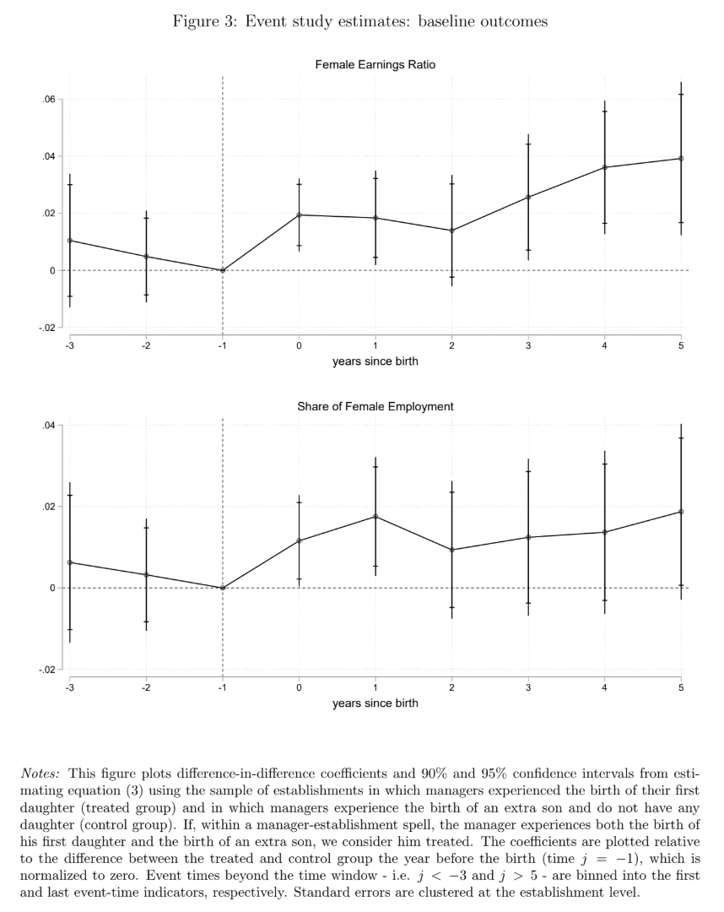

A new [study by Maddalena Ronchi and Nina Smith (2026)](https://www.restud.com/daddys-girl-daughters-managerial-decisions-and-gender-inequality/) uses Danish registry data to ask whether having a daughter changes how male managers treat women at work.

The design is clever. They look at 6,701 manager-establishment spells and compare what happens after a manager has a daughter versus a son. Child sex is plausibly random, and they follow changes within the same manager-firm relationship, which is a much better counterfactual than simply comparing “fathers of daughters” with “fathers of sons”.

After the birth of a manager’s first daughter:

* women’s relative earnings improve by 4.4%
* female employment increases by 2.9%
* managers hire more women instead of men with similar education, hours and pay
* there is no detectable deterioration in firm performance

<figure style="text-align:center;">
  
  <figcaption>After a manager’s first daughter is born, women’s relative earnings and employment rise. Importantly, there is little sign of a pre-existing trend.</figcaption>
</figure>

The hiring result is particularly interesting: managers seem able to switch between similarly qualified male and female candidates without materially changing the observable composition or cost of the workforce.

The causal design is strong. No obvious pre-trends. No differential manager attrition. No effect of child sex on paternity leave. And the effects appear quickly and persist.

But there is an important causal wrinkle. The study randomizes - courtesy of nature - having a daughter, not gender attitudes. So I’m quite convinced by: daughter → different managerial decisions. But I’m less convinced that we can cleanly identify: daughter → more egalitarian attitudes → different decisions. Attitudes aren’t directly measured, and a daughter can change a father in more ways than one 🤔

Still, this is a fascinating result. It suggests that some gender inequality may come from surprisingly malleable managerial preferences at the margin - not from differences in available talent.

And fortunately, “have more daughters” is probably not the only intervention worth testing 😉

<!-- RELATED:BEGIN -->
## Related notes
- [[gender-gap-in-hiring-decisions|Evidence on the presence of gender bias in selection settings]]
- [[managerial-quality|Unexpected protective effect of having a good manager?]]
- [[causal-impact-of-leadership-skills|Novel way to measure leadership skills via causal inference (and AI)?]]
- [[interventions-reducing-gender-pay-gap|Evidence-based interventions that help reduce the gender pay gap]]
- [[managers-and-performance-evaluations|"A new broom sweeps clean"]]
<!-- RELATED:END -->

---
> 📄 Read the [original post with full outputs](https://blog-about-people-analytics.netlify.app/posts/2026-08-30-the-daughter-effect/) on my blog.
