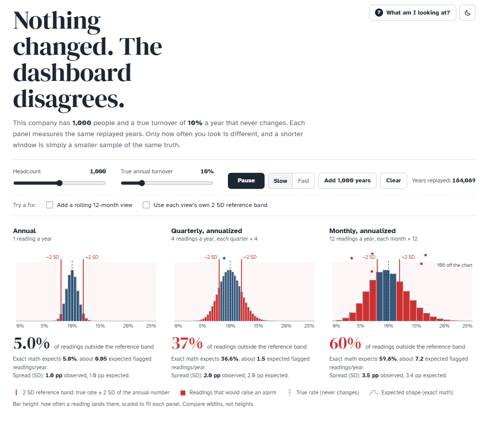
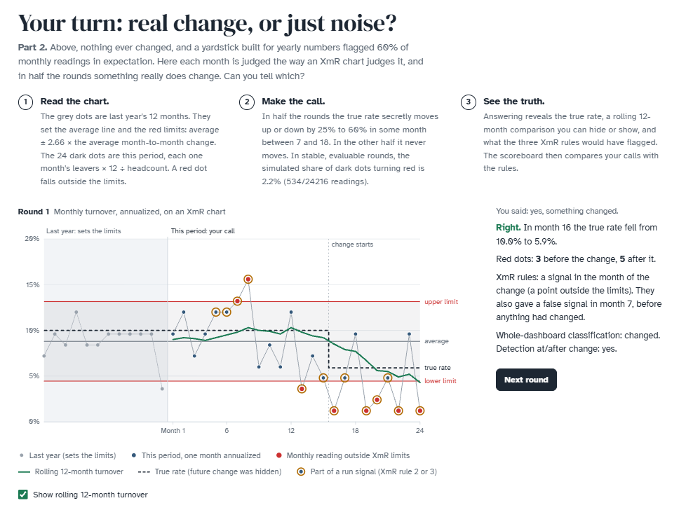

The question sounded simple: is it OK to show monthly TR annualized, next to the annual number, and react when it jumps? To make the answer tangible, I built a small interactive app. It simulates a company of 1,000 people with a true turnover of 10% that never changes, and then measures it annually, quarterly and monthly (the latter two annualized).

A few things it shows:

1. The shorter the window, the noisier the number. Precision depends on the leavers behind it: ~100 a year, ~25 a quarter, ~8 a month. One person more or less moves the annualized monthly rate by 1.2 pp. The typical swing (1 SD) is about ±1 pp for annual, ±2 pp for quarterly and ±3.5 pp for monthly TR.
2. Things go wrong when we read monthly numbers with an annual sense of "normal". Using the annual mean ±2 SD as the normal range for TR, about 37% of quarters and 60% of months fall outside it - in a company where nothing changed. Each of them can trigger a meeting or an intervention. After an unusually high month, the next reading will often be lower even without intervention (hello, regression to the mean), which can make an intervention look effective.
3. Small teams are the same trap in disguise. A team of ~80 people measured once a year is about as noisy as the whole 1,000-person company measured monthly.
4. So the issue is less how often we look and more which yardstick we use. A rolling 12-month TR has the same variability as the annual one, but spreads a real change over several months. Window-specific reference bands - or [XmR](https://blog-about-people-analytics.netlify.app/posts/2024-10-30-xmr-charts-in-people-analytics/) limits estimated from monthly data - give us a more appropriate yardstick, but there's no free lunch. At the app's default settings, with XmR limits based on one year of data, relying only on points outside the limits misses ~58% of real 25-60% relative shifts starting between months 7 and 18 of a 24-month dashboard: no signal at or after the change before the dashboard ends. Adding the other two rules used here cuts those misses to ~20%, but then at least one rule also fires in ~4 in 10 dashboards where nothing changed at all. More ways to look, more chances to see something.

<figure style="text-align:center;">

  

</figure>

The second part is a game: 24 monthly readings, half the time with a hidden real change, and a scoreboard comparing your calls with the XmR rules. After answering, you can hide or show a rolling 12-month line beside the true rate to explore smoothing and the gradual response to change. Telling signal from noise by eye is hard, yet an approximate model that knows the true baseline and how rounds are generated gets ~94% right by combining evidence across months.

<figure style="text-align:center;">

  

</figure>

You can play with it [here](https://lstehlik2809.github.io/turnover-signal-noise/).
Maybe you’ll find it useful for your own internal discussions or for some edu purposes.

How do you report TR in your org - monthly annualized, rolling 12 months, control charts, something else? And how do you keep people from reacting to every wiggle? 🤔

P.S. The first part of the app builds on a neat Monte Carlo illustration credited to Lipinski (2017).

<!-- RELATED:BEGIN -->
## Related notes
- [[change-detection|How to quickly navigate dashboard users to what they need to know?]]
- [[bayesian-shrinkage|Using Bayesian shrinkage in reporting employee turnover]]
- [[contagious-turnover|Is contagious turnover overrated? Probably only if you ignore the managers.]]
- [[tenure-vs-satisfaction|Simulating the "survivorship" effect in employee satisfaction data over time]]
- [[xmr-charts-in-people-analytics|Do you use XmR charts for People Analytics use cases?]]
<!-- RELATED:END -->

---
> 📄 Read the [original post with full outputs](https://blog-about-people-analytics.netlify.app/posts/2026-09-28-turnover-signal-and-noise/) on my blog.
